# BMAD Method Guide: Building Masterful AI-Driven Development

## What is BMAD?

BMAD (Building Masterful AI-Driven Development) is a structured methodology for managing AI development teams through two distinct phases: Strategic Planning and Tactical Execution. Think of it as your framework for turning AI agents into a coordinated development team.

## Quick Start Installation

### Step 1: Navigate to Your Project

Always start by navigating to your project folder:

```bash
cd your-project-folder
```

### Step 2: Install BMAD Method

Instead of typing the full path, use the current directory shortcut:

```bash
npx bmad-method install
```

When prompted for the project directory path, simply enter `.` (dot) to use the current directory:

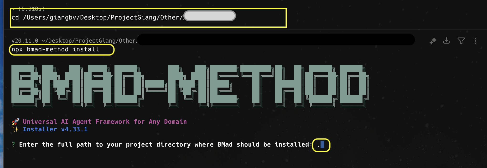

The `.` character tells the installer to use the current directory, avoiding long path inputs.

### Step 3: Select Installation Package

Choose the appropriate BMAD package for your project type:

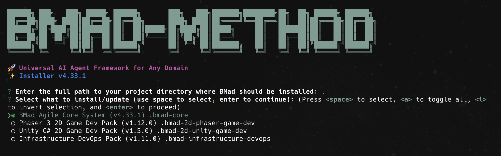

Available options include:

- **BMad Agile Core System** - Standard development projects
- **Phaser 3 2D Game Dev Pack** - Game development projects
- **Unity C# 2D Game Dev Pack** - Unity game development
- **Infrastructure DevOps Pack** - DevOps and infrastructure projects

### Step 4: Configure Document Organization

Configure how your project documentation should be organized:

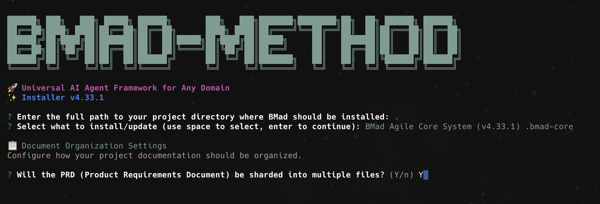

Answer the configuration questions:

- **Will the PRD be sharded into multiple files?** - Usually "Yes" for better organization
- **Will the architecture documentation be sharded?** - "Yes" for complex projects

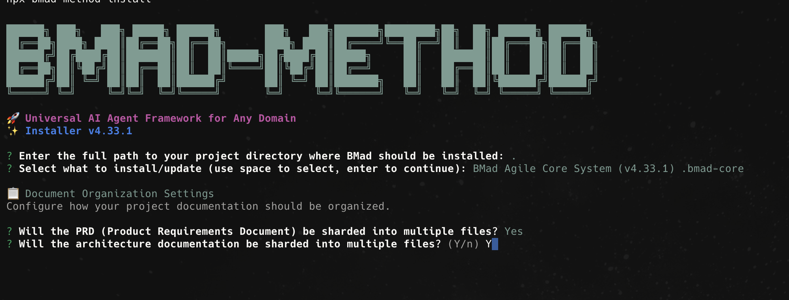

### Step 5: Select IDE Configuration

Choose which IDEs you want to configure for BMAD:

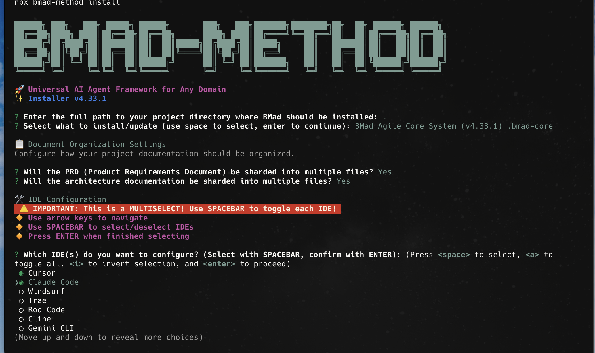

Select from available IDEs (use **Space** to select, **Enter** to confirm):

- **Cursor** ✓ (Recommended)
- **Claude Code** ✓ (Recommended)
- **Windsurf**
- **Trae**
- **Roo Code**
- **Cline**
- **Gemini CLI**

> **💡 Pro Tip:** For optimal token usage and context management, consider using [Serena](https://github.com/oraios/serena) alongside your chosen IDE. Serena helps optimize AI interactions and reduce token consumption in large repositories.

### Step 6: Configure Web Bundles

Choose whether to include pre-built web bundles for AI platforms:

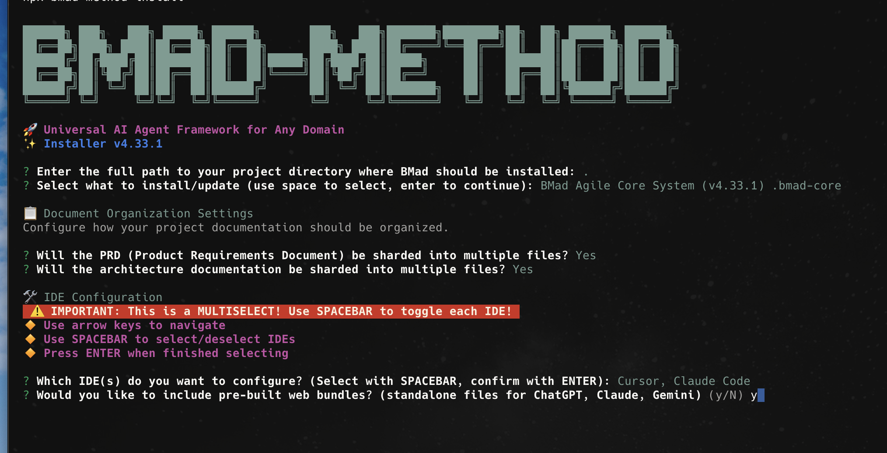

**Web bundles** are standalone files perfect for web AI platforms. You can choose different teams/agents than your IDE installation.

### Step 7: Select Web Bundle Options

Configure which web bundles to include:

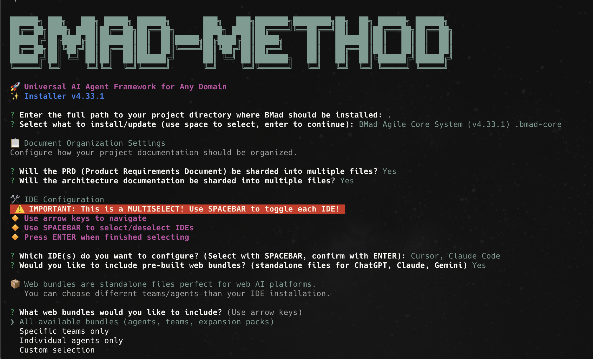

Available bundle options:

- **All available bundles** (agents, teams, expansion packs)
- **Specific teams only**
- **Individual agents only**
- **Custom selection**

### Step 8: Set Web Bundle Directory

Specify where web bundles should be stored:

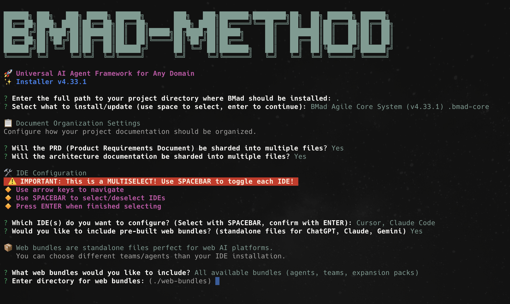

Default location is `./web-bundles/` - you can use this or specify a custom directory.

### Step 9: Verify Installation

After installation completes, you'll see the project structure:

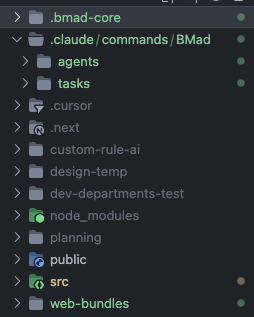

Check that BMAD folders were created:

```bash
ls -la
```

You should see the complete BMAD structure:

- **`.bmad-core/`** - Core BMAD system files
- **`.claude/commands/BMad/`** - Claude Code integration
- **`agents/`** - Individual agent configurations
- **`tasks/`** - Task management
- **`cursor/`** - Cursor IDE integration
- **`planning/`** - Project planning documents
- **`public/`** - Public assets
- **`src/`** - Source code
- **`web-bundles/`** - Web platform bundles

## BMAD Workflow Overview

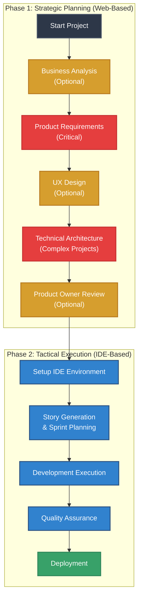

## Phase 1: Strategic Planning (Web-Based)

Work in your web-based AI platform (Claude, ChatGPT, Gemini) acting as executive leadership.

### Step 1: Business Analysis (Optional)

**Role:** CEO/Founder  
**Agent:** Business Analyst (BA)  
**Deliverable:** Project Brief

Upload BMAD orchestrator bundle and conduct:

- Market validation and competitor research
- Feature brainstorming and MVP scoping
- Business model validation

### Step 2: Product Requirements (Critical)

**Role:** Product Owner  
**Agent:** Product Manager (PM)  
**Deliverable:** Product Requirements Document (PRD)

Most critical step. The PM will ask clarifying questions until comfortable drafting detailed PRD:

- User stories and acceptance criteria
- Feature priorities and dependencies
- Detailed specifications for development

### Step 3: UX Design (Optional)

**Role:** Design Director  
**Agent:** UX Expert  
**Deliverable:** UX Specifications

Create design-ready specifications:

- Prompts optimized for V0 or UI generators
- User flows and interface requirements
- Design feasibility assessment

### Step 4: Technical Architecture (Critical for Complex Projects)

**Role:** CTO  
**Agent:** Architect  
**Deliverable:** Architecture Document

For complex projects:

- Technology stack decisions
- System design and scalability planning
- Integration and deployment strategies

### Step 5: Product Owner Review (Optional)

**Role:** Product Owner  
**Agent:** Product Owner (PO)  
**Deliverable:** Refined story prioritization

Final review before development:

- Story sequencing in PRD
- Release planning
- Final sign-off on build priorities

## Phase 2: Tactical Execution (IDE-Based)

Switch to your IDE environment acting as project manager/team lead.

### Step 6: Setup IDE Environment

1. Open your IDE (Cursor, Claude Code, Windsurf)
2. Navigate to project: `cd .` (current directory)
3. Import planning documents to `/docs/`
4. Configure custom agent modes

### Step 7: Story Generation & Sprint Planning

**Role:** Scrum Master  
**Agent:** Scrum Master (SM) or Dev Agent  
**Deliverable:** Individual Story Files

Transform PRD into hyper-detailed development stories:

- Full context and implementation details
- Architectural guidance embedded in stories
- Proper story scoping for single sessions

### Step 8: Development Execution

**Role:** Team Lead  
**Agent:** Developer (Dev)  
**Deliverable:** Working Code

Dev agent works one story at a time:

- Creates draft story for review
- Implements after approval
- Follows TDD practices

### Step 9: Quality Assurance

**Role:** QA Manager  
**Agent:** QA/Tester  
**Deliverable:** Test Results

- Test plan execution
- Bug triage and priority assignment
- Release readiness assessment

## Claude Code Specific Instructions

### Agent Calling Best Practices

When using Claude Code, you'll see agent suggestions as shown in the images:

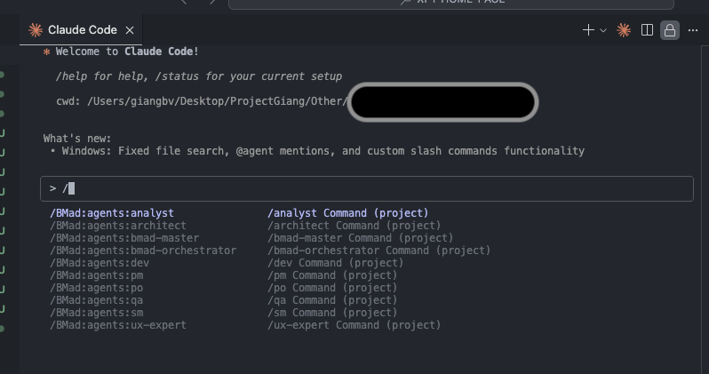

#### Calling Agents with `/` Command

1. **Type `/`** - This brings up the agent selection menu
2. **Select your agent** - Choose from available agents (analyst, architect, pm, etc.)
3. **Tab to complete** - Use Tab to select the agent
4. **Remove the `/`** - Delete the forward slash character
5. **Add `@` for context** - Now you can use `@` to reference files/folders
6. **Complete your prompt** - Write your instructions
7. **Add `/` back** - Restore the `/` at the beginning
8. **Press Enter** - Execute the agent command

#### Example Flow:

```
/ → /analyst → analyst → @docs/prd.md analyze this → /analyst @docs/prd.md analyze this
```

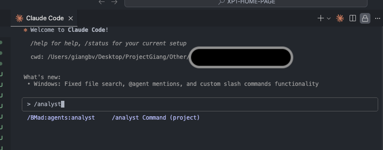

This workaround ensures you can use both agent calling (`/`) and file referencing (`@`) in the same prompt.

### Project Management in Claude Code

#### Sprint Management

- Work one story at a time
- Start new chat for each story (clean context)
- Commit and push after completed stories

#### Context Management

- Keep all planning docs in `/docs/`
- Reference relevant docs with `@` in each story
- Maintain version control for all artifacts

## Best Practices & Troubleshooting

### Quality Gates

- Never approve stories without understanding implementation
- Ensure all tests pass before marking stories complete
- Review architectural alignment before implementation

### Common Mistakes to Avoid

1. **Skipping Planning Phase**

   - Don't jump straight to coding
   - Always create PRD and Architecture docs first

2. **Insufficient Story Detail**

   - Embed full context in story files
   - Include implementation details and architectural guidance

3. **Poor Story Scope**

   - Keep stories completable in one focused session
   - Break large epics into smaller stories

4. **Inadequate Review Process**
   - Act as project manager - review everything
   - Don't auto-approve agent outputs

### Context Management Strategy

The two-phase approach eliminates:

- Planning inconsistency
- Context loss during development
- Agent confusion about requirements

Each agent receives exactly the context they need when they need it.

## Full BMAD Repository Reference

For complete documentation and advanced techniques, visit:
[https://github.com/bmadcode/BMAD-METHOD](https://github.com/bmadcode/BMAD-METHOD)

---

**Remember:** BMAD is about managing AI agents like a real development team. You're the executive in Phase 1 and the project manager in Phase 2. Success comes from proper planning and disciplined execution.
