# 🎮 THE CURSOR TIPS DUNGEON CRAWLER

## _An Epic Quest Through the IDE Dimension_

```mermaid
graph TD
    Start[🚪 Welcome, Code Warrior!] --> CharCreate{Choose Your Path}

    CharCreate -->|"⚔️ Battle Hardened"| Veteran[Skip to Advanced Campaign]
    CharCreate -->|"🌱 Fresh Graduate"| Beginner[Start Core Campaign]
    CharCreate -->|"🤔 Just Browsing"| Explorer[Free Roam Mode]
    CharCreate -->|"🎓 Ready to Apply"| TrainingMode[Enter Training Grounds]

    Beginner --> Quest1[🧙‍♂️ Sage Plannicus<br/>★☆☆☆☆]
    Quest1 --> Quest2[🎨 Chart-mancer Diagramius<br/>★★★☆☆]
    Quest2 --> Quest3[👑 The Protocol Overlord<br/>★★★★★]

    Quest3 --> UnlockAdvanced{Core Campaign Complete?}
    UnlockAdvanced -->|"Yes"| AdvancedQuest[⚡ The MCP Mystic<br/>★★★★★★ LEGENDARY]
    UnlockAdvanced -->|"No"| KeepTraining[Continue Training]

    AdvancedQuest --> UnlockUltimate{MCP Mastery Complete?}
    UnlockUltimate -->|"Yes"| UltimateQuest[🏦 The Memory Bank Master<br/>★★★★★★★ ULTIMATE MASTER]
    UnlockUltimate -->|"No"| ContinueMCP[Continue MCP Training]

    TrainingMode --> TrainingGrounds[🏛️ Planning Temple]
    AdvancedQuest --> MCPMastery[🌟 AI Collaboration Master]

    Explorer --> Map[🗺️ Dungeon Map]
    Veteran --> AdvancedQuest

    Map --> Quest1
    Map --> Quest2
    Map --> Quest3
    Map --> AdvancedQuest
    Map --> TrainingGrounds

    classDef start fill:#ff6b6b,stroke:#c92a2a,stroke-width:3px,color:#fff
    classDef quest fill:#4ecdc4,stroke:#26a69a,stroke-width:2px,color:#fff
    classDef boss fill:#ffe66d,stroke:#ffc947,stroke-width:3px,color:#000
    classDef legendary fill:#9f39ff,stroke:#7c2d12,stroke-width:4px,color:#fff
    classDef training fill:#22c55e,stroke:#15803d,stroke-width:2px,color:#fff
    classDef victory fill:#51cf66,stroke:#37b24d,stroke-width:3px,color:#fff

    class Start start
    class Quest1,Quest2 quest
    class Quest3 boss
    class AdvancedQuest legendary
    class TrainingMode,TrainingGrounds training
    class MCPMastery victory
```



---

## 📊 YOUR ADVENTURE STATS

<details>
<summary>🧬 Character Profile Generator</summary>

**Current Level:** `Ctrl+Shift+P` Novice  
**XP:** 0 / 2000 _(expanded for new content!)_  
**Health:** ████████████████████ 100/100  
**Sanity:** ███████░░░░░░░░░░░░░░ 35/100 _(perfectly normal for a developer)_  
**AI Compatibility:** ░░░░░░░░░░░░░░░░░░░░ 0/100 _(unlock in advanced campaign)_

**Skills Unlocked:**

- [ ] 📋 Planning Mastery
- [ ] 🎨 Mermaid Sorcery
- [ ] 🤖 Protocol Enlightenment
- [ ] 🔥 Multi-Dimensional Thinking
- [ ] 💀 Error Debugging Fu
- [ ] ⚡ **MCP Collaboration** _(LEGENDARY SKILL)_
- [ ] 🏛️ **Real-World Application** _(PRACTICAL MASTERY)_
- [ ] 🏦 **Memory Banking Mastery** _(NEW - ULTIMATE SKILL)_

**Inventory:**

- 🍕 Emergency Pizza Slice x3
- ☕ Caffeine Potion x∞
- 🐛 Rubber Duck Debugger
- 💾 Legacy Code Detector _(cursed item)_
- 🤖 **AI Collaboration Orb** _(unlocks MCP powers)_
- 📋 **Master Planning Scroll** _(contains ancient templates)_
- 🏦 **Memory Banking System** _(NEW - ultimate development framework)_
- ⚙️ **Isolation Rules Archive** _(NEW - contains the six sacred modes)_

</details>

---

## 🗺️ EXPANDED DUNGEON MAP: The Sacred Campaigns

```mermaid
graph TB
    subgraph "🏰 The Cursor Tips Citadel"
        direction TB

        subgraph "⭐ CORE CAMPAIGN"
            subgraph "🌅 Tutorial Grounds"
                Tutorial[🧙‍♂️ Sage Plannicus<br/>planning-template-example.md<br/>★☆☆☆☆ TUTORIAL BOSS]
            end

            subgraph "🎨 The Mystic Charts Chamber"
                Charts[🎨 Chart-mancer Diagramius<br/>prompt-guide-mermaid-chart.md<br/>★★★☆☆ MID BOSS]
            end

            subgraph "⚡ The Protocol Throne Room"
                Protocol[👑 The Ancient Protocol Overlord<br/>rule-21-05-2025.md<br/>★★★★★ FINAL BOSS]
            end
        end

        subgraph "🌟 ADVANCED CAMPAIGN"
            subgraph "⚡ The MCP Sanctum"
                MCPBoss[⚡ The MCP Mystic<br/>AI Collaboration Master<br/>★★★★★★ LEGENDARY BOSS]
            end
        end

        subgraph "💎 ULTIMATE CAMPAIGN"
            subgraph "🏦 The Memory Bank Citadel"
                UltimateBoss[🏦 The Memory Bank Master<br/>AI-Enhanced Development Master<br/>★★★★★★★ ULTIMATE MASTER]
            end
        end

        subgraph "🌟 CONTEXT ENGINEERING CAMPAIGN"
            subgraph "📚 The Context Sanctum"
                ContextBoss[📚 The Context Engineer<br/>AI Context Management Master<br/>★★★★★★ LEGENDARY ARCHITECT]
            end
        end

        subgraph "💰 MONEY-SAVING CAMPAIGN"
            subgraph "💳 The Frugal Developer's Sanctuary"
                MoneyBoss[💰 The Budget Master<br/>Claude Code Extension Setup<br/>★★☆☆☆ COST-SAVING CHAMPION]
            end
        end

        subgraph "🏛️ TRAINING GROUNDS"
            subgraph "📚 Planning Temple"
                Mission1[🏗️ Mission 1: Backend APIs<br/>output-planning-4.0-generate-example/<br/>step-1-car-stores-and-apis-planning.md]
                Mission2[🎨 Mission 2: UI Components<br/>output-planning-4.0-generate-example/<br/>step-2-car-selection-component-planning.md]
                Mission3[🔗 Mission 3: System Integration<br/>output-planning-4.0-generate-example/<br/>step-3-product-integration-planning.md]
            end
        end

        subgraph "🏆 Hall of Ultimate Legends"
            Victory[🎉 AI-Enhanced Code Warrior<br/>Master of All Dimensions]
        end
    end

    Tutorial --> Charts
    Charts --> Protocol
    Protocol --> MCPBoss
    MCPBoss --> ContextBoss
    ContextBoss --> UltimateBoss
    UltimateBoss --> Victory

    Protocol -.-> MoneyQuest[💰 Money-Saving Quest Unlocked]
    MoneyQuest --> MoneyBoss
    MoneyBoss -.-> MCPBoss

    Protocol -.-> TrainingUnlock[🔓 Training Grounds Unlocked]
    TrainingUnlock -.-> Mission1
    Mission1 --> Mission2
    Mission2 --> Mission3
    Mission3 -.-> MCPBoss

    MCPBoss -.-> ContextUnlock[🔓 Context Engineering Unlocked]
    ContextUnlock -.-> ContextBoss

    Tutorial -.-> SecretPath[🕳️ Secret Speedrun Route]
    SecretPath -.-> Protocol

    classDef tutorial fill:#a8e6cf,stroke:#7fcdcd,stroke-width:2px,color:#000
    classDef intermediate fill:#ffd93d,stroke:#ffb84d,stroke-width:2px,color:#000
    classDef final fill:#ff6b6b,stroke:#c92a2a,stroke-width:3px,color:#fff
    classDef legendary fill:#9f39ff,stroke:#7c2d12,stroke-width:4px,color:#fff
    classDef training fill:#22c55e,stroke:#15803d,stroke-width:2px,color:#fff
    classDef victory fill:#51cf66,stroke:#37b24d,stroke-width:3px,color:#fff
    classDef secret fill:#845ec2,stroke:#6741a5,stroke-width:2px,color:#fff
    classDef unlock fill:#f59e0b,stroke:#d97706,stroke-width:2px,color:#fff
    classDef money fill:#10b981,stroke:#047857,stroke-width:2px,color:#fff

    class Tutorial tutorial
    class Charts intermediate
    class Protocol final
    class MCPBoss,ContextBoss,UltimateBoss legendary
    class Mission1,Mission2,Mission3 training
    class Victory victory
    class SecretPath secret
    class TrainingUnlock,MoneyQuest,ContextUnlock unlock
    class MoneyBoss money
```



---

## ⚔️ QUEST 1: DEFEAT SAGE PLANNICUS

### _The Master of Organization and Templates_

<details>
<summary>🧙‍♂️ Boss Intel Report</summary>

**Sage Plannicus** _(Difficulty: ★☆☆☆☆)_

- **HP:** 89 lines of pure wisdom
- **Special Attacks:** Overwhelming Organization, Template Tornado
- **Weakness:** Developers who actually read documentation
- **Drops:** Planning Template Mastery, Markdown Fu

**Boss Quote:** _"You cannot code what you have not planned, young warrior!"_

</details>

**BATTLE ACTIONS:**

- [📖 Read the Ancient Scrolls](guide-prompt-template/planning-template-example.md)
- [⚔️ Challenge Accepted] - Study the planning template
- [🎨 Visualize] - Create your own planning diagram
- [✅ Mark as Defeated] - Complete the quest

**Victory Condition:** Create a project plan using the template

<details>
<summary>🏆 LOOT: Planning Template (Copy this!)</summary>

```markdown
# 🎯 Project Battle Plan

## Context

- Mission: [Your Epic Quest Here]
- Deadline: [When the world ends]
- Protocol: RIPER-5 + Multi-Dimensional Thinking

## Victory Conditions

- [ ] Feature 1: [Describe your destiny]
- [ ] Feature 2: [Define your legend]
- [ ] Feature 3: [Declare your victory]

## Battle Strategy

### Plan A: The Hero's Path

- **Principle:** Face challenges head-on
- **Steps:** [Your journey here]
- **Risks:** [What could go wrong]

### Plan B: The Ninja Route

- **Principle:** Swift and silent execution
- **Steps:** [Alternative approach]
- **Risks:** [Backup plan dangers]

## Implementation Checklist

1. [ ] Setup development environment
2. [ ] Create project structure
3. [ ] Implement core features
4. [ ] Test everything twice
5. [ ] Deploy to production
6. [ ] Celebrate victory 🎉
```

</details>

**QUEST COMPLETION:**

- [ ] I have read the planning template scrolls
- [ ] I understand the RIPER-5 protocol
- [ ] I created my own battle plan
- [ ] I'm ready for the next challenge

---

## 🎨 QUEST 2: CONFRONT CHART-MANCER DIAGRAMIUS

### _The Mystical Artist of Mermaid Magic_

<details>
<summary>🎨 Boss Intel Report</summary>

**Chart-mancer Diagramius** _(Difficulty: ★★★☆☆)_

- **HP:** 420 lines of visual sorcery
- **Special Attacks:** Syntax Error Curse, Infinite Loop Trap, Color Chaos
- **Weakness:** Developers who test their Mermaid charts first
- **Drops:** Visual Communication Mastery, Diagram Drawing Powers

**Boss Quote:** _"Your flowcharts are weak! Let me show you TRUE visual power!"_

</details>

**BATTLE ACTIONS:**

- [📖 Study the Mermaid Grimoire](guide-prompt-template/prompt-guide-mermaid-chart.md)
- [⚔️ Master the Syntax] - Learn proper Mermaid formatting
- [🎨 Create Art] - Draw your first battle diagram
- [✅ Prove Your Worth] - Show mastery

**Boss Battle Interface:**

```mermaid
graph TD
    You[🧙‍♀️ Code Warrior] -->|"Cast Mermaid Spell"| Battle{Chart Battle!}

    Battle -->|"Syntax Error!"| Failure[💀 YOU DIED<br/>Missing quotes around node text]
    Battle -->|"Perfect Chart!"| Victory[🎉 CRITICAL HIT!<br/>Diagramius is impressed]

    Failure -->|"Try Again"| You
    Victory --> Reward[🏆 Unlock: Visual Mastery]

    classDef player fill:#4ecdc4,stroke:#26a69a,stroke-width:2px,color:#fff
    classDef battle fill:#ffe66d,stroke:#ffc947,stroke-width:2px,color:#000
    classDef death fill:#ff6b6b,stroke:#c92a2a,stroke-width:2px,color:#fff
    classDef win fill:#51cf66,stroke:#37b24d,stroke-width:2px,color:#fff

    class You player
    class Battle battle
    class Failure death
    class Victory,Reward win
```



**Victory Condition:** Create a flawless Mermaid diagram

<details>
<summary>🏆 LOOT: Chart Spellbook (Master These!)</summary>

**Essential Incantations:**


**Power-up Colors:**

- Primary: `fill:#3182ce,stroke:#2c5282,color:#fff`
- Success: `fill:#38a169,stroke:#2f855a,color:#fff`
- Error: `fill:#e53e3e,stroke:#c53030,color:#fff`
- Warning: `fill:#d69e2e,stroke:#b7791f,color:#fff`

</details>

**QUEST COMPLETION:**

- [ ] I have mastered Mermaid syntax
- [ ] I can create diagrams without errors
- [ ] I understand the color palette system
- [ ] My charts are tested and beautiful
- [ ] I'm ready for the final battle

---

## 👑 QUEST 3: FACE THE PROTOCOL OVERLORD

### _The Ancient Master of Multi-Dimensional Thinking_

<details>
<summary>👑 Final Boss Intel Report</summary>

**The Ancient Protocol Overlord** _(Difficulty: ★★★★★ DARK SOULS)_

- **HP:** 263 lines of concentrated wisdom
- **Special Attacks:** Pattern Confusion, Mode Switching Madness, Infinite Recursion
- **Weakness:** Developers who actually follow protocols
- **Drops:** Ultimate Development Mastery, Enlightenment

**Boss Quote:** _"You think you know code? I AM THE CODE!"_

</details>

**⚠️ WARNING: This boss has multiple phases!**

```mermaid
graph TD
    Start[🚪 Enter Throne Room] --> Phase1[📚 PHASE 1<br/>Research Mode]
    Phase1 --> Phase2[💡 PHASE 2<br/>Innovation Mode]
    Phase2 --> Phase3[📋 PHASE 3<br/>Planning Mode]
    Phase3 --> Phase4[✅ PHASE 4<br/>Verification Mode]
    Phase4 --> Phase5[⚡ PHASE 5<br/>Execution Mode]
    Phase5 --> Phase6[🔍 PHASE 6<br/>Review Mode]
    Phase6 --> Final[🧠 FINAL PHASE<br/>Intelligence Mode]

    Final --> Victory[🏆 CORE CAMPAIGN COMPLETE]
    Final --> Death[💀 Protocol Overflow<br/>Start Over]

    Victory --> UnlockAdvanced[🔓 Advanced Campaign Unlocked!]
    Victory --> UnlockTraining[🔓 Training Grounds Unlocked!]

    classDef phase fill:#845ec2,stroke:#6741a5,stroke-width:2px,color:#fff
    classDef final fill:#ff6b6b,stroke:#c92a2a,stroke-width:3px,color:#fff
    classDef win fill:#51cf66,stroke:#37b24d,stroke-width:3px,color:#fff
    classDef death fill:#2f3349,stroke:#1a1a2e,stroke-width:2px,color:#fff
    classDef unlock fill:#f59e0b,stroke:#d97706,stroke-width:2px,color:#fff

    class Phase1,Phase2,Phase3,Phase4,Phase5,Phase6 phase
    class Final final
    class Victory win
    class Death death
    class UnlockAdvanced,UnlockTraining unlock
```



**BATTLE ACTIONS:**

- [📖 Read the Sacred Protocol](custom-rules/rule-21-05-2025.md)
- [⚔️ Master All 7 Patterns] - The ultimate challenge
- [🎨 Demonstrate Mastery] - Show you understand
- [✅ Achieve Enlightenment] - Complete transformation

**Victory Condition:** Successfully apply the multi-dimensional thinking protocol

<details>
<summary>🏆 ULTIMATE LOOT: The Sacred Knowledge</summary>

**The Seven Sacred Patterns:** _(Use these to become unstoppable)_

1. **Research** - Gather info, understand deeply
2. **Innovation** - Generate ≥2 orthogonal solutions
3. **Planning** - Create exhaustive technical specs
4. **Verification** - Fact-check everything
5. **Execution** - Implement with 100% fidelity
6. **Review** - Confirm and validate results
7. **Intelligence** - Do it all in one response

**The Ultimate Incantation:**

```
[Mode: Intelligent]
Analysis → Options → Recommendation → Plan → Verification → Execution → Review
```

</details>

**FINAL QUEST COMPLETION:**

- [ ] I have read and understood all 263 lines
- [ ] I can identify which pattern fits each situation
- [ ] I understand multi-dimensional thinking
- [ ] I can execute the full protocol chain
- [ ] I have unlocked the advanced campaign!

---

## 📚 QUEST 4.5: THE CONTEXT ENGINEER _(LEGENDARY ARCHITECT)_

### _Master of AI Context Management and Systematic Documentation_

> 🔒 **UNLOCK CONDITION:** Complete QUEST 4 (The MCP Mystic) first!

<details>
<summary>📚 Legendary Architect Intel Report</summary>

**The Context Engineer** _(Difficulty: ★★★★★★ LEGENDARY ARCHITECT)_

- **HP:** ∞ (Scales with your documentation and context management skills)
- **Special Attacks:** Documentation Overload, Context Window Fragmentation, PRD Confusion, Rule File Chaos
- **Weakness:** Developers who understand systematic project planning and context window management
- **Drops:** Ultimate Context Engineering Mastery, The Sacred Documentation System, Perfect AI Context Control

**Boss Quote:** _"You think you can manage AI context with random prompts? Let me show you the power of systematic documentation and structured context engineering that eliminates hallucinations forever!"_

</details>

**🌟 LEGENDARY ARCHITECT BATTLE MECHANICS:**

```mermaid
graph TD
    Enter[🚪 Enter Context Sanctum] --> ContextChallenge{Choose Your Context Trial}

    ContextChallenge -->|"PRD Mastery"| PRD[📋 PRD Creation<br/>Project Requirements Documentation]
    ContextChallenge -->|"Documentation System"| Docs[📚 Four-File System<br/>Systematic Documentation]
    ContextChallenge -->|"Rule Engineering"| Rules[⚙️ Rule File Mastery<br/>Generate & Work Rules]
    ContextChallenge -->|"Ultimate Challenge"| AllThree[⚡ Complete Workflow<br/>True Context Engineering]

    PRD --> PRDTest[Test: Create comprehensive PRD with feature analysis]
    Docs --> DocsTest[Test: Generate all four documentation files]
    Rules --> RulesTest[Test: Create and use Generate & Work rules]
    AllThree --> UltimateTest[Test: Full Context Engineering workflow]

    PRDTest --> PRDMastery[🏆 PRD Master]
    DocsTest --> DocsMastery[🏆 Documentation Master]
    RulesTest --> RulesMastery[🏆 Rule Engineering Master]
    UltimateTest --> ContextMaster[🌟 CONTEXT ENGINEERING MASTER]

    PRDMastery --> CheckProgress{All Skills Mastered?}
    DocsMastery --> CheckProgress
    RulesMastery --> CheckProgress
    CheckProgress -->|"Yes"| ContextMaster
    CheckProgress -->|"No"| ContextChallenge

    classDef legendary fill:#9f39ff,stroke:#7c2d12,stroke-width:4px,color:#fff
    classDef challenge fill:#3b82f6,stroke:#1e40af,stroke-width:2px,color:#fff
    classDef test fill:#f59e0b,stroke:#d97706,stroke-width:2px,color:#fff
    classDef mastery fill:#10b981,stroke:#047857,stroke-width:2px,color:#fff
    classDef ultimate fill:#ef4444,stroke:#dc2626,stroke-width:3px,color:#fff

    class Enter,ContextMaster legendary
    class PRD,Docs,Rules,AllThree challenge
    class PRDTest,DocsTest,RulesTest,UltimateTest test
    class PRDMastery,DocsMastery,RulesMastery mastery
    class ContextMaster ultimate
```



**🔥 LEGENDARY ARCHITECT BATTLE ACTIONS:**

- [📖 Study the Context Engineering Arts](context-engineer/guide.md)
- [📋 Master PRD Creation] - Learn systematic project requirements documentation
- [📚 Master Documentation System] - Four-file systematic approach
- [⚙️ Master Rule Engineering] - Generate and Work rule creation
- [⚡ Prove Ultimate Mastery] - Complete Context Engineering workflow

**🌟 Victory Condition:** Successfully implement the complete Context Engineering methodology for complex development projects

<details>
<summary>🏆 LEGENDARY ARCHITECT LOOT: The Context Engineering Arsenal</summary>

**📋 PRD Mastery Powers:**

- Create comprehensive Product Requirements Documents
- Perform systematic feature analysis and categorization
- Research and recommend optimal tech stacks
- Define clear project scope and requirements

**📚 Documentation System Magic:**

- **Implementation.md**: Complete step-by-step development plans
- **project_structure.md**: Systematic file and folder organization
- **UI_UX_doc.md**: Design system and user experience documentation
- **Bug_tracking.md**: Quality assurance and error management

**⚙️ Rule Engineering Mastery:**

- **Generate Rule**: Convert PRD into comprehensive documentation
- **Work Rule**: Guide AI through systematic development process
- Strategic context window management
- Elimination of AI hallucinations through proper context

**⚡ Ultimate Context Engineering:**

```javascript
// The Sacred Context Engineering Incantation
const contextEngineering = {\n  prd: "Product Requirements Document as foundation",
  documentation: "Four-file systematic approach",
  rules: "Generate and Work rules for AI guidance",
  workflow: "Context Generation → Development → Ongoing",
  mastery: "Perfect AI context control and systematic development"
};
```

</details>

**LEGENDARY ARCHITECT QUEST COMPLETION:**

- [ ] I understand Context Engineering methodology and principles
- [ ] I can create comprehensive PRDs with feature analysis
- [ ] I can generate all four documentation files systematically
- [ ] I can create and use Generate and Work rules effectively
- [ ] I have implemented the complete Context Engineering workflow
- [ ] I can manage AI context windows without hallucinations
- [ ] I AM THE CONTEXT ENGINEERING MASTER!

---

## ⚡ QUEST 5: THE MCP MYSTIC _(LEGENDARY BOSS)_

### _Master of AI Collaboration and Context Mastery_

> 🔒 **UNLOCK CONDITION:** Complete QUEST 4.5 (The Context Engineer) first!

<details>
<summary>⚡ Legendary Boss Intel Report</summary>

**The MCP Mystic** _(Difficulty: ★★★★★★ LEGENDARY)_

- **HP:** ∞ (Scales with your AI collaboration skills)
- **Special Attacks:** Context Overload, Sequential Thinking Maze, Multi-Tool Confusion
- **Weakness:** Developers who understand AI as a true partner
- **Drops:** Ultimate AI Collaboration Mastery, The Sacred MCP Knowledge

**Boss Quote:** _"You think you can code alone? Let me show you the power of true AI partnership!"_

</details>

**🌟 LEGENDARY BATTLE MECHANICS:**

```mermaid
graph TD
    Enter[🚪 Enter MCP Sanctum] --> MCPChallenge{Choose Your Trial}

    MCPChallenge -->|"Sequential Mastery"| Sequential[🧠 Sequential Thinking<br/>Multi-step reasoning]
    MCPChallenge -->|"Context Mastery"| Context[📚 Context Management<br/>Information synthesis]
    MCPChallenge -->|"Clear Thought"| ClearThought[💭 Clear Thinking<br/>Structured analysis]
    MCPChallenge -->|"Ultimate Challenge"| AllThree[⚡ All Three Combined<br/>True MCP Mastery]

    Sequential --> SeqTest[Test: Complex problem solving]
    Context --> CtxTest[Test: Large context management]
    ClearThought --> ThinkTest[Test: Systematic analysis]
    AllThree --> UltimateTest[Test: Real project collaboration]

    SeqTest --> SeqMastery[🏆 Sequential Thinking Master]
    CtxTest --> CtxMastery[🏆 Context Management Master]
    ThinkTest --> ThinkMastery[🏆 Clear Thought Master]
    UltimateTest --> MCPMaster[🌟 MCP COLLABORATION MASTER]

    SeqMastery --> CheckProgress{All Skills Mastered?}
    CtxMastery --> CheckProgress
    ThinkMastery --> CheckProgress
    CheckProgress -->|"Yes"| MCPMaster
    CheckProgress -->|"No"| MCPChallenge

    classDef legendary fill:#9f39ff,stroke:#7c2d12,stroke-width:4px,color:#fff
    classDef challenge fill:#3b82f6,stroke:#1e40af,stroke-width:2px,color:#fff
    classDef test fill:#f59e0b,stroke:#d97706,stroke-width:2px,color:#fff
    classDef mastery fill:#10b981,stroke:#047857,stroke-width:2px,color:#fff
    classDef ultimate fill:#ef4444,stroke:#dc2626,stroke-width:3px,color:#fff

    class Enter,MCPMaster legendary
    class Sequential,Context,ClearThought,AllThree challenge
    class SeqTest,CtxTest,ThinkTest,UltimateTest test
    class SeqMastery,CtxMastery,ThinkMastery mastery
    class MCPMaster ultimate
```



**🔥 LEGENDARY BATTLE ACTIONS:**

- [📖 Study the MCP Arts](setup-mcp-tool/MCP.png)
- [🧠 Master Sequential Thinking] - Learn step-by-step reasoning with AI
- [📚 Master Context Management] - Handle large information sets
- [💭 Master Clear Thought] - Structured problem analysis
- [⚡ Prove Ultimate Mastery] - Collaborate on a real project

**🌟 Victory Condition:** Successfully collaborate with AI to solve complex development challenges

<details>
<summary>🏆 LEGENDARY LOOT: The MCP Arsenal</summary>

**🧠 Sequential Thinking Powers:**

- Break complex problems into manageable steps
- Build reasoning chains that adapt and evolve
- Question and revise previous thoughts
- Generate and verify solution hypotheses

**📚 Context Management Magic:**

- Synthesize information from multiple sources
- Maintain coherent understanding across large contexts
- Extract relevant patterns from complex data
- Bridge knowledge gaps with targeted research

**💭 Clear Thought Mastery:**

- Apply systematic mental models to problems
- Use structured approaches for decision making
- Implement formal reasoning methods
- Maintain metacognitive awareness

**⚡ Ultimate AI Partnership:**

```javascript
// The Sacred MCP Incantation
const aiCollaboration = {
  sequential: "Think step by step, adapt as you learn",
  context: "Synthesize all available information",
  clear: "Apply structured reasoning methods",
  mastery: "True partnership with AI systems",
};
```

</details>

**LEGENDARY QUEST COMPLETION:**

- [ ] I understand MCP and AI collaboration principles
- [ ] I can use sequential thinking for complex problems
- [ ] I can manage large contexts effectively
- [ ] I can apply clear, structured thinking methods
- [ ] I have achieved true AI partnership mastery
- [ ] I AM THE AI COLLABORATION MASTER!

---

## 🏦 QUEST 6: THE MEMORY BANK MASTER _(ULTIMATE BOSS)_

### _Master of AI-Enhanced Development Workflows_

> 🔒 **UNLOCK CONDITION:** Complete QUEST 5 (The MCP Mystic) first!

<details>
<summary>🏦 Ultimate Boss Intel Report</summary>

**The Memory Bank Master** _(Difficulty: ★★★★★★★ ULTIMATE MASTER)_

- **HP:** ∞ (Scales with your entire development mastery)
- **Special Attacks:** Workflow Chaos, Mode Confusion, Context Overload, Development Paralysis
- **Weakness:** Developers who have mastered all previous quests and understand true AI-enhanced workflows
- **Drops:** Ultimate Development Mastery, The Sacred Memory Banking System, Complete AI Partnership

**Boss Quote:** _"You think you've mastered AI collaboration? Let me show you the true power of systematic, AI-enhanced development workflows that transcend all limitations!"_

</details>

### 🚀 **ACTUAL IMPLEMENTATION AVAILABLE!**

**🎉 BREAKTHROUGH:** The Memory Banking system is no longer theoretical! We've discovered the actual implementation in `setup-custom-mode/` - a complete 5-mode AI development workflow system that you can install and use immediately!

**🌟 ULTIMATE BATTLE MECHANICS:**


**🏦 ULTIMATE BATTLE ACTIONS:**

- [📖 Study the Sacred Memory Banking Arts](memory-banking/guide.md)
- [⚙️ Install the Ancient Isolation Rules] - Copy the sacred framework from memory-banking/isolation_rules
- [🔍 Master VAN Mode] - Verification, Analysis, Navigation (setup-custom-mode/VAN/)
- [📋 Master PLAN Mode] - Strategic Planning (setup-custom-mode/PLAN/)
- [🎨 Master CREATIVE Mode] - Design & Architecture (setup-custom-mode/CREATIVE/)
- [⚙️ Master IMPLEMENT Mode] - Development Execution (setup-custom-mode/IMPLEMENT/)
- [🤔 Master REFLECT Mode] - Analysis & Learning (setup-custom-mode/REFLECT-AND-ARCHIVE/)
- [📦 Master ARCHIVE Mode] - Knowledge Preservation (setup-custom-mode/REFLECT-AND-ARCHIVE/)
- [🌟 Prove Ultimate Mastery] - Complete AI-enhanced development workflow

### 🏛️ THE FIVE SACRED MODES

Each mode represents a critical phase in the Memory Banking development workflow:

#### 🔍 VAN Mode: Verification, Analysis, Navigation

- **Purpose:** Entry point that detects commands and routes to appropriate modes
- **Complexity Detection:** Automatically determines project complexity (Level 1-4)
- **Memory Bank Management:** Maintains tasks.md, projectbrief.md, activeContext.md, progress.md
- **Command Interface:** Responds to VAN, PLAN, CREATIVE, IMPLEMENT, QA commands
- **Trial:** Master project analysis and workflow navigation
- **Mastery:** Instantly understand any project and optimize development flow

#### 📋 PLAN Mode: Strategic Planning & Task Breakdown

- **Purpose:** Creates detailed implementation plans based on complexity level
- **Level 2:** Simple enhancement planning with clear steps
- **Level 3:** Comprehensive planning identifying creative phase components
- **Level 4:** Architectural planning with diagrams and phased implementation
- **Creative Flagging:** Identifies components requiring design decisions
- **Trial:** Create complete development plans for complex features
- **Mastery:** Transform any requirement into perfectly structured implementation plans

#### 🎨 CREATIVE Mode: Design & Architecture Decisions

- **Purpose:** Handles design decisions for components flagged during planning
- **Architecture Design:** System structure, components, technical foundations
- **Algorithm Design:** Efficiency, complexity, scalability analysis
- **UI/UX Design:** User experience, accessibility, design patterns
- **Multi-Option Analysis:** Generates 2-4 options with pros/cons evaluation
- **Trial:** Navigate complex architectural decisions with systematic evaluation
- **Mastery:** Make optimal design decisions through structured creative processes

#### ⚙️ IMPLEMENT Mode: Development Execution

- **Purpose:** Executes planned changes following creative phase decisions
- **Level 1:** Quick bug fixes with targeted solutions
- **Level 2:** Simple enhancements following build plans
- **Level 3-4:** Phased implementation with comprehensive testing
- **Command Documentation:** Records all commands and results
- **Trial:** Build complex features following design decisions perfectly
- **Mastery:** Transform designs into flawless implementations systematically

#### 🤔 REFLECT+ARCHIVE Mode: Reflection & Knowledge Preservation

- **Purpose:** Final reflection and formal documentation archival
- **Reflection Phase:** Reviews implementation, documents successes/challenges/lessons
- **Archive Phase:** Creates formal documentation in docs/archive/, resets context
- **Command Trigger:** Uses "ARCHIVE NOW" command to transition between phases
- **Memory Bank Updates:** Updates all files and prepares for next development cycle
- **Trial:** Extract meaningful insights and create comprehensive documentation
- **Mastery:** Turn every experience into actionable wisdom and perfect knowledge continuity

### 🚀 SETTING UP THE MEMORY BANKING SYSTEM

For detailed setup instructions, see: [`memory-banking/guide.md`](memory-banking/guide.md)

**Step 1: Install the Complete Memory Banking Implementation**

```bash
# Navigate to your project root (the sacred ground)
cd your-project-directory

# Copy the isolation_rules folder to .cursor/rules (the ritual of power)
cp -r memory-banking/isolation_rules .cursor/rules/

# Follow the detailed setup guides in setup-custom-mode/
# Each mode has its own setup directory with screenshots and instructions:
# - setup-custom-mode/VAN/
# - setup-custom-mode/PLAN/
# - setup-custom-mode/CREATIVE/
# - setup-custom-mode/IMPLEMENT/
# - setup-custom-mode/REFLECT-AND-ARCHIVE/
```

**Step 2: Initialize Your Memory Bank Files**

Create the core Memory Bank file structure:

```bash
# Create Memory Bank files
touch tasks.md
touch projectbrief.md
touch activeContext.md
touch progress.md
touch implementation-plan.md
```

**Step 3: Activate the 5-Mode System**

In Cursor, use these sacred commands to activate each mode:

```
VAN         # Verification, Analysis, Navigation (Entry point)
PLAN        # Strategic Planning Mode
CREATIVE    # Design & Architecture Mode
IMPLEMENT   # Development Execution Mode
QA          # Quality Assurance & Reflection+Archive Mode
```

**Step 4: Begin Your Ultimate Journey**

Start with `VAN` mode - it will analyze your project and guide you through the complete development workflow!

**🌟 Victory Condition:** Successfully use the Memory Banking system to complete a real development project, demonstrating mastery of all five modes.

<details>
<summary>🏆 ULTIMATE LOOT: The Complete Memory Banking Arsenal</summary>

**🏦 Memory Banking Mastery - 5 Sacred Modes:**

- **VAN Mode Powers**: Command detection, complexity analysis (Level 1-4), Memory Bank file management, workflow navigation
- **PLAN Mode Powers**: Complexity-based planning, creative phase identification, architectural diagrams (Level 4), implementation strategy
- **CREATIVE Mode Powers**: Multi-option design analysis, architecture/algorithm/UI decisions, systematic evaluation, implementation guidelines
- **IMPLEMENT Mode Powers**: Phased execution, command documentation, level-appropriate processes, comprehensive testing
- **REFLECT+ARCHIVE Mode Powers**: Structured reflection, formal archival, Memory Bank updates, project cycle completion

**⚙️ The Five Sacred Artifacts:**

```javascript
// The Ultimate Memory Banking Implementation
const memoryBankingSystem = {
  van: "Entry point - detects complexity, routes to appropriate mode",
  plan: "Creates detailed plans based on complexity (Level 1-4)",
  creative: "Handles flagged design decisions with multiple options",
  implement: "Executes using appropriate level process",
  reflectArchive: "Reviews and formally archives with 'ARCHIVE NOW'",
  commands: ["VAN", "PLAN", "CREATIVE", "IMPLEMENT", "QA"],
  files: ["tasks.md", "projectbrief.md", "activeContext.md", "progress.md"],
};
```

**🌟 Ultimate Development Powers:**

- **Complete 5-Mode Workflow Mastery**: VAN → PLAN → CREATIVE → IMPLEMENT → REFLECT+ARCHIVE
- **Complexity-Adaptive Planning**: Automatic scaling from Level 1 bug fixes to Level 4 architectural projects
- **Systematic Creative Decision Making**: Multi-option evaluation for architecture, algorithms, and UI/UX
- **Command-Driven Development**: Simple command interface for seamless mode transitions
- **Continuous Memory Banking**: Persistent context and knowledge across development cycles
- **Perfect Project Documentation**: Formal archival system with complete knowledge preservation
- **AI-Enhanced Workflow Integration**: Seamless collaboration between human creativity and AI systematic thinking

</details>

**ULTIMATE QUEST COMPLETION:**

- [ ] I have set up the Memory Banking system in my project (copied setup-custom-mode files)
- [ ] I understand all five sacred modes (VAN, PLAN, CREATIVE, IMPLEMENT, REFLECT+ARCHIVE)
- [ ] I understand the complexity level system (Level 1-4)
- [ ] I can use the command interface (VAN, PLAN, CREATIVE, IMPLEMENT, QA commands)
- [ ] I have used the system to complete a real development project
- [ ] I understand the Memory Bank file structure (tasks.md, projectbrief.md, etc.)
- [ ] I can trigger the ARCHIVE NOW command to complete projects
- [ ] I have achieved the ultimate synthesis of human creativity and AI systematic thinking
- [ ] I AM THE MEMORY BANK MASTER - THE ULTIMATE AI-ENHANCED DEVELOPER!

---

## 🏛️ TRAINING GROUNDS: The Planning Temple

### _Where AI Meets Reality - Live Battle Recordings_

> 🔓 **UNLOCKED AFTER:** Completing Core Campaign Quest 3
>
> ⚡ **SPECIAL FEATURE:** These are REAL outputs from Claude Sonnet 4.0 using the planning template!

**🎬 LIVE COMBAT FOOTAGE ALERT!** 🎬 
_What you're about to witness are actual battle recordings from when a Code Warrior collaborated with Claude Sonnet 4.0 to plan and execute a complex car selection component project. These aren't simulations - they're real AI collaboration in action!_

```mermaid
graph TD
    Temple[🏛️ Planning Temple Entrance] --> RealWorld[🎬 LIVE BATTLE RECORDINGS<br/>Claude Sonnet 4.0 + Planning Template]

    RealWorld --> OriginalQuest[📜 The Original Quest<br/>Create car selection component<br/>and integrate to product]

    OriginalQuest --> AICollaboration[🤖 AI Collaboration Session<br/>Human + Claude Sonnet 4.0<br/>Using planning-template-example.md]

    AICollaboration --> Mission1[🏗️ RECORDING 1<br/>Backend Infrastructure Battle<br/>★★☆☆☆ REAL COMBAT]
    AICollaboration --> Mission2[🎨 RECORDING 2<br/>UI Component Architecture<br/>★★★☆☆ REAL COMBAT]
    AICollaboration --> Mission3[🔗 RECORDING 3<br/>System Integration War<br/>★★★★☆ REAL COMBAT]

    Mission1 --> Study1[📖 Study: How AI planned stores & APIs]
    Mission2 --> Study2[📖 Study: How AI designed components]
    Mission3 --> Study3[📖 Study: How AI integrated systems]

    Study1 --> Practice1[⚔️ Practice: Apply AI patterns to your project]
    Study2 --> Practice2[⚔️ Practice: Collaborate with AI like a pro]
    Study3 --> Practice3[⚔️ Practice: Master template-driven AI work]

    Practice1 --> Master1[🏆 AI Backend Collaboration Master]
    Practice2 --> Master2[🏆 AI Component Design Master]
    Practice3 --> Master3[🏆 AI Integration Master]

    Master1 --> CheckCompletion{All Recordings Studied?}
    Master2 --> CheckCompletion
    Master3 --> CheckCompletion

    CheckCompletion -->|"Yes"| TempleMaster[🌟 TEMPLE MASTER<br/>Real-World AI Collaboration Sage]
    CheckCompletion -->|"No"| AICollaboration

    TempleMaster --> SecretUnlock[🔓 SECRET UNLOCKED:<br/>Template Adaptation Mastery]

    classDef temple fill:#22c55e,stroke:#15803d,stroke-width:3px,color:#fff
    classDef realworld fill:#9f39ff,stroke:#7c2d12,stroke-width:3px,color:#fff
    classDef mission fill:#3b82f6,stroke:#1e40af,stroke-width:2px,color:#fff
    classDef study fill:#f59e0b,stroke:#d97706,stroke-width:2px,color:#fff
    classDef practice fill:#ef4444,stroke:#dc2626,stroke-width:2px,color:#fff
    classDef mastery fill:#8b5cf6,stroke:#7c3aed,stroke-width:2px,color:#fff
    classDef ultimate fill:#10b981,stroke:#047857,stroke-width:3px,color:#fff
    classDef secret fill:#ec4899,stroke:#db2777,stroke-width:2px,color:#fff

    class Temple temple
    class RealWorld,OriginalQuest,AICollaboration realworld
    class Mission1,Mission2,Mission3 mission
    class Study1,Study2,Study3 study
    class Practice1,Practice2,Practice3 practice
    class Master1,Master2,Master3 mastery
    class TempleMaster ultimate
    class SecretUnlock secret
```



### 🎬 THE EPIC QUEST THAT STARTED IT ALL

**🎯 Original Mission Brief:**  
_"Help me create a car selection component and integrate it to a product system"_

**🤖 AI Collaboration Setup:**

- **Human Warrior:** You (the quest giver)
- **AI Partner:** Claude Sonnet 4.0 (the strategic mastermind)
- **Sacred Template:** [planning-template-example.md](planning-template-example.md)
- **Battle Arena:** Cursor IDE
- **Collaboration Protocol:** Template-driven systematic planning

**🌟 What Makes This LEGENDARY:**

- These are **REAL** AI collaboration outputs, not examples
- Shows template adaptation in action across different project phases
- Demonstrates how AI interprets and applies the RIPER-5 protocol
- Reveals the power of systematic planning with AI partnership
- Each phase builds upon the previous (backend → UI → integration)

---

### 🏗️ LIVE RECORDING 1: Backend Infrastructure Battle

**Difficulty:** ★★☆☆☆ | **AI Collaboration Level:** Systematic Architecture Planning

<details>
<summary>🎬 Battle Recording Analysis</summary>

**What Claude Sonnet 4.0 Did:**

- Applied the planning template to backend infrastructure design
- Created comprehensive type definitions for car management
- Designed API architecture with proper error handling
- Built modular store patterns following existing project structure
- Generated detailed Mermaid diagrams for data flow visualization

**Template Adaptation Techniques:**

- Phase-based implementation breakdown (6 distinct phases)
- Timestamp tracking for continuation-resilient planning
- Visual architecture documentation with mandatory diagrams
- Technical specification depth appropriate for backend work
- Risk analysis specific to API integration challenges

**AI Collaboration Patterns Revealed:**

- How AI interprets abstract template requirements into concrete technical specs
- Template flexibility demonstrated across different development domains
- Systematic thinking applied to complex backend architecture
- Real-world constraint handling (existing system integration)

</details>

**MISSION ACTIONS:**

- [📖 Study the Live Backend Battle](output-planning-4.0-generate-example/step-1-car-stores-and-apis-planning.md)
- [🎨 Analyze] - How AI visualized complex data architecture
- [🤖 Learn] - Template adaptation techniques for backend planning
- [⚔️ Apply] - Use these patterns for your own backend projects
- [✅ Master] - Backend planning with AI collaboration

**🏆 BATTLE INSIGHTS UNLOCKED:**

- How to structure backend planning with AI partnership
- Template adaptation for different technical domains
- Systematic API design through collaborative planning
- Visual documentation strategies for complex systems

---

### 🎨 LIVE RECORDING 2: UI Component Architecture Battle

**Difficulty:** ★★★☆☆ | **AI Collaboration Level:** Advanced UX Design Planning

<details>
<summary>🎬 Battle Recording Analysis</summary>

**What Claude Sonnet 4.0 Did:**

- Transformed template for UI/UX component planning
- Created sophisticated user interaction workflow designs
- Applied Material-UI patterns with accessibility considerations
- Designed cascading dropdown logic with performance optimization
- Generated multiple diagram types (workflow, architecture, accessibility)

**Template Evolution Demonstrated:**

- Adaptation from backend to frontend planning methodology
- User experience focus integrated into technical planning
- Component hierarchy visualization techniques
- Accessibility requirements woven into planning phases
- Performance considerations embedded in design process

**Advanced AI Collaboration Techniques:**

- How AI balances technical constraints with user experience
- Template flexibility for different development paradigms
- Systematic approach to complex UI interaction design
- Integration of multiple stakeholder concerns (developers, users, accessibility)

</details>

**MISSION ACTIONS:**

- [📖 Study the Live UI Battle](output-planning-4.0-generate-example/step-2-car-selection-component-planning.md)
- [🎨 Analyze] - Advanced user workflow visualization techniques
- [🤖 Learn] - How AI approaches UX planning systematically
- [⚔️ Apply] - Template-driven component design for your projects
- [✅ Master] - AI-collaborative UI architecture planning

**🏆 BATTLE INSIGHTS UNLOCKED:**

- Template adaptation for user experience planning
- How to balance technical and UX requirements systematically
- AI-human collaboration in complex component design
- Advanced visualization techniques for UI workflows

---

### 🔗 LIVE RECORDING 3: System Integration War

**Difficulty:** ★★★★☆ | **AI Collaboration Level:** Master-Tier System Design

<details>
<summary>🎬 Battle Recording Analysis</summary>

**What Claude Sonnet 4.0 Did:**

- Evolved template for complex system integration planning
- Designed backward-compatible integration strategies
- Created comprehensive risk mitigation frameworks
- Built multi-system data flow architectures
- Planned testing strategies across integration boundaries

**Template Mastery Demonstrated:**

- Most sophisticated template adaptation across all recordings
- Integration of multiple planning domains (backend, frontend, system)
- Advanced risk analysis and mitigation planning
- Performance and compatibility considerations throughout
- End-to-end system thinking with template framework

**Elite AI Collaboration Patterns:**

- How AI handles complex constraint satisfaction problems
- Template evolution across project complexity levels
- Systematic approach to integration challenges
- Balance of innovation with stability requirements

</details>

**MISSION ACTIONS:**

- [📖 Study the Live Integration War](output-planning-4.0-generate-example/step-3-product-integration-planning.md)
- [🎨 Analyze] - Master-level system integration visualization
- [🤖 Learn] - Elite AI collaboration for complex system design
- [⚔️ Apply] - Template-driven integration planning for your systems
- [✅ Master] - AI partnership for enterprise-level system design

**🏆 BATTLE INSIGHTS UNLOCKED:**

- Master-tier template adaptation and evolution
- Complex system integration planning with AI
- Risk mitigation strategies for system-level changes
- Elite collaboration patterns for enterprise development

---

### 🌟 TEMPLE MASTER ACHIEVEMENT: The Ultimate Lesson

> **🔮 THE SECRET REVEALED:** The planning template isn't just a document—it's a **collaboration protocol** between human creativity and AI systematic thinking!

**What These Live Recordings Prove:**

```mermaid
graph TD
    Template[📋 Planning Template] --> HumanAI[👥 Human + AI Collaboration]

    HumanAI --> Creativity[🎨 Human Creativity<br/>Vision, Goals, Context]
    HumanAI --> Systematic[🤖 AI Systematic Thinking<br/>Structure, Analysis, Execution]

    Creativity --> Synthesis[⚡ Collaborative Synthesis]
    Systematic --> Synthesis

    Synthesis --> RealWorld[🌍 Real-World Solutions<br/>Better than either could create alone]

    RealWorld --> CarProject[🚗 Car Selection Component<br/>Successfully Planned & Executed]
    RealWorld --> YourProject[🎯 Your Next Project<br/>Ready for AI Collaboration]

    classDef template fill:#9f39ff,stroke:#7c2d12,stroke-width:3px,color:#fff
    classDef collaboration fill:#3b82f6,stroke:#1e40af,stroke-width:2px,color:#fff
    classDef human fill:#10b981,stroke:#047857,stroke-width:2px,color:#fff
    classDef ai fill:#ef4444,stroke:#dc2626,stroke-width:2px,color:#fff
    classDef synthesis fill:#f59e0b,stroke:#d97706,stroke-width:3px,color:#fff
    classDef realworld fill:#22c55e,stroke:#15803d,stroke-width:2px,color:#fff

    class Template template
    class HumanAI collaboration
    class Creativity human
    class Systematic ai
    class Synthesis synthesis
    class RealWorld,CarProject,YourProject realworld
```



**TRAINING GROUNDS COMPLETION:**

- [ ] I've studied all three AI collaboration recordings
- [ ] I understand how the template adapts across different project types
- [ ] I can see the evolution from backend → UI → integration planning
- [ ] I recognize the patterns of human creativity + AI systematic thinking
- [ ] I'm ready to collaborate with AI using the template myself
- [ ] I AM THE REAL-WORLD AI COLLABORATION MASTER!

**🔓 SECRET UNLOCKED: Template Adaptation Mastery**  
_You now understand that the template is not rigid—it's a flexible framework that evolves with your project needs while maintaining systematic thinking structure. The real power comes from the human-AI collaboration it enables!_

---

## 🎒 ENHANCED INVENTORY & ACHIEVEMENTS

### 🏆 Updated Achievement Gallery

<details>
<summary>🏅 Unlock Your Expanded Badges</summary>

| Badge | Achievement                                                       | Status |
| ----- | ----------------------------------------------------------------- | ------ |
| 🥉    | **First Steps** - Read any tip file                               | ⬜     |
| 🥈    | **Chart Master** - Create perfect Mermaid diagram                 | ⬜     |
| 🥇    | **Planning Guru** - Use template in real project                  | ⬜     |
| 💎    | **Protocol Adept** - Apply all 7 patterns                         | ⬜     |
| 👑    | **Core Campaign Master** - Complete all core quests               | ⬜     |
| ⚡    | **MCP Collaboration Master** - Master AI partnership              | ⬜     |
| 📚    | **Context Engineering Master** - Master systematic documentation  | ⬜     |
| 🏛️    | **Temple Master** - Complete all training missions                | ⬜     |
| 🎬    | **Live Recording Analyst** - Study all AI collaboration examples  | ⬜     |
| 🤖    | **AI Collaboration Expert** - Apply template with AI successfully | ⬜     |
| 🏦    | **Memory Banking Master** - Master all six sacred modes           | ⬜     |
| 🔍    | **VAN Mode Expert** - Master verification and analysis            | ⬜     |
| 📋    | **PLAN Mode Expert** - Master strategic planning                  | ⬜     |
| 🎨    | **CREATIVE Mode Expert** - Master design decisions                | ⬜     |
| ⚙️    | **IMPLEMENT Mode Expert** - Master systematic implementation      | ⬜     |
| 🤔    | **REFLECT Mode Expert** - Master deep learning analysis           | ⬜     |
| 📦    | **ARCHIVE Mode Expert** - Master knowledge preservation           | ⬜     |
| 🌟    | **Ultimate Code Warrior** - Master all campaigns                  | ⬜     |
| 🦄    | **Secret Speedrunner** - Find hidden shortcuts                    | ⬜     |
| 🐉    | **Dragon Slayer** - Fix someone else's broken Mermaid             | ⬜     |
| 🧙‍♂️    | **Meme Lord** - Reference this README in a PR                     | ⬜     |
| 📋    | **Planning Sensei** - Share template with your team               | ⬜     |
| ⚔️    | **Template Adapter** - Modify template for your domain            | ⬜     |

</details>

### 🎒 Enhanced Skills & Tools Collected

<details>
<summary>📦 Your Expanded Developer Arsenal</summary>

**Core Planning Skills:**

- [ ] 📋 Template Creation
- [ ] 🎯 Goal Definition
- [ ] ⚖️ Risk Analysis
- [ ] 📊 Progress Tracking

**Visual Communication:**

- [ ] 🎨 Mermaid Mastery
- [ ] 🖼️ Diagram Design
- [ ] 🌈 Color Theory
- [ ] 🔗 Interactive Charts

**Protocol Mastery:**

- [ ] 🧠 Multi-Dimensional Thinking
- [ ] 🔄 Pattern Recognition
- [ ] ⚡ Mode Switching
- [ ] 🎯 Systematic Problem Solving

**🌟 AI Collaboration Powers:**

- [ ] 🤖 MCP Protocol Mastery
- [ ] 🧠 Sequential Thinking
- [ ] 📚 Context Management
- [ ] 💭 Clear Thought Processing
- [ ] ⚡ Multi-Tool AI Workflows

**📚 Context Engineering Powers:**

- [ ] 📋 PRD Creation and Analysis
- [ ] 📚 Four-File Documentation System
- [ ] ⚙️ Rule Engineering (Generate & Work)
- [ ] 🔄 Context Window Management
- [ ] 🎯 AI Hallucination Elimination

**🏛️ Real-World Application:**

- [ ] 🏗️ Backend Architecture Planning
- [ ] 🎨 Component Design Mastery
- [ ] 🔗 System Integration Expertise
- [ ] 📋 Template Adaptation Skills
- [ ] 🎬 **Live AI Collaboration Analysis**
- [ ] 🤖 **AI Partnership Patterns**

**🏦 Memory Banking Mastery:**

- [ ] 🔍 **VAN Mode Expertise** - Verification, Analysis, Navigation
- [ ] 📋 **PLAN Mode Expertise** - Strategic Planning & Task Breakdown
- [ ] 🎨 **CREATIVE Mode Expertise** - Structured Design Decision Making
- [ ] ⚙️ **IMPLEMENT Mode Expertise** - Systematic Development Execution
- [ ] 🤔 **REFLECT Mode Expertise** - Deep Learning & Improvement Analysis
- [ ] 📦 **ARCHIVE Mode Expertise** - Knowledge Preservation & Documentation
- [ ] 🏦 **Complete Memory Banking Workflow** _(NEW - ULTIMATE MASTERY)_

**Legendary Items:**

- [ ] 🔥 The Auto-Decision Algorithm
- [ ] ⚔️ The Debugging Blade of Truth
- [ ] 🛡️ Shield of Code Quality
- [ ] 👑 Crown of Documentation
- [ ] 🤖 **The MCP Collaboration Orb**
- [ ] 📋 **Master Planning Scroll**
- [ ] ⚡ **Sequential Thinking Crystal**
- [ ] 🎬 **Live Battle Recording Archive**
- [ ] 🌟 **Template Adaptation Toolkit**
- [ ] 📚 **Context Engineering Documentation System** _(NEW - LEGENDARY ARTIFACT)_
- [ ] 🏦 **The Memory Banking System** _(NEW - ULTIMATE ARTIFACT)_
- [ ] ⚙️ **Isolation Rules Archive** _(NEW - contains the six sacred modes)_
- [ ] 🔍 **VAN Mode Crystal** _(NEW - instant project analysis)_
- [ ] 🎨 **Creative Decision Matrix** _(NEW - structured design mastery)_
- [ ] 📦 **Knowledge Preservation Engine** _(NEW - perfect documentation)_

</details>

---

## 💰 BONUS QUEST: THE BUDGET MASTER _(MONEY-SAVING CHAMPION)_

### _Master of Cost-Effective AI Development_

> 🔒 **UNLOCK CONDITION:** Complete Core Campaign Quest 3 first!

<details>
<summary>💰 Budget Master Intel Report</summary>

**The Budget Master** _(Difficulty: ★★☆☆☆ COST-SAVING CHAMPION)_

- **HP:** Smart resource management and cost optimization
- **Special Attacks:** Subscription Drain Blocker, Free Tool Mastery, Context Switch Efficiency
- **Weakness:** Developers who think expensive equals better
- **Drops:** Ultimate Cost Savings, Claude Code Extension Mastery, Free AI Planning Powers

**Boss Quote:** _"Why pay for Pro+ when you can achieve greatness with smart tool combination? Let me show you the way of the frugal developer!"_

</details>

**💳 MONEY-SAVING BATTLE MECHANICS:**


**💰 BUDGET MASTER BATTLE ACTIONS:**

- [📖 Study the Frugal Arts](tip-money-saving-strategy/guide.md)
- [🛠️ Master Claude Code Setup] - Complete installation and authentication
- [🎯 Master Smart Workflow] - Use Gemini for planning, Claude Code for implementation
- [⚡ Master Cost Optimization] - Efficient context management with @ tags
- [💰 Prove Ultimate Savings] - Demonstrate complete cost-effective workflow

**Victory Condition:** Successfully set up and use Claude Code extension with Gemini planning to save money

<details>
<summary>🏆 BUDGET MASTER LOOT: The Frugal Developer's Arsenal</summary>

**💰 Cost-Saving Powers:**

- **Claude Code Extension Setup**: Complete installation guide with authentication
- **Gemini 2.5 Pro Preview Integration**: Free planning and architecture design
- **@ Tag Context Management**: Efficient file referencing for targeted AI assistance
- **Smart Resource Allocation**: Pay only for implementation, not planning

**🛠️ The Sacred Installation Ritual:**

```bash
# Step 1: Install the sacred SDK
npm install -g @anthropic-ai/claude-code

# Step 2: Download Claude Desktop from claude.ai/download
# Step 3: Install Claude Code extension in Cursor
# Step 4: Run authentication
claude
```

**⚡ Ultimate Money-Saving Workflow:**

```javascript
// The Sacred Frugal Development Incantation
const frugalWorkflow = {
  planning: "Use Gemini 2.5 Pro Preview (FREE) for architecture and planning",
  implementation: "Use Claude Code extension for targeted code implementation",
  context: "Reference planning files with @ tags for efficient context",
  savings: "Save $240/year by avoiding Cursor Pro+ subscription",
  result: "Professional AI-enhanced development without breaking the budget",
};
```

**💸 Ultimate Cost Benefits:**

- **Avoid Cursor Pro+ subscription** ($20/month = $240/year)
- **Use free Gemini 2.5 Pro Preview** for all planning and architecture
- **Pay-per-use Claude Code** only when implementing
- **Context-aware development** using @ tag file references
- **Professional results** without enterprise costs

</details>

**BUDGET MASTER QUEST COMPLETION:**

- [ ] I have installed Claude Code SDK and Desktop successfully
- [ ] I have set up Claude Code extension in Cursor
- [ ] I have completed authentication using `claude` command
- [ ] I understand the cost-saving workflow (Gemini planning + Claude implementation)
- [ ] I can use @ tags to reference planning files efficiently
- [ ] I have calculated my annual savings vs Cursor Pro+ subscription
- [ ] I AM THE BUDGET MASTER - FRUGAL DEVELOPER CHAMPION!

---

## 🚪 ENHANCED EXIT PORTAL: Apply Your Ultimate Knowledge

### Ready to Use Your Enhanced Powers?

```mermaid
graph LR
    Knowledge[🧠 Complete Knowledge Arsenal] --> Apply{How Will You Use It?}

    Apply --> CoreProjects[🏗️ Apply Core Skills<br/>Planning + Diagrams + Protocols]
    Apply --> AIProjects[🤖 AI-Enhanced Development<br/>MCP + Sequential Thinking]
    Apply --> RealWorld[🏛️ Real-World Applications<br/>Template-Driven Projects]
    Apply --> LiveCollab[🎬 Live AI Collaboration<br/>Template + Claude/AI Partner]
    Apply --> MemoryBanking[🏦 Memory Banking Mastery<br/>Complete AI-Enhanced Workflows]
    Apply --> Teaching[📢 Teach & Share<br/>Spread the ultimate wisdom]
    Apply --> Innovation[🌟 Create New Patterns<br/>Innovate beyond the template]

    CoreProjects --> CoreSuccess[📈 Enhanced Productivity]
    AIProjects --> AISuccess[⚡ AI-Human Partnership]
    RealWorld --> RealSuccess[🎯 Systematic Project Success]
    LiveCollab --> CollabSuccess[🤖 Elite AI Collaboration]
    MemoryBanking --> UltimateSuccess[🏦 Ultimate Development Mastery]
    Teaching --> Community[🌟 Empowered Community]
    Innovation --> Legacy[🏛️ Leave a Revolutionary Legacy]

    classDef knowledge fill:#9f39ff,stroke:#7c2d12,stroke-width:3px,color:#fff
    classDef action fill:#3b82f6,stroke:#1e40af,stroke-width:2px,color:#fff
    classDef outcome fill:#10b981,stroke:#047857,stroke-width:2px,color:#fff

    class Knowledge knowledge
    class CoreProjects,AIProjects,RealWorld,LiveCollab,Teaching,Innovation action
    class CoreSuccess,AISuccess,RealSuccess,CollabSuccess,Community,Legacy outcome
```



### 🎯 Ultimate Real-World Missions

1. **🏗️ Master Your Next Project**

   - Use the planning template for complex development projects
   - Apply MCP collaboration for AI-enhanced development
   - Create comprehensive documentation with Mermaid diagrams
   - Watch your team's productivity soar

2. **🤖 Become an AI Collaboration Expert**

   - Use the template with Claude, GPT-4, or your preferred AI
   - Apply sequential thinking for complex problem solving
   - Master context management for large projects
   - Become the go-to person for AI-enhanced development

3. **🏛️ Transform Your Development Process**

   - Implement template-driven planning across your organization
   - Train your team in visual communication with Mermaid
   - Establish systematic protocols for all development work
   - Create a culture of thoughtful, planned development

4. **🎬 Start Your Own Live AI Collaboration**

   - Choose a complex project like the car selection component
   - Use the template as your collaboration framework
   - Document your AI partnership journey
   - Share your own "live battle recordings" with the community

5. **🏦 Master Memory Banking Workflows**

   - Set up the complete Memory Banking system in your project
   - Use all six modes (VAN, PLAN, CREATIVE, IMPLEMENT, REFLECT, ARCHIVE) for a real feature
   - Experience the ultimate AI-enhanced development workflow
   - Achieve perfect synthesis of human creativity and AI systematic thinking

6. **🌟 Innovate Beyond the Template**
   - Adapt the planning template for your specific domain
   - Create new MCP collaboration patterns
   - Develop novel visualization techniques
   - Push the boundaries of systematic development

---

## 💀 ENHANCED DEVELOPER'S GRAVEYARD

### _Learn from the Fallen Warriors (Updated with AI Collaboration Wisdom)_

<details>
<summary>⚰️ Classic Deaths & New AI-Era Failures</summary>

**💀 Death by Semicolon**

```
Cause: Inconsistent semicolon usage in Mermaid charts
Solution: Pick a style and stick to it
Resurrection: Use the Chart-mancer's color palette
```

**💀 Death by Scope Creep**

```
Cause: Adding features without planning
Solution: Use the Planning Template religiously
Resurrection: Apply the Protocol Overlord's wisdom
```

**💀 Death by Context Overload**

```
Cause: Trying to work with AI without proper context management
Solution: Master MCP context synthesis techniques
Resurrection: Learn from the MCP Mystic's teachings
```

**💀 Death by AI Dependency**

```
Cause: Relying on AI without understanding the fundamentals
Solution: Master the core skills first, then enhance with AI
Resurrection: Complete the core campaign before advanced MCP
```

**💀 Death by Template Rigidity**

```
Cause: Following the template too literally without adaptation
Solution: Study the live recordings to see template flexibility
Resurrection: Learn template adaptation from the Training Grounds
```

**💀 Death by Planning Paralysis**

```
Cause: Over-planning without executing
Solution: Use the template but start executing phases
Resurrection: Follow the training ground mission examples
```

**💀 Death by Poor AI Collaboration**

```
Cause: Treating AI as a magic solution instead of a partner
Solution: Learn systematic AI collaboration from live recordings
Resurrection: Master the human creativity + AI systematic thinking balance
```

**💀 Death by Memory Banking Chaos**

```
Cause: Skipping modes or not following the Memory Banking workflow
Solution: Master all six modes systematically (VAN → PLAN → CREATIVE → IMPLEMENT → REFLECT → ARCHIVE)
Resurrection: Achieve the ultimate synthesis through the Memory Bank Master quest
```

**💀 Death by Mode Confusion**

```
Cause: Using the wrong mode for the current phase or task
Solution: Understand the purpose and timing of each sacred mode
Resurrection: Study the Chamber descriptions and master each trial
```

</details>

---

## 🤝 JOIN THE ENHANCED GUILD

### Contribute to the Ultimate Adventure

Found a new boss we missed? Discovered advanced MCP techniques? Want to add your own training missions or live AI collaboration recordings?

**How to Contribute:**

1. Fork this ultimate dungeon
2. Add your wisdom to the appropriate campaign
3. Test your Mermaid spells in the [Live Editor](https://mermaid.live/)
4. Apply the planning template to document your additions
5. Submit a pull request with proper MCP collaboration
6. Become a legend

**Enhanced Contribution Ideas:**

- 🐲 New legendary bosses (advanced tips & techniques)
- 🤖 MCP collaboration patterns and examples
- 🏛️ More real-world training missions
- 🎬 Your own live AI collaboration recordings
- 📋 Template adaptations for different domains (mobile, DevOps, ML, etc.)
- 🏦 Memory Banking mode variations and specialized workflows
- 🔍 Advanced VAN mode analysis techniques
- 🎨 Creative decision-making templates and frameworks
- ⚙️ Implementation patterns for different technology stacks
- 📦 Knowledge archival strategies and documentation templates
- 🗺️ Enhanced dungeon maps and navigation
- 🎨 Advanced interactive elements
- 🏆 New achievement categories and progression paths
- 😂 More developer humor (we can never have enough)

---

## 📜 ENHANCED CREDITS & EASTER EGGS

**Created by:** The Ultimate Code Warriors Guild : [GiangBV - Mage](https://www.linkedin.com/in/buivangiang1992), [AuPMH - Warrior](https://www.linkedin.com/in/pham-au-2a1bb1162)
**Powered by:** Caffeine, Determination, AI Collaboration, Memory Banking Mastery, and Questionable Life Choices  
**Special Thanks:** [vanzan01](https://github.com/vanzan01), [https://smithery.ai/](https://smithery.ai/), MCP Protocol, Sequential Thinking, Claude Sonnet 4.0,Anthropic, and my best friend [Au Pham](https://www.linkedin.com/in/pham-au-2a1bb1162)

**🎬 Live Recordings Featured:**

- **Claude Sonnet 4.0** - The AI partner that demonstrated template mastery
- **The Car Selection Quest** - The epic mission that showcased real AI collaboration
- **Template Evolution** - Proof that systematic thinking adapts and grows
- **Memory Banking System** - The ultimate AI-enhanced development workflow
- **The Six Sacred Modes** - VAN, PLAN, CREATIVE, IMPLEMENT, REFLECT, ARCHIVE mastery

**Hidden Secrets:**

- Try the Konami Code: ↑↑↓↓←→←→BA (now unlocks Memory Banking debug mode!)
- There's a secret speedrun route from Quest 1 to Memory Bank Master
- The Protocol Overlord's weakness is actually reading the documentation
- This README was written using its own planning template (meta!)
- The MCP Mystic can be defeated by perfect AI collaboration
- Each training mission contains hidden efficiency techniques
- The live recordings reveal the secret to template adaptation
- The Memory Bank Master can only be defeated by mastering all six sacred modes
- The isolation_rules folder contains the true secrets of AI-enhanced development
- Each mode has hidden power-ups for advanced practitioners
- The real treasure is the complete synthesis of human creativity and AI systematic thinking
