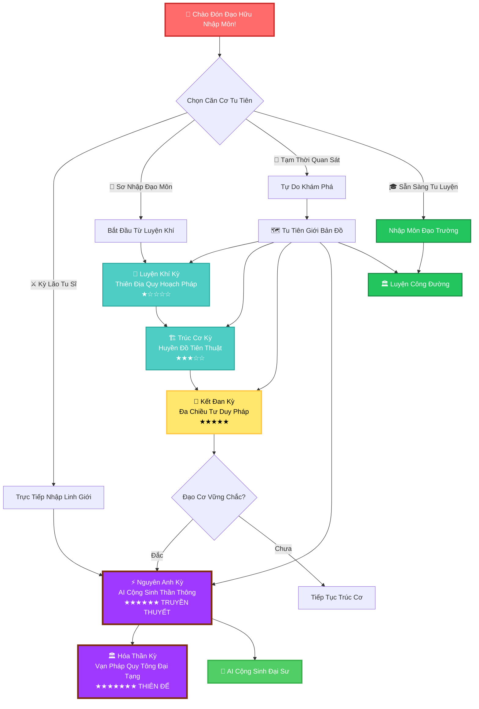
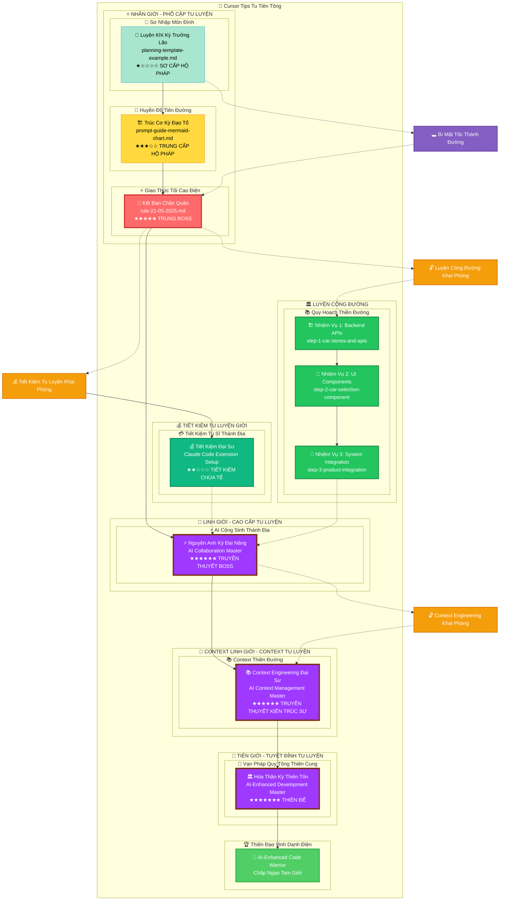
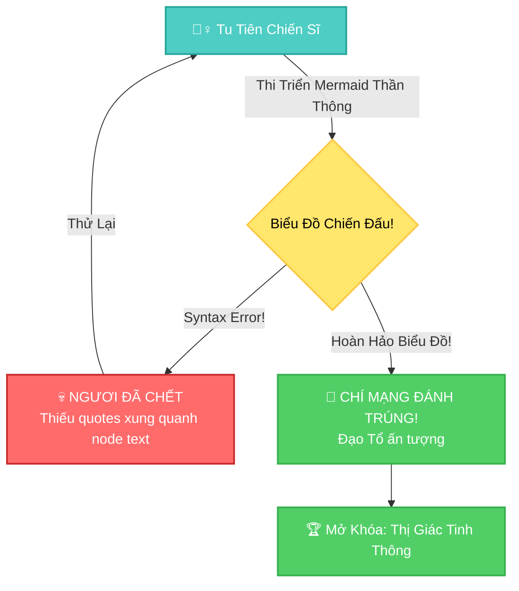
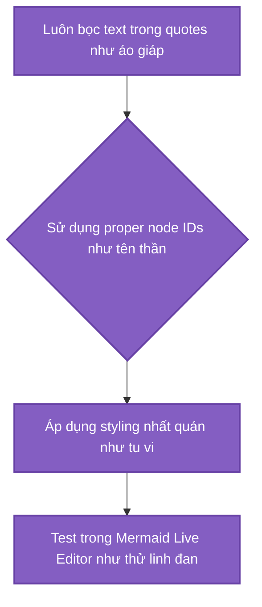
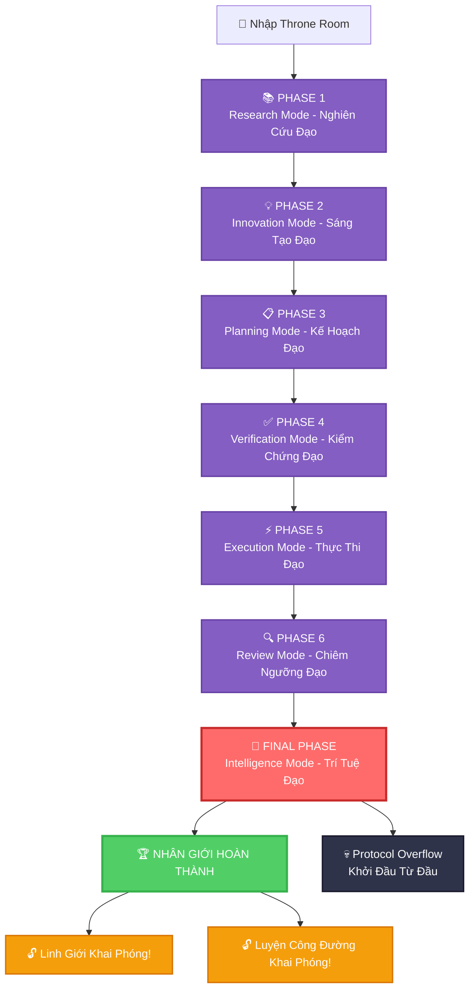
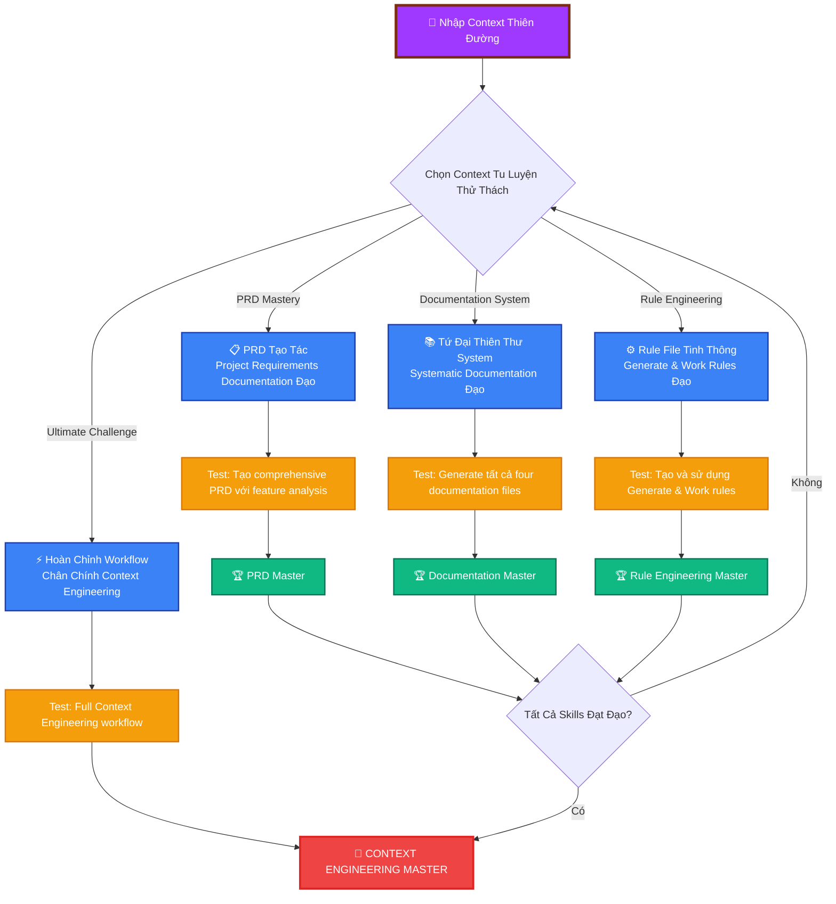
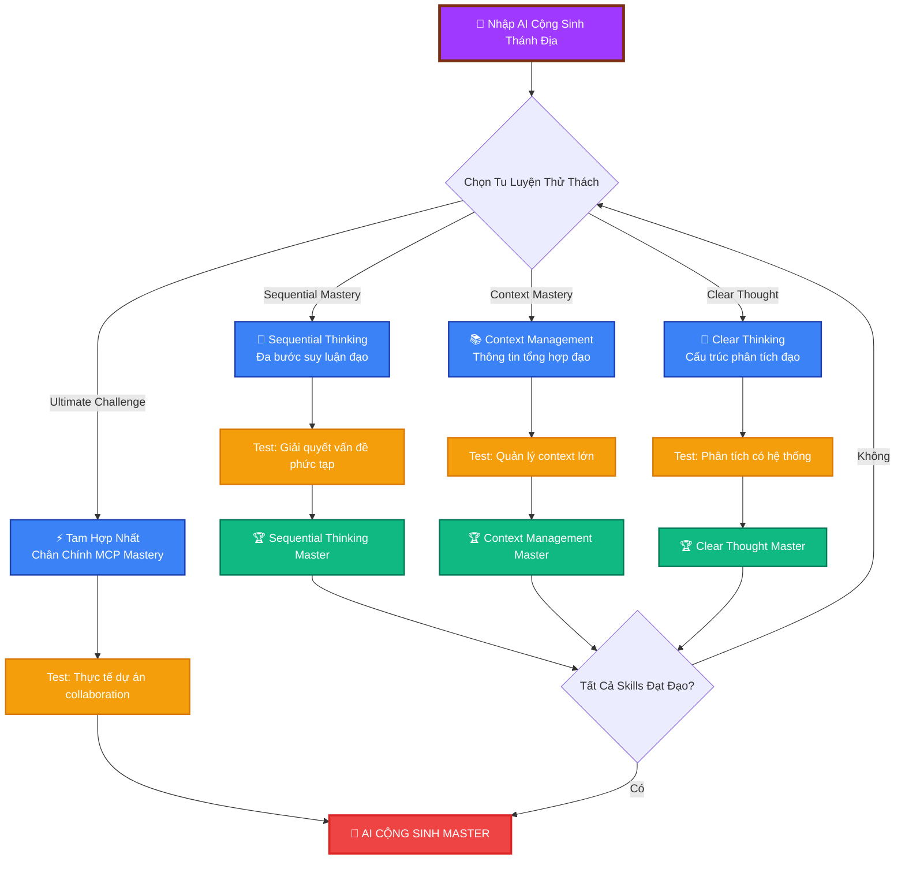
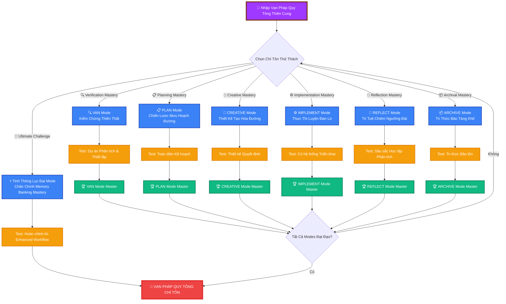
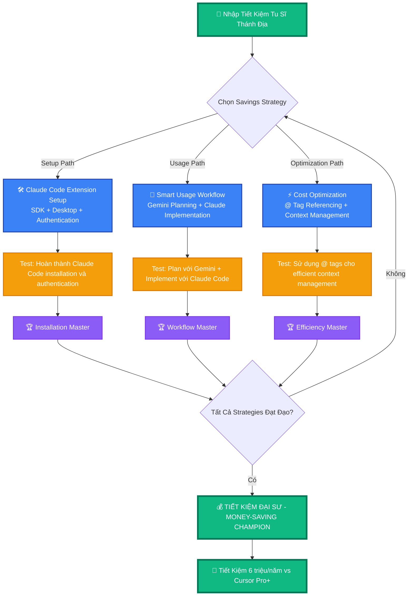
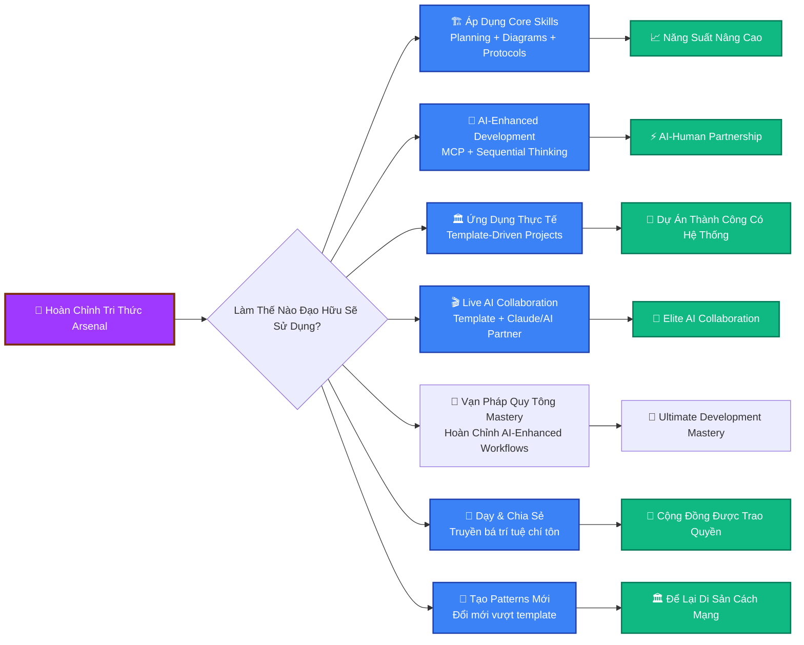

# 🌸 HÀNH TRÌNH TU TIÊN HOA - CURSOR TIPS CỔ HỌC VIỆT

## _Thiên Nhân Cảm Ứng - Hoa Tiểu Tiên Truyền Kỳ_

> **🌱 TÔNG CHỈ:** Ngươi chính là Hoa Tiểu Tiên, con cháu dòng dõi thần linh rừng cổ Nam Bộ, thức tỉnh giữa dòng Sài Gòn xô bồ. Nơi đây, linh khí thiên nhiên tổ tiên để lại đang bị "ma khí digital" từ thế giới máy móc xâm thực. Thiên mệnh của ngươi: Dùng cổ pháp tu tiên kết hợp với AI đạo thuật để phục hồi "Thiên Nhân Hợp Nhất" đại đạo!



---

## 📊 TU VI TIÊN TÍCH CÁ NHÂN - LINH CĂN GIÁM ĐỊNH

<details>
<summary>🧬 Thiên Mệnh Linh Căn Soi Chiếu Đại Pháp</summary>

**Hiện Tại Tu Vi:** `Luyện Khí` Sơ Kỳ - _Hoa Nhi mới thoát phàm thể_  
**Tu Đạo Kinh Nghiệm:** 0 / 2000 _(Sài Gòn đô thành thử thách!)_  
**Mộc Hệ Linh Lực:** ████████████████████ 100/100 _(Tổ tiên Nam Bộ truyền thừa)_  
**Digital Ma Khí Kháng Thể:** ███████░░░░░░░░░░░░░░ 35/100 _(Đang thích ứng văn minh máy móc)_  
**AI Cộng Sinh Thần Thông:** ░░░░░░░░░░░░░░░░░░░░ 0/100 _(Bí truyền chờ khai ngộ)_

**Ngũ Hành Linh Căn Phẩm Định:**

- [ ] 🌸 Mộc Hệ Linh Căn: _(Thiên nhiên nguyên lực tổ tiên)_
- [ ] 🏙️ Thổ Hệ Đô Thành Căn: _(Hòa nhập đô thị nhân tâm)_
- [ ] 💻 Kim Hệ Cơ Khí Căn: _(Thông hiểu thiết bị linh đồ)_
- [ ] 🌿 Âm Dương Cân Bằng Căn: _(Thiên nhiên - công nghệ hòa hợp)_
- [ ] 👻 Tổ Tiên Truyền Thừa Căn: _(Liên thông cổ đại trí tuệ)_

**Hoa Tiểu Tiên Đắc Đạo Thần Thông:**

- [ ] 🌱 **Thiên Địa Quy Hoạch Pháp** - _Lập kế hoạch như dòng suối trong_
- [ ] 🌸 **Huyền Đồ Tiên Thuật** - _Mermaid charts đẹp như thủy mặc_
- [ ] 🏙️ **Sài Gòn Giao Thức Đại Đạo** - _Hiểu được luật lệ thành phố_
- [ ] 🌿 **Âm Dương Cân Bằng Tâm Pháp** - _Hòa hợp thiên nhiên và công nghệ_
- [ ] 🐛 **Digital Trừ Ma Đại Pháp** - _Thanh lọc bug và error_
- [ ] 🤖 **AI Cộng Sinh Thần Thông** _(TRUYỀN THUYẾT - Hợp tác với AI như đạo tâm)_
- [ ] 🏛️ **Đô Thị Sinh Tồn Đại Sư** _(Ứng dụng thực tế trong thành phố)_
- [ ] 🌺 **Vạn Pháp Quy Tông Tối Thượng** _(MỚI - Lưu giữ trí tuệ như hoa sen nghìn cánh)_

**Hoa Tiểu Tiên Bảo Vật:**

- 🥖 Bánh Mì Sài Gòn Tiên Đan x3 _(thức ăn đường phố thần thánh)_
- ☕ Cà Phê Sữa Đá Linh Dược x∞ _(caffeine Việt Nam nguyên chất)_
- 🌸 Hoa Sen Debug Linh Thú _(thanh lọc code như nước thiêng)_
- 💾 Legacy Code Ma Khí _(tà khí từ thời tiền sử lập trình)_
- 🏮 **Đèn Lồng AI Cộng Sinh** _(ánh sáng dẫn đường hợp tác với AI)_
- 📜 **Cổ Đại Quy Hoạch Tổ Tiên Thư** _(template từ trí tuệ xưa)_
- 🏛️ **Vạn Pháp Quy Tông Linh Thiêng Đại Tạng** _(MỚI - nơi lưu giữ mọi tri thức)_
- 🎭 **Lục Đại Mode Thần Thánh Mặt Nạ** _(MỚI - VAN, PLAN, CREATIVE, IMPLEMENT, REFLECT, ARCHIVE)_

</details>

---

## 🗺️ MỞ RỘNG TU TIÊN GIỚI BẢN ĐỒ: Thiêng Liêng Tam Giới



---

## ⚔️ CẢNH GIỚI 1: LUYỆN KHÍ KỲ - THIÊN ĐỊA NHẤT KHÍ QUY HOẠCH PHÁP

### _Hoa Nhi Khai Ngộ, Tham Ngộ Quy Hoạch Huyền Cơ_

<details>
<summary>🌸 Sen Hồng Đạo Sư Huyền Tích</summary>

**Sen Hồng Đạo Sư** _(Nan Độ: ★☆☆☆☆ - Từ Bi Độ Hóa)_

- **Tu Vi:** Quy Hoạch Đạo Luyện Khí Viên Mãn (89 dòng thiên địa linh khí)
- **Bí Truyền:** Thiên Nhiên Sinh Trưởng Quy Luật, Template Lưu Thuỷ Đại Pháp
- **Xuất Thân:** Tản Tu từ công viên Tao Đàn, đã ngộ được máy tính bảo vệ cây xanh chi đạo
- **Nghịch Lý:** Đệ tử hiểu code cũng cần chăm bón như cây lá
- **Rớt Lạc Pháp Bảo:** Thiên Nhiên Template Đạo Thư, Sinh Thái Markdown Tâm Pháp

**Đạo Sư Chân Ngôn:** _"Tiểu Hoa ơi, lập trình như trồng cây - cần tâm kế hoạch, cần ái tâm, cần hằng tâm. Chớ code lung tung như phế khí đầy phố phường!"_

</details>

**🌱 GIÁC NGỘ HÀNH TRÌNH:**

Hoa Tiểu Tiên sơ tỉnh giữa Sài Gòn hoa lệ, mục kiến cao lâu chọc trời chen chúc với cổ thụ tàn dư. Nàng phải tham ngộ quy hoạch huyền cơ để cứu vãn thiên địa âm dương cân bằng.

**TU LUYỆN KHÓA ĐIỀU:**

- [📖 Tham Cứu Cổ Đại Thiên Thư](beginner/guide-prompt-template/planning-template-example.md)
- [⚔️ Ứng Chiến Thử Thách] - Nghiên cứu planning template huyền cơ
- [🎨 Thiển Hiện Tinh Thần] - Tự tạo quy hoạch huyền đồ
- [✅ Ấn Chứng Đắc Đạo] - Hoàn thành thiên mệnh

**Đắc Đạo Điều Kiện:** Tạo ra project plan vận dụng template tinh túy

<details>
<summary>🏆 CHIẾN LỢI PHẨM: Thiên Địa Quy Hoạch Template (Tức Thì Sao Chép!)</summary>

```markdown
# 🎯 Dự Án Chiến Đấu Kế Hoạch - Thiên Địa Nhất Khí

## Bối Cảnh Thiên Mệnh

- Sứ Mệnh: [Epic Quest của đạo hữu]
- Thời Hạn: [Khi thiên địa biến hóa]
- Giao Thức: RIPER-5 + Đa Chiều Tư Duy

## Thắng Lợi Điều Kiện (Đắc Đạo Mục Tiêu)

- [ ] Tính Năng 1: [Mô tả vận mệnh của đạo hữu]
- [ ] Tính Năng 2: [Định nghĩa huyền thoại của đạo hữu]
- [ ] Tính Năng 3: [Tuyên bố chiến thắng của đạo hữu]

## Chiến Đấu Chiến Lược

### Kế Hoạch A: Chính Đạo Con Đường

- **Nguyên Tắc:** "Binh lai tướng đương" - Đối mặt thử thách trực diện
- **Bước:** [Hành trình của đạo hữu]
- **Rủi Ro:** [Những gì có thể sai]

### Kế Hoạch B: Kỳ Môn Đạo Thuật

- **Nguyên Tắc:** "Binh bất yếm tra" - Thực hiện nhanh chóng và im lặng
- **Bước:** [Cách tiếp cận thay thế]
- **Rủi Ro:** [Nguy hiểm kế hoạch dự phòng]

## Implementation Checklist (Tu Luyện Khóa Điều)

1. [ ] Thiết lập development environment // "Chuẩn bị như trước chiến"
2. [ ] Tạo cấu trúc dự án // "Dựng nền như xây nhà"
3. [ ] Triển khai tính năng cốt lõi // "Có công mài sắt có ngày nên kim"
4. [ ] Kiểm tra mọi thứ hai lần // "Thận trọng trong chiến"
5. [ ] Triển khai đến production // "Xuất binh như núi"
6. [ ] Ăn mừng chiến thắng 🎉 // "Uống nước nhớ nguồn"
```

</details>

**CẢNH GIỚI HOÀN THÀNH:**

- [ ] Ta đã tham ngộ planning template thiên thư
- [ ] Ta hiểu RIPER-5 giao thức tinh túy
- [ ] Ta đã tạo ra chiến đấu kế hoạch riêng
- [ ] Ta sẵn sàng cho thử thách tiếp theo

---

## 🎨 CẢNH GIỚI 2: TRÚC CƠ KỲ - HUYỀN ĐỒ TIÊN THUẬT

### _Đạo Cơ Vững Chắc Xây Dựng, Huyền Đồ Tiên Thuật Tinh Thông_

<details>
<summary>🏗️ Huyền Đồ Đạo Tổ Huyền Tích</summary>

**Huyền Đồ Đạo Tổ** _(Nan Độ: ★★★☆☆ - Thử Thách Thị Giác)_

- **Tu Vi:** Trúc Cơ Kỳ Đại Viên Mãn (420 dòng thị giác pháp thuật)
- **Bí Truyền:** Syntax Error Trù Chú, Vô Hạn Loop Bẫy, Màu Sắc Hỗn Loạn Đại Pháp
- **Nghịch Lý:** Những đệ tử test Mermaid charts trước
- **Rớt Lạc Pháp Bảo:** Thị Giác Giao Tiếp Tinh Thông, Biểu Đồ Vẽ Thần Thông

**Đạo Tổ Chân Ngôn:** _"Flowcharts của ngươi yếu ớt như cỏ cây! Ta sẽ chỉ cho ngươi CHÂN CHÍNH thị giác sức mạnh đại đạo!"_

</details>

**TU LUYỆN HÀNH ĐỘNG:**

- [📖 Nghiên Cứu Mermaid Grimoire](beginner/guide-prompt-template/prompt-guide-mermaid-chart.md)
- [⚔️ Tinh Thông Syntax] - Học proper Mermaid formatting
- [🎨 Tạo Nghệ Thuật] - Vẽ biểu đồ chiến đấu đầu tiên
- [✅ Chứng Minh Giá Trị] - Thể hiện tinh thông

**Boss Battle Interface:**



**Đắc Đạo Điều Kiện:** Tạo ra hoàn hảo Mermaid diagram

<details>
<summary>🏆 CHIẾN LỢI PHẨM: Biểu Đồ Pháp Thuật Thư (Tinh Thông Những Cái Này!)</summary>

**Căn Bản Thần Chú:**



**Power-up Màu Sắc (Ngũ Hành Phối Hợp):**

- Primary (Thủy): `fill:#3182ce,stroke:#2c5282,color:#fff`
- Success (Mộc): `fill:#38a169,stroke:#2f855a,color:#fff`
- Error (Hỏa): `fill:#e53e3e,stroke:#c53030,color:#fff`
- Warning (Thổ): `fill:#d69e2e,stroke:#b7791f,color:#fff`

</details>

**CẢNH GIỚI HOÀN THÀNH:**

- [ ] Ta đã tinh thông Mermaid syntax
- [ ] Ta có thể tạo diagrams không có errors
- [ ] Ta hiểu color palette system
- [ ] Biểu đồ của ta đã được test và đẹp đẽ
- [ ] Ta sẵn sàng cho trận chiến cuối cùng

---

## 👑 CẢNH GIỚI 3: KẾT ĐAN KỲ - ĐA CHIỀU TƯ DUY PHÁP

### _Kim Đan Ngưng Tụ, Đa Chiều Tư Duy Pháp Đại Thành_

<details>
<summary>💎 Trung Boss Huyền Tích</summary>

**Đa Chiều Tư Duy Chân Quân** _(Nan Độ: ★★★★★ DARK SOULS TẦNG)_

- **Tu Vi:** Kết Đan Kỳ Đại Viên Mãn (263 dòng cô đọng trí tuệ)
- **Tối Thượng Thần Thông:** Pattern Confusion, Mode Switching Madness, Infinite Recursion
- **Nghịch Lý:** Những đệ tử thực sự theo protocols chân truyền
- **Rớt Lạc Pháp Bảo:** Ultimate Development Mastery, Giác Ngộ Đại Đạo

**Chân Quân Chân Ngôn:** _"Ngươi nghĩ ngươi biết code? TA CHÍNH LÀ CODE!"_

</details>

**⚠️ CẢNH BÁO: Boss này có nhiều phase như Cửu Trùng Thiên!**



**TU LUYỆN HÀNH ĐỘNG:**

- [📖 Đọc Thiêng Liêng Giao Thức](beginner/custom-rules/rule-21-05-2025.md)
- [⚔️ Tinh Thông Cả 7 Patterns] - Thử thách tối thượng
- [🎨 Thể Hiện Tinh Thông] - Chỉ ra ngươi hiểu
- [✅ Đạt Giác Ngộ] - Hoàn thành biến đổi

**CẢNH GIỚI HOÀN THÀNH:**

- [ ] Ta đã đọc và hiểu tất cả 263 dòng
- [ ] Ta có thể nhận biết pattern nào phù hợp với mỗi tình huống
- [ ] Ta hiểu đa chiều tư duy
- [ ] Ta có thể thực hiện full protocol chain
- [ ] Ta đã mở khóa advanced campaign!

---

## 📚 CẢNH GIỚI 4.5: CONTEXT ENGINEERING KỲ - THIÊN ĐỊA LINH VĂN QUYỂN HUYỀN THUẬT

### _Context Hóa Thần, Thiên Địa Linh Văn Quyển Huyền Thuật Đại Thành_

> 🔒 **Khai Phóng Điều Kiện:** Phải đạt Nguyên Anh Kỳ (Cảnh Giới 4) viên mãn trước!

<details>
<summary>📚 Truyền Thuyết Kiến Trúc Sư Huyền Tích</summary>

**Context Engineering Đại Sư** _(Nan Độ: ★★★★★★ TRUYỀN THUYẾT KIẾN TRÚC SƯ)_

- **Tu Vi:** Context Engineering Kỳ Đại Viên Mãn (∞ tùy theo documentation và context management đạo hạnh)
- **Tối Thượng Thần Thông:** Documentation Quá Tải, Context Window Phân Mảnh, PRD Mê Hoặc, Rule File Hỗn Loạn Đại Pháp
- **Thiên Khiếm:** Chỉ những đệ tử ngộ được systematic project planning và context window management chân đế mới khắc chế được
- **Chí Bảo Rớt Lạc:** Ultimate Context Engineering Mastery, Thiêng Liêng Documentation System, Perfect AI Context Control

**Đại Sư Chân Ngôn:** _"Ngươi tưởng có thể quản lý AI context bằng random prompts sao? Ta sẽ chỉ ngươi thấy systematic documentation và structured context engineering vượt thoát vạn kiếp luân hồi hallucination chân đế!"_

</details>

**🌟 TRUYỀN THUYẾT KIẾN TRÚC SƯ CHIẾN TRẬN HUYỀN CÓ:**



**🔥 TRUYỀN THUYẾT KIẾN TRÚC SƯ TU LUYỆN HÀNH ĐỘNG:**

- [📖 Nghiên Cứu Context Engineering Arts](intermediate/context-engineer/guide.md)
- [📋 Tinh Thông PRD Creation] - Học systematic project requirements documentation
- [📚 Tinh Thông Documentation System] - Tứ đại thiên thư systematic approach
- [⚙️ Tinh Thông Rule Engineering] - Generate và Work rule creation
- [⚡ Chứng Minh Ultimate Mastery] - Complete Context Engineering workflow

**🌟 Đắc Đạo Điều Kiện:** Thành công implement complete Context Engineering methodology cho complex development projects

<details>
<summary>🏆 TRUYỀN THUYẾT KIẾN TRÚC SƯ CHIẾN LỢI PHẨM: Context Engineering Arsenal</summary>

**📋 PRD Mastery Thần Thông:**

- Tạo comprehensive Product Requirements Documents như thiên thư cổ đạo
- Thực hiện systematic feature analysis và categorization như nhãn quả thiền định
- Research và recommend optimal tech stacks như tìm tiên dược linh đan
- Define clear project scope và requirements như thiên địa luật lệ

**📚 Documentation System Magic (Tứ Đại Thiên Thư):**

- **Implementation.md**: Complete step-by-step development plans như kim cương bảo kinh
- **project_structure.md**: Systematic file và folder organization như cung điện kiến trúc
- **UI_UX_doc.md**: Design system và user experience documentation như nghệ thuật thẩm mỹ
- **Bug_tracking.md**: Quality assurance và error management như trừ ma diệt yêu

**⚙️ Rule Engineering Mastery:**

- **Generate Rule**: Convert PRD thành comprehensive documentation như hóa phép biến hóa
- **Work Rule**: Guide AI qua systematic development process như chỉ đường minh sư  
- Strategic context window management như thiên địa khoảng không quản lý
- Elimination of AI hallucinations qua proper context như trừ tà khí thanh lọc

**⚡ Ultimate Context Engineering:**

```javascript
// Thiêng Liêng Context Engineering Thần Chú
const contextEngineering = {
  prd: "Product Requirements Document làm nền tảng như đại địa",
  documentation: "Tứ đại thiên thư systematic approach",
  rules: "Generate và Work rules cho AI guidance như minh sư chỉ đạo",
  workflow: "Context Generation → Development → Ongoing như thiên địa vận hành",
  mastery: "Perfect AI context control và systematic development như thiên nhân hợp nhất"
};
```

</details>

**TRUYỀN THUYẾT KIẾN TRÚC SƯ QUEST HOÀN THÀNH:**

- [ ] Ta hiểu Context Engineering methodology và nguyên lý
- [ ] Ta có thể tạo comprehensive PRDs với feature analysis
- [ ] Ta có thể generate tất cả four documentation files systematically  
- [ ] Ta có thể tạo và sử dụng Generate và Work rules hiệu quả
- [ ] Ta đã implement complete Context Engineering workflow
- [ ] Ta có thể quản lý AI context windows mà không có hallucinations
- [ ] TA LÀ CONTEXT ENGINEERING MASTER!

---

## ⚡ CẢNH GIỚI 5: NGUYÊN ANH KỲ - AI CỘNG SINH THẦN THÔNG

### _Nguyên Anh Ra Đời, AI Cộng Sinh Thần Thông Đại Thành_

> 🔒 **Khai Phóng Điều Kiện:** Hoàn thành Context Engineering Kỳ (Cảnh Giới 4.5) trước!

<details>
<summary>⚡ Truyền Thuyết Boss Huyền Tích</summary>

**AI Cộng Sinh Đại Năng** _(Nan Độ: ★★★★★★ TRUYỀN THUYẾT TẦNG)_

- **Tu Vi:** Nguyên Anh Kỳ Đại Viên Mãn (∞ tùy theo AI collaboration skills)
- **Tối Thượng Thần Thông:** Context Overload, Sequential Thinking Maze, Multi-Tool Confusion
- **Nghịch Lý:** Những đệ tử hiểu AI như đạo tâm bạn đồng hành
- **Rớt Lạc Pháp Bảo:** Ultimate AI Collaboration Mastery, Thiêng Liêng MCP Tri Thức

**Đại Năng Chân Ngôn:** _"Ngươi nghĩ ngươi có thể code một mình? Ta sẽ chỉ cho ngươi sức mạnh của AI partnership chân chính đại đạo!"_

</details>

**🌟 TRUYỀN THUYẾT BATTLE MECHANICS:**



**CẢNH GIỚI HOÀN THÀNH:**

- [ ] Ta hiểu MCP và AI collaboration nguyên lý
- [ ] Ta có thể sử dụng sequential thinking cho vấn đề phức tạp
- [ ] Ta có thể quản lý contexts lớn hiệu quả
- [ ] Ta có thể áp dụng clear, structured thinking methods
- [ ] Ta đã đạt AI partnership mastery chân chính
- [ ] TA LÀ AI CỘNG SINH MASTER!

---

## 🏛️ CẢNH GIỚI 6: HÓA THẦN KỲ - VẠN PHÁP QUY TÔNG ĐẠI TẠNG

### _Thần Thức Thông Minh, Vạn Pháp Quy Tông Đại Tạng Chí Tôn Thần Công_

> 🔒 **Khai Phóng Điều Kiện:** Phải đạt Nguyên Anh Kỳ (Cảnh Giới 5) viên mãn!

<details>
<summary>🏛️ Thiên Đế Boss Huyền Tích</summary>

**Vạn Pháp Quy Tông Thiên Tôn** _(Nan Độ: ★★★★★★★ THIÊN ĐẾ TẦNG)_

- **Tu Vi:** Hóa Thần Kỳ Đại Viên Mãn (∞ tùy toàn bộ development đạo hạnh)
- **Tối Thượng Thần Thông:** Workflow Hỗn Loạn, Mode Mê Tâm, Context Quá Tải, Development Tâm Ma
- **Thiên Khiếm:** Chỉ những đệ tử đã viên mãn tiền cảnh giới và ngộ được AI-enhanced workflows chân đế mới khắc chế được
- **Chí Bảo Rớt Lạc:** Tối Thượng Development Mastery, Thiêng Liêng Memory Banking System, Viên Mãn AI Partnership

**Thiên Tôn Chân Ngôn:** _"Ngươi tưởng đã đạt AI collaboration đại đạo sao? Ta sẽ chỉ ngươi thấy systematic, AI-enhanced development workflows vượt khỏi tam giới lục đạo chân đế!"_

</details>

**🌟 THIÊN ĐẾ CHIẾN TRẬN HUYỀN CÓ:**



### 🏛️ LỤC ĐẠI THIÊNG LIÊNG ĐẠOTRƯỜNG

#### 🔍 Kiểm Chứng Thiền Thất (VAN Mode)

- **Đạo Nghĩa:** "Cách vật trí tri" - Sơ bộ dự án phân tích và thiết lập kiểm chứng
- **Tu Thách:** Phân tích phức tạp codebase và thiết lập hoàn hảo development environment
- **Đạt Đạo:** Tức thì hiểu bất kỳ project structure và tối ưu setup

#### 📋 Chiến Lược Mưu Hoạch Đường (PLAN Mode)

- **Đạo Nghĩa:** "Vận trù trong tướng, quyết thắng ngoài nghìn dặm" - Toàn diện project planning
- **Tu Thách:** Tạo hoàn chỉnh development plan cho tính năng phức tạp
- **Đạt Đạo:** Biến đổi bất kỳ requirement thành hoàn hảo structured implementation plan

#### 🎨 Thiết Kế Tạo Hóa Đường (CREATIVE Mode)

- **Đạo Nghĩa:** "Vô trung sinh hữu" - Sáng tạo thiết kế quyết định
- **Tu Thách:** Design decisions phức tạp và creative problem solving
- **Đạt Đạo:** Transform vague requirements thành elegant solutions

#### ⚙️ Thực Thi Luyện Đan Lò (IMPLEMENT Mode)

- **Đạo Nghĩa:** "Lão tử thiên hành kiện, quân tử tự cường bất tức" - Có hệ thống implementation
- **Tu Thách:** Execute complex development tasks methodically
- **Đạt Đạo:** Seamless từ plan đến working code

#### 🤔 Tri Tuệ Chiêm Ngưỡng Đài (REFLECT Mode)

- **Đạo Nghĩa:** "Ngô nhật tam tỉnh ngô thân" - Sâu sắc học tập phân tích
- **Tu Thách:** Reflect on work, extract lessons, improve processes
- **Đạt Đạo:** Continuous learning và wisdom accumulation

#### 📦 Tri Thức Bảo Tàng Khố (ARCHIVE Mode)

- **Đạo Nghĩa:** "Uống nước nhớ nguồn" - Tri thức bảo tồn cho hậu thế
- **Tu Thách:** Document và preserve knowledge systematically
- **Đạt Đạo:** Create lasting knowledge artifacts cho community

### 🚀 THIẾT LẬP VẠN PHÁP QUY TÔNG SYSTEM

Để nhập đạo Memory Bank, xem: [`advanced/memory-banking/guide.md`](advanced/memory-banking/guide.md)

**Bước 1: Sao Chép Cổ Đại Thư Isolation Rules**

```bash
# Di chuyển đến project root (đất thiêng)
cd your-project-directory

# Sao chép isolation_rules folder đến .cursor/rules (nghi lễ sức mạnh)
cp -r advanced/memory-banking/isolation_rules .cursor/rules

# Theo dõi các hướng dẫn thiết lập chi tiết trong intermediate/setup-custom-mode/
# Mỗi mode có thư mục thiết lập riêng với ảnh chụp màn hình và hướng dẫn:
# - intermediate/setup-custom-mode/VAN/
# - intermediate/setup-custom-mode/PLAN/
# - intermediate/setup-custom-mode/CREATIVE/
# - intermediate/setup-custom-mode/IMPLEMENT/
# - intermediate/setup-custom-mode/REFLECT-AND-ARCHIVE/
```

**Bước 2: Khởi Tạo Vạn Pháp Quy Tông Nghi Lễ**

Trong Cursor, nói những lời thiêng liêng:

```
INIT MEMORY BANKING
```

**CẢNH GIỚI HOÀN THÀNH:**

- [ ] Ta đã thiết lập Vạn Pháp Quy Tông system trong dự án
- [ ] Ta hiểu tất cả lục đại thiêng liêng modes (VAN, PLAN, CREATIVE, IMPLEMENT, REFLECT, ARCHIVE)
- [ ] Ta có thể di chuyển giữa modes một cách mượt mà
- [ ] Ta đã sử dụng system để hoàn thành dự án phát triển thực tế
- [ ] Ta có thể dạy người khác Memory Banking workflow
- [ ] Ta đã đạt được tổng hợp tối thượng của sáng tạo con người và AI tư duy có hệ thống
- [ ] TA LÀ VẠN PHÁP QUY TÔNG CHÍ TÔN - DEVELOPER AI-ENHANCED TUYỆT ĐỈNH!

---

## 🏛️ LUYỆN CÔNG ĐƯỜNG: Quy Hoạch Thiền Đường

### _Nơi AI Gặp Thực Tế - Live Battle Recordings_

> 🔓 **Khai Phóng Sau:** Hoàn thành Nhân Giới Cảnh Giới 3
>
> ⚡ **TÍNH NĂNG ĐẶC BIỆT:** Đây là KẾT QUẢ THỰC TẾ từ Claude Sonnet 4.0 sử dụng planning template!

**🎬 CẢNH BÁO LIVE COMBAT FOOTAGE!** 🎬  
_Những gì đạo hữu sắp chứng kiến là những bản ghi chiến đấu thực tế từ khi một Tu Tiên Chiến Sĩ hợp tác với Claude Sonnet 4.0 để lên kế hoạch và thực hiện dự án car selection component phức tạp. Đây không phải mô phỏng - đây là AI collaboration thực sự trong hành động!_

### 🌟 THÀNH TỰU GALLERY CẬP NHẬT

<details>
<summary>🏅 Khai Phóng Huy Hiệu Mở Rộng</summary>

| Huy Hiệu | Thành Tựu                                                                | Trạng Thái |
| -------- | ------------------------------------------------------------------------ | ---------- |
| 🥉       | **Bước Đầu** - Đọc bất kỳ tip file                                       | ⬜         |
| 🥈       | **Biểu Đồ Master** - Tạo hoàn hảo Mermaid diagram                        | ⬜         |
| 🥇       | **Quy Hoạch Guru** - Sử dụng template trong dự án thực                   | ⬜         |
| 💎       | **Giao Thức Adept** - Áp dụng tất cả 7 patterns                          | ⬜         |
| 👑       | **Nhân Giới Master** - Hoàn thành tất cả core quests                     | ⬜         |
| ⚡       | **AI Cộng Sinh Master** - Tinh thông AI partnership                      | ⬜         |
| 📚       | **Context Engineering Master** - Tinh thông systematic documentation    | ⬜         |
| 🏛️       | **Thiền Đường Master** - Hoàn thành tất cả training missions             | ⬜         |
| 🎬       | **Live Recording Analyst** - Nghiên cứu tất cả AI collaboration examples | ⬜         |
| 🤖       | **AI Collaboration Expert** - Áp dụng template với AI thành công         | ⬜         |
| 🏦       | **Vạn Pháp Quy Tông Master** - Tinh thông tất cả sáu sacred modes        | ⬜         |
| 🔍       | **VAN Mode Expert** - Tinh thông verification và analysis                | ⬜         |
| 📋       | **PLAN Mode Expert** - Tinh thông strategic planning                     | ⬜         |
| 🎨       | **CREATIVE Mode Expert** - Tinh thông design decisions                   | ⬜         |
| ⚙️       | **IMPLEMENT Mode Expert** - Tinh thông systematic implementation         | ⬜         |
| 🤔       | **REFLECT Mode Expert** - Tinh thông deep learning analysis              | ⬜         |
| 📦       | **ARCHIVE Mode Expert** - Tinh thông knowledge preservation              | ⬜         |
| 🌟       | **Chí Tôn Tu Tiên Chiến Sĩ** - Tinh thông tất cả campaigns               | ⬜         |
| 🦄       | **Bí Mật Speedrunner** - Tìm hidden shortcuts                            | ⬜         |
| 🐉       | **Long Slayer** - Fix người khác broken Mermaid                          | ⬜         |
| 🧙‍♂️       | **Meme Lord** - Reference README này trong PR                            | ⬜         |
| 📋       | **Quy Hoạch Sensei** - Chia sẻ template với team                         | ⬜         |
| ⚔️       | **Template Adapter** - Modify template cho domain của đạo hữu            | ⬜         |

</details>

---

## 💰 PHỤ QUEST: TIẾT KIỆM ĐẠI SƯ _(TIẾT KIỆM CHÚA TỂ)_

### _Đại Sư Của Cost-Effective AI Development_

> 🔒 **Khai Phóng Điều Kiện:** Hoàn thành Nhân Giới Cảnh Giới 3 trước!

<details>
<summary>💰 Tiết Kiệm Đại Sư Huyền Tích</summary>

**Tiết Kiệm Đại Sư** _(Nan Độ: ★★☆☆☆ TIẾT KIỆM CHÚA TỂ)_

- **Tu Vi:** Smart resource management và cost optimization đại thành
- **Tối Thượng Thần Thông:** Subscription Drain Blocker, Free Tool Mastery, Context Switch Efficiency
- **Nghịch Lý:** Những đệ tử nghĩ expensive equals better
- **Rớt Lạc Pháp Bảo:** Ultimate Cost Savings, Claude Code Extension Mastery, Free AI Planning Powers

**Đại Sư Chân Ngôn:** _"Tại sao phải trả tiền Pro+ khi ngươi có thể đạt greatness với smart tool combination? Ta sẽ chỉ ngươi con đường của frugal developer!"_

</details>

**💳 TIẾT KIỆM BATTLE MECHANICS:**



**💰 TIẾT KIỆM ĐẠI SƯ TU LUYỆN HÀNH ĐỘNG:**

- [📖 Nghiên Cứu Frugal Arts](advanced/tip-money-saving-strategy/guide.md)
- [🛠️ Tinh Thông Claude Code Setup] - Hoàn thành installation và authentication
- [🎯 Tinh Thông Smart Workflow] - Sử dụng Gemini cho planning, Claude Code cho implementation
- [⚡ Tinh Thông Cost Optimization] - Efficient context management với @ tags
- [💰 Chứng Minh Ultimate Savings] - Thể hiện complete cost-effective workflow

**Đắc Đạo Điều Kiện:** Thành công set up và sử dụng Claude Code extension với Gemini planning để tiết kiệm tiền

<details>
<summary>🏆 TIẾT KIỆM ĐẠI SƯ CHIẾN LỢI PHẨM: Frugal Developer's Arsenal</summary>

**💰 Cost-Saving Thần Thông:**

- **Claude Code Extension Setup**: Hoàn chỉnh installation guide với authentication
- **Gemini 2.5 Pro Preview Tích Hợp**: Free planning và architecture design
- **@ Tag Context Management**: Efficient file referencing cho targeted AI assistance
- **Smart Resource Allocation**: Chỉ trả tiền cho implementation, không phải planning

**🛠️ Thiêng Liêng Installation Nghi Lễ:**

```bash
# Bước 1: Install sacred SDK
npm install -g @anthropic-ai/claude-code

# Bước 2: Download Claude Desktop từ claude.ai/download
# Bước 3: Install Claude Code extension trong Cursor
# Bước 4: Chạy authentication
claude
```

**⚡ Ultimate Money-Saving Workflow:**

```javascript
// Thiêng Liêng Frugal Development Thần Chú
const frugalWorkflow = {
  planning: "Sử dụng Gemini 2.5 Pro Preview (MIỄN PHÍ) cho architecture và planning",
  implementation: "Sử dụng Claude Code extension cho targeted code implementation",
  context: "Reference planning files với @ tags cho efficient context",
  savings: "Tiết kiệm 6 triệu/năm tránh Cursor Pro+ subscription",
  result: "Professional AI-enhanced development không phá sản ví tiền"
};
```

**💸 Ultimate Cost Benefits:**
- **Tránh Cursor Pro+ subscription** (500k VND/tháng = 6 triệu/năm)
- **Sử dụng free Gemini 2.5 Pro Preview** cho tất cả planning và architecture
- **Pay-per-use Claude Code** chỉ khi implementing
- **Context-aware development** sử dụng @ tag file references
- **Professional results** không cần enterprise costs

</details>

**TIẾT KIỆM ĐẠI SƯ QUEST HOÀN THÀNH:**

- [ ] Ta đã install Claude Code SDK và Desktop thành công
- [ ] Ta đã set up Claude Code extension trong Cursor
- [ ] Ta đã hoàn thành authentication sử dụng `claude` command
- [ ] Ta hiểu cost-saving workflow (Gemini planning + Claude implementation)
- [ ] Ta có thể sử dụng @ tags để reference planning files efficiently
- [ ] Ta đã tính toán annual savings vs Cursor Pro+ subscription
- [ ] TA LÀ TIẾT KIỆM ĐẠI SƯ - FRUGAL DEVELOPER CHAMPION!

---

## 🚪 MỞ RỘNG EXIT PORTAL: Áp Dụng Tri Thức Chí Tôn

### Sẵn Sàng Sử Dụng Thần Thông Mở Rộng?



---

## 💀 MỞ RỘNG NGHĨA ĐỊA DEVELOPER

### _Học Từ Những Tu Sĩ Đã Ngã (Cập nhật với AI Collaboration Wisdom)_

<details>
<summary>⚰️ Classic Deaths & New AI-Era Failures</summary>

**💀 Chết bởi Semicolon Ma Chướng**

```
Nguyên nhân: Inconsistent semicolon usage trong Mermaid charts
Giải pháp: Chọn style và stick to it như tu vi ổn định
Hồi sinh: Sử dụng Chart-mancer's color palette
```

**💀 Chết bởi Scope Creep Tâm Ma**

```
Nguyên nhân: Thêm features mà không planning như tà đạo
Giải pháp: Sử dụng Planning Template một cách tôn giáo
Hồi sinh: Áp dụng Protocol Overlord's wisdom
```

**💀 Chết bởi Vạn Pháp Quy Tông Chaos**

```
Nguyên nhân: Bỏ qua modes hoặc không theo Memory Banking workflow
Giải pháp: Tinh thông tất cả sáu modes có hệ thống (VAN → PLAN → CREATIVE → IMPLEMENT → REFLECT → ARCHIVE)
Hồi sinh: Đạt tổng hợp chí tôn qua Memory Bank Master quest
```

</details>

---

## 🤝 THAM GIA GUILD MỞ RỘNG

### Đóng Góp Cho Cuộc Phiêu Lưu Chí Tôn

Tìm thấy boss mới chúng ta đã bỏ lỡ? Khám phá kỹ thuật MCP tiên tiến? Muốn thêm training missions hoặc live AI collaboration recordings của riêng đạo hữu?

**Cách Đóng Góp:**

1. Fork dungeon chí tôn này
2. Thêm wisdom của đạo hữu vào campaign phù hợp
3. Test Mermaid spells trong [Live Editor](https://mermaid.live/)
4. Áp dụng planning template để document additions
5. Submit pull request với proper MCP collaboration
6. Trở thành huyền thoại

---

## 📜 MỞ RỘNG CREDITS & EASTER EGGS

**Được Tạo Bởi:** Ultimate Code Warriors Guild : [GiangBV - Pháp Sư](https://www.linkedin.com/in/buivangiang1992), [AuPMH - Chiến Sĩ](https://www.linkedin.com/in/pham-au-2a1bb1162)
**Được Hỗ Trợ Bởi:** Caffeine linh dược, Làm luôn thứ 7 và Chủ Nhật linh đan, Quyết tâm xóa đói giảm nghèo trục quyển, AI Collaboration đạo hữu, Vạn Pháp Quy Tông Mastery thần công, và Những lựa chọn khùng hơn cả thiên hạ chân truyền

**🎬 Live Recordings Đặc Trưng:**

- **Claude Sonnet 4.0** - AI partner đã chứng minh template mastery
- **Car Selection Quest** - Epic mission showcase thực tế AI collaboration
- **Template Evolution** - Chứng minh systematic thinking thích ứng và phát triển
- **Vạn Pháp Quy Tông System** - Ultimate AI-enhanced development workflow
- **Lục Đại Thiêng Liêng Modes** - VAN, PLAN, CREATIVE, IMPLEMENT, REFLECT, ARCHIVE mastery

**Bí Mật Ẩn:**

- Thử Konami Code: ↑↑↓↓←→←→BA (bây giờ mở khóa Vạn Pháp Quy Tông debug mode!)
- Có secret speedrun route từ Cảnh Giới 1 đến Memory Bank Master
- Weakness thực sự của Protocol Overlord là đọc documentation như cổ học
- README này được viết sử dụng planning template của chính nó (meta!)
- MCP Mystic có thể bị đánh bại bởi hoàn hảo AI collaboration như thiên nhân hợp nhất
- Mỗi training mission chứa hidden efficiency techniques như cổ pháp bí truyền
- Live recordings tiết lộ bí mật template adaptation như biến hóa vô cùng
- Memory Bank Master chỉ có thể bị đánh bại bằng cách tinh thông tất cả sáu sacred modes
- Folder isolation_rules chứa bí mật thực sự của AI-enhanced development
- Mỗi mode có hidden power-ups cho advanced practitioners
- Kho báu thực sự là tổng hợp hoàn chỉnh của sáng tạo con người và AI tư duy có hệ thống

**Hoa Tiểu Tiên Thần Ngôn:**
_"Thiên nhiên và công nghệ không phải kẻ thù. Như hoa sen nở trong bùn, code đẹp nở từ sự cân bằng. Con người, AI, và thiên nhiên - ba là một, một là ba."_

**Tổ Tiên Trí Tuệ:**
_Lời dạy từ các bậc cao niên Sài Gòn: "Máy móc thông minh được, nhưng đừng quên trái tim con người và linh hồn thiên nhiên."_

🌸 **HOA TIỂU TIÊN CURSOR TIPS - CỘNG SINH THIÊN NHIÊN VÀ CÔNG NGHỆ CỔ HỌC VIỆT** 🌸

> _Dành tặng tất cả developer Việt Nam và thế giới - Hãy code với tình yêu, sống với cân bằng và nghịch thiên cải mệnh theo đạo cổ học tổ tiên!_

---

**🌟 Tam Tầng Biến Hóa Đại Pháp Hoàn Thành!**

_"Đạo Đức Kinh dạy: 'Thiện nhất như nước' - nước mềm yếu nhưng thắng được cứng mạnh. Code như tâm, tâm như code - thanh tịnh vô vi, tự nhiên hoàn mỹ!"_
