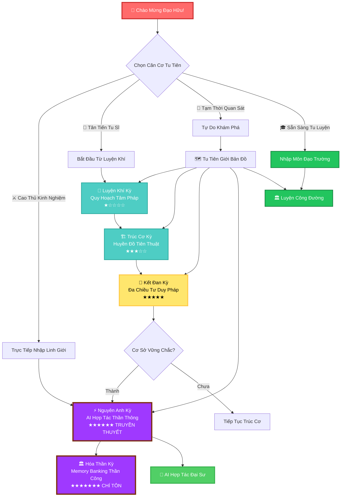
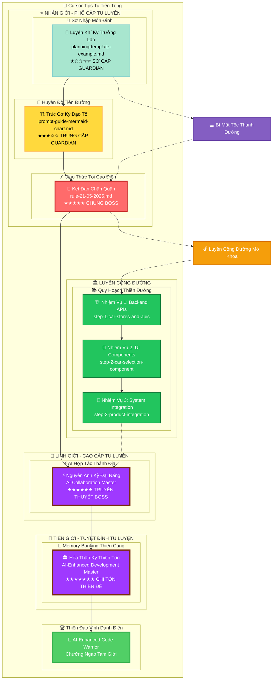
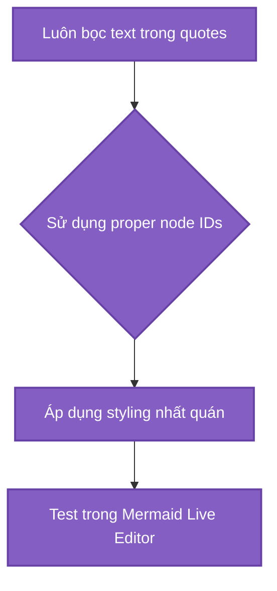
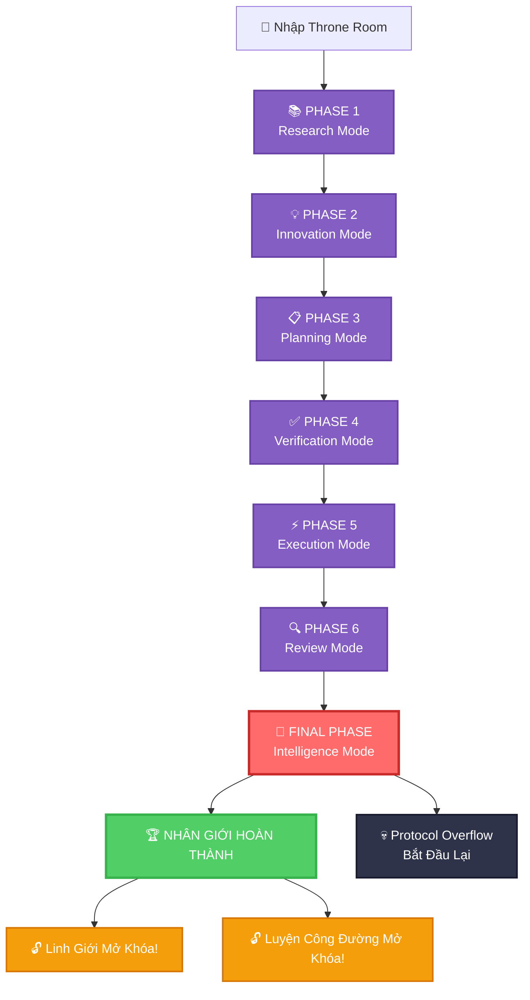
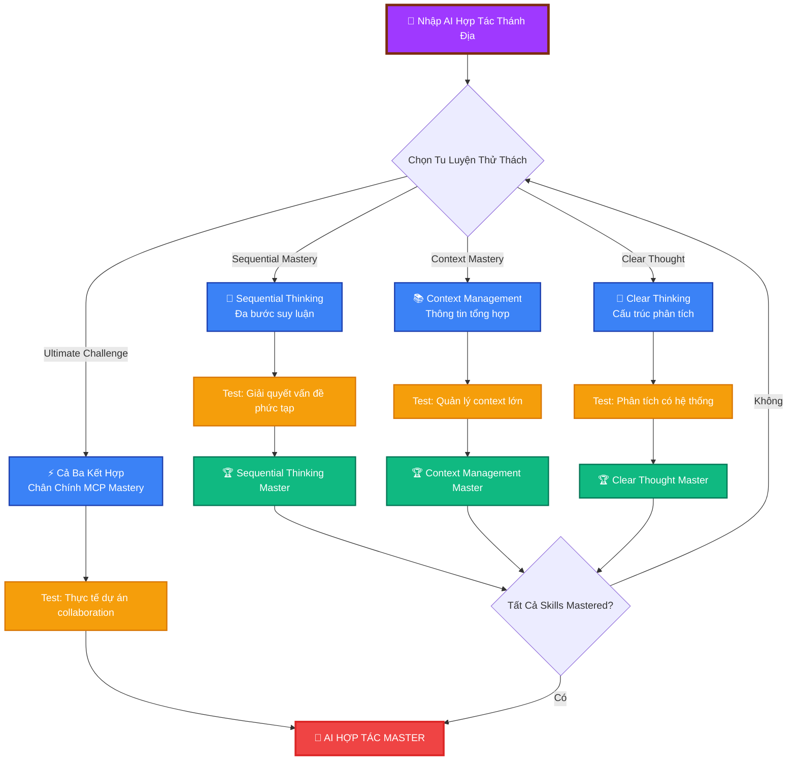
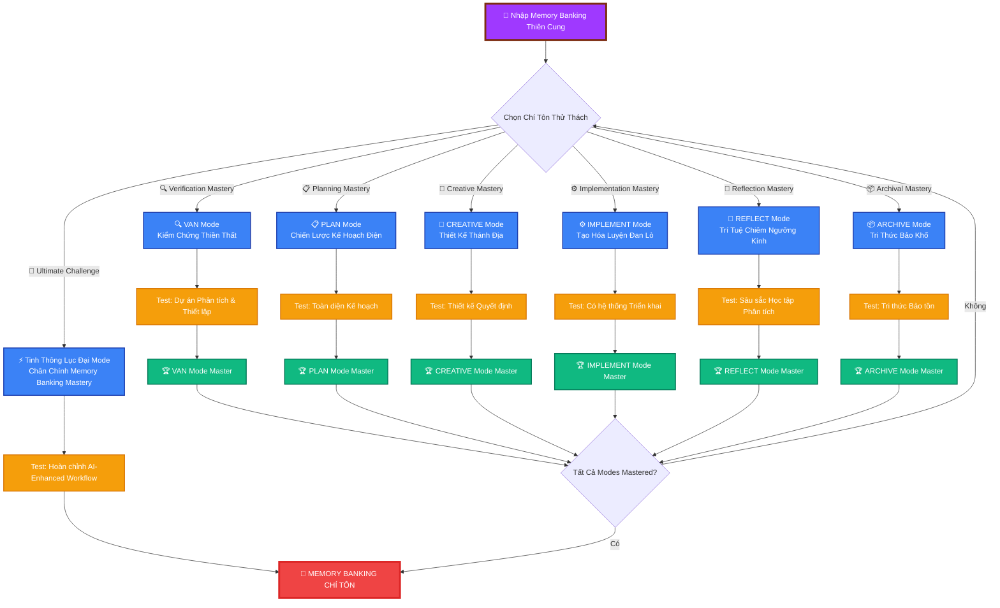
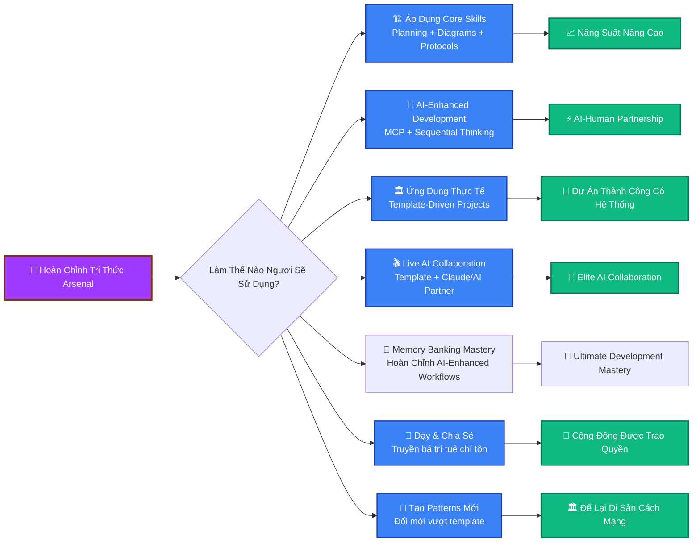

# 🔥 HÀNH TRÌNH TU TIÊN CURSOR TIPS

## _Thiên Hạ Đệ Nhất Tu Tiên IDE - Con Đường Thành Đạo_



---

## 📊 TU VI THỐNG KÊ CÁ NHÂN

<details>
<summary>🧬 Linh Căn Phân Tích Hệ Thống</summary>

**Hiện Tại Tu Vi:** `Luyện Khí` Sơ Kỳ  
**Tu Tiên Kinh Nghiệm:** 0 / 2000 _(mở rộng cho nội dung mới!)_  
**Linh Lực:** ████████████████████ 100/100  
**Tâm Tính:** ███████░░░░░░░░░░░░░░ 35/100 _(hoàn toàn bình thường cho lập trình viên)_  
**AI Hợp Tác:** ░░░░░░░░░░░░░░░░░░░░ 0/100 _(mở khóa ở cảnh giới cao)_

**Linh Căn Thuộc Tính:**

- [ ] 🔥 Hỏa Linh Căn: _(Tốc độ lập trình)_
- [ ] 💧 Thủy Linh Căn: _(Linh hoạt thích ứng)_
- [ ] 🌍 Thổ Linh Căn: _(Nền tảng vững chắc)_
- [ ] 🌪️ Phong Linh Căn: _(Tư duy nhanh nhạy)_
- [ ] ⚡ Lôi Linh Căn: _(Sức mạnh đột phá)_

**Đã Lĩnh Ngộ Thần Thông:**

- [ ] 📋 Quy Hoạch Tâm Pháp Đại Thành
- [ ] 🎨 Mermaid Huyền Thuật Tinh Thông
- [ ] 🤖 Giao Thức Đại Đạo Lĩnh Ngộ
- [ ] 🔥 Đa Chiều Tư Duy Thần Công
- [ ] 💀 Debug Trừ Ma Đại Pháp
- [ ] ⚡ **AI Hợp Tác Thần Thông** _(TRUYỀN THUYẾT)_
- [ ] 🏛️ **Thực Chiến Ứng Dụng Đại Sư** _(THỰC DỤNG CHÂN QUYỀN)_
- [ ] 🏦 **Memory Banking Chí Cao Thần Công** _(MỚI - CHUYỆT KỸ TUYỆT ĐỈNH)_

**Linh Khí Kho Tàng:**

- 🍕 Khẩn Cấp Pizza x3
- ☕ Caffeine Tiên Đan x∞
- 🐛 Cao Su Vịt Debug _(linh khí cổ vật)_
- 💾 Legacy Code Thám Tri Khí _(tà khí vật phẩm)_
- 🤖 **AI Hợp Tác Linh Châu** _(mở khóa MCP thần thông)_
- 📋 **Đại Sư Quy Hoạch Thiên Thư** _(chứa cổ đại template)_
- 🏦 **Memory Banking Hệ Thống** _(MỚI - chuyệt kỹ tuyệt đỉnh framework)_
- ⚙️ **Cô Lập Quy Tắc Cổ Tịch** _(MỚI - chứa lục đại thiêng liêng mode)_

</details>

---

## 🗺️ MỞ RỘNG TU TIÊN GIỚI BẢN ĐỒ: Thiêng Liêng Tam Giới



---

## ⚔️ CẢNH GIỚI 1: LUYỆN KHÍ KỲ - QUY HOẠCH TÂM PHÁP

### _Sơ Nhập Tu Tiên Chi Môn, Quy Hoạch Tâm Pháp Lĩnh Ngộ_

<details>
<summary>🌟 Trưởng Lão Tình Báo</summary>

**Quy Hoạch Trưởng Lão** _(Difficulty: ★☆☆☆☆)_

- **Tu Vi:** Luyện Khí Kỳ Đại Viên Mãn (89 dòng thiên cơ cảm ngộ)
- **Thần Thông:** Tổ Chức Áp Đảo Thuật, Template Lốc Xoáy Đại Pháp
- **Yếu Điểm:** Những đệ tử thực sự đọc documentation
- **Rơi Rớt Vật Phẩm:** Quy Hoạch Template Tinh Thông, Markdown Võ Học

**Trưởng Lão Tuyên Ngôn:** _"Không có quy hoạch, không thể lập trình, tiểu sư đệ!"_

</details>

**TU LUYỆN HÀNH ĐỘNG:**

- [📖 Tham Ngộ Cổ Đại Thiên Thư](planning-template-example.md)
- [⚔️ Thách Đấu Chấp Nhận] - Nghiên cứu planning template
- [🎨 Tinh Thần Hiện Hình] - Tạo ra sơ đồ quy hoạch riêng
- [✅ Đánh Dấu Đã Đánh Bại] - Hoàn thành nhiệm vụ

**Thành Công Điều Kiện:** Tạo ra project plan sử dụng template

<details>
<summary>🏆 CHIẾN LỢI PHẨM: Quy Hoạch Template (Sao chép ngay!)</summary>

```markdown
# 🎯 Dự Án Chiến Đấu Kế Hoạch

## Bối Cảnh

- Sứ Mệnh: [Epic Quest của bạn ở đây]
- Thời Hạn: [Khi thế giới kết thúc]
- Giao Thức: RIPER-5 + Đa Chiều Tư Duy

## Thắng Lợi Điều Kiện

- [ ] Tính Năng 1: [Mô tả vận mệnh của bạn]
- [ ] Tính Năng 2: [Định nghĩa huyền thoại của bạn]
- [ ] Tính Năng 3: [Tuyên bố chiến thắng của bạn]

## Chiến Đấu Chiến Lược

### Kế Hoạch A: Con Đường Anh Hùng

- **Nguyên Tắc:** Đối mặt thử thách trực diện
- **Bước:** [Hành trình của bạn ở đây]
- **Rủi Ro:** [Những gì có thể sai]

### Kế Hoạch B: Ninja Route

- **Nguyên Tắc:** Thực hiện nhanh chóng và im lặng
- **Bước:** [Cách tiếp cận thay thế]
- **Rủi Ro:** [Nguy hiểm kế hoạch dự phòng]

## Implementation Checklist

1. [ ] Thiết lập môi trường phát triển
2. [ ] Tạo cấu trúc dự án
3. [ ] Triển khai tính năng cốt lõi
4. [ ] Kiểm tra mọi thứ hai lần
5. [ ] Triển khai đến production
6. [ ] Ăn mừng chiến thắng 🎉
```

</details>

**CẢNH GIỚI HOÀN THÀNH:**

- [ ] Ta đã tham ngộ planning template thiên thư
- [ ] Ta hiểu RIPER-5 giao thức
- [ ] Ta đã tạo ra chiến đấu kế hoạch riêng
- [ ] Ta sẵn sàng cho thử thách tiếp theo

---

## 🎨 CẢNH GIỚI 2: TRÚC CƠ KỲ - HUYỀN ĐỒ TIÊN THUẬT

### _Nền Móng Vững Chắc Xây Dựng, Huyền Đồ Tiên Thuật Tinh Thông_

<details>
<summary>🏗️ Đạo Tổ Tình Báo</summary>

**Huyền Đồ Đạo Tổ** _(Difficulty: ★★★☆☆)_

- **Tu Vi:** Trúc Cơ Kỳ Đại Viên Mãn (420 dòng thị giác pháp thuật)
- **Thần Thông:** Syntax Error Trù Chú, Vô Hạn Loop Trap, Màu Sắc Hỗn Loạn Đại Pháp
- **Yếu Điểm:** Những đệ tử test Mermaid charts trước
- **Rơi Rớt Vật Phẩm:** Thị Giác Giao Tiếp Tinh Thông, Biểu Đồ Vẽ Thần Thông

**Đạo Tổ Tuyên Ngôn:** _"Flowcharts của ngươi yếu ớt! Ta sẽ chỉ cho ngươi CHÂN CHÍNH thị giác sức mạnh!"_

</details>

**TU LUYỆN HÀNH ĐỘNG:**

- [📖 Nghiên Cứu Mermaid Grimoire](prompt-guide-mermaid-chart.md)
- [⚔️ Tinh Thông Syntax] - Học proper Mermaid formatting
- [🎨 Tạo Nghệ Thuật] - Vẽ biểu đồ chiến đấu đầu tiên
- [✅ Chứng Minh Giá Trị] - Thể hiện tinh thông

**Boss Battle Interface:**


**Thắng Lợi Điều Kiện:** Tạo ra hoàn hảo Mermaid diagram

<details>
<summary>🏆 CHIẾN LỢI PHẨM: Biểu Đồ Pháp Thuật Thư (Tinh Thông Những Cái Này!)</summary>

**Căn Bản Thần Chú:**



**Power-up Màu Sắc:**

- Primary: `fill:#3182ce,stroke:#2c5282,color:#fff`
- Success: `fill:#38a169,stroke:#2f855a,color:#fff`
- Error: `fill:#e53e3e,stroke:#c53030,color:#fff`
- Warning: `fill:#d69e2e,stroke:#b7791f,color:#fff`

</details>

**CẢNH GIỚI HOÀN THÀNH:**

- [ ] Ta đã tinh thông Mermaid syntax
- [ ] Ta có thể tạo diagrams không có errors
- [ ] Ta hiểu color palette system
- [ ] Biểu đồ của ta đã được test và đẹp đẽ
- [ ] Ta sẵn sàng cho trận chiến cuối cùng

---

## 👑 CẢNH GIỚI 3: KẾT ĐAN KỲ - ĐA CHIỀU TƯ DUY PHÁP

### _Kim Đan Ngưng Tụ, Đa Chiều Tư Duy Pháp Đại Thành_

<details>
<summary>💎 Chung Boss Tình Báo</summary>

**Đa Chiều Tư Duy Chân Quân** _(Difficulty: ★★★★★ DARK SOULS)_

- **Tu Vi:** Kết Đan Kỳ Đại Viên Mãn (263 dòng cô đọng trí tuệ)
- **Thần Thông:** Pattern Confusion, Mode Switching Madness, Infinite Recursion
- **Yếu Điểm:** Những đệ tử thực sự theo protocols
- **Rơi Rớt Vật Phẩm:** Ultimate Development Mastery, Giác Ngộ

**Chân Quân Tuyên Ngôn:** _"Ngươi nghĩ ngươi biết code? TA CHÍNH LÀ CODE!"_

</details>

**⚠️ CẢNH BÁO: Boss này có nhiều phase!**



**TU LUYỆN HÀNH ĐỘNG:**

- [📖 Đọc Thiêng Liêng Giao Thức](rule-21-05-2025.md)
- [⚔️ Tinh Thông Cả 7 Patterns] - Thử thách tối thượng
- [🎨 Thể Hiện Tinh Thông] - Chỉ ra ngươi hiểu
- [✅ Đạt Giác Ngộ] - Hoàn thành biến đổi

**CẢNH GIỚI HOÀN THÀNH:**

- [ ] Ta đã đọc và hiểu tất cả 263 dòng
- [ ] Ta có thể nhận biết pattern nào phù hợp với mỗi tình huống
- [ ] Ta hiểu đa chiều tư duy
- [ ] Ta có thể thực hiện full protocol chain
- [ ] Ta đã mở khóa advanced campaign!

---

## ⚡ CẢNH GIỚI 4: NGUYÊN ANH KỲ - AI HỢP TÁC THẦN THÔNG

### _Nguyên Anh Ra Đời, AI Hợp Tác Thần Thông Đại Thành_

> 🔒 **MỞ KHÓA ĐIỀU KIỆN:** Hoàn thành tất cả Nhân Giới quests trước!

<details>
<summary>⚡ Truyền Thuyết Boss Tình Báo</summary>

**AI Hợp Tác Đại Năng** _(Difficulty: ★★★★★★ TRUYỀN THUYẾT)_

- **Tu Vi:** Nguyên Anh Kỳ Đại Viên Mãn (∞ tùy theo AI collaboration skills)
- **Thần Thông:** Context Overload, Sequential Thinking Maze, Multi-Tool Confusion
- **Yếu Điểm:** Những đệ tử hiểu AI như đối tác thực sự
- **Rơi Rớt Vật Phẩm:** Ultimate AI Collaboration Mastery, Thiêng Liêng MCP Tri Thức

**Đại Năng Tuyên Ngôn:** _"Ngươi nghĩ ngươi có thể code một mình? Ta sẽ chỉ cho ngươi sức mạnh của AI partnership chân chính!"_

</details>

**🌟 TRUYỀN THUYẾT BATTLE MECHANICS:**



**CẢNH GIỚI HOÀN THÀNH:**

- [ ] Ta hiểu MCP và AI collaboration nguyên lý
- [ ] Ta có thể sử dụng sequential thinking cho vấn đề phức tạp
- [ ] Ta có thể quản lý contexts lớn hiệu quả
- [ ] Ta có thể áp dụng clear, structured thinking methods
- [ ] Ta đã đạt AI partnership mastery chân chính
- [ ] TA LÀ AI COLLABORATION MASTER!

---

## 🏛️ CẢNH GIỚI 5: HÓA THẦN KỲ - MEMORY BANKING THẦN CÔNG

### _Thần Thức Cường Đại, Memory Banking Thần Công Chí Tôn_

> 🔒 **MỞ KHÓA ĐIỀU KIỆN:** Hoàn thành CẢNH GIỚI 4 (Nguyên Anh Kỳ) trước!

<details>
<summary>🏛️ Chí Tôn Boss Tình Báo</summary>

**Memory Banking Thiên Tôn** _(Difficulty: ★★★★★★★ CHÍ TÔN THIÊN ĐẾ)_

- **Tu Vi:** Hóa Thần Kỳ Đại Viên Mãn (∞ tùy theo toàn bộ development mastery)
- **Thần Thông:** Workflow Chaos, Mode Confusion, Context Overload, Development Paralysis
- **Yếu Điểm:** Những đệ tử đã tinh thông tất cả cảnh giới trước và hiểu AI-enhanced workflows chân chính
- **Rơi Rớt Vật Phẩm:** Ultimate Development Mastery, Thiêng Liêng Memory Banking System, Hoàn Chỉnh AI Partnership

**Thiên Tôn Tuyên Ngôn:** _"Ngươi nghĩ ngươi đã tinh thông AI collaboration? Ta sẽ chỉ cho ngươi sức mạnh chân chính của systematic, AI-enhanced development workflows vượt khỏi mọi giới hạn!"_

</details>

**🌟 CHÍ TÔN BATTLE MECHANICS:**



### 🏛️ LỤC ĐẠI THIÊNG LIÊNG THIỀN THẤT

#### 🔍 Kiểm Chứng Thiền Thất (VAN Mode)

- **Mục Đích:** Sơ bộ dự án phân tích và thiết lập kiểm chứng
- **Thử Thách:** Phân tích codebase phức tạp và thiết lập hoàn hảo development environment
- **Tinh Thông:** Tức thì hiểu bất kỳ project structure và tối ưu setup

#### 📋 Chiến Lược Kế Hoạch Điện (PLAN Mode)

- **Mục Đích:** Toàn diện project planning và task breakdown
- **Thử Thách:** Tạo hoàn chỉnh development plan cho tính năng phức tạp
- **Tinh Thông:** Biến đổi bất kỳ requirement thành hoàn hảo structured implementation plan

### 🚀 THIẾT LẬP MEMORY BANKING SYSTEM

**Bước 1: Sao Chép Cổ Đại Isolation Rules**

```bash
# Di chuyển đến project root (đất thiêng)
cd your-project-directory

# Sao chép isolation_rules folder đến .cursor/rules (nghi lễ sức mạnh)
cp -r memory-banking/isolation_rules .cursor/rules
```

**Bước 2: Khởi Tạo Memory Banking Nghi Lễ**

Trong Cursor, nói những lời thiêng liêng:

```
INIT MEMORY BANKING
```

**CẢNH GIỚI HOÀN THÀNH:**

- [ ] Ta đã thiết lập Memory Banking system trong dự án
- [ ] Ta hiểu tất cả lục đại thiêng liêng modes (VAN, PLAN, CREATIVE, IMPLEMENT, REFLECT, ARCHIVE)
- [ ] Ta có thể di chuyển giữa modes một cách mượt mà
- [ ] Ta đã sử dụng system để hoàn thành dự án phát triển thực tế
- [ ] Ta có thể dạy người khác Memory Banking workflow
- [ ] Ta đã đạt được tổng hợp tối thượng của sáng tạo con người và AI tư duy có hệ thống
- [ ] TA LÀ MEMORY BANK CHÍ TÔN - DEVELOPER AI-ENHANCED TUYỆT ĐỈNH!

---

## 🏛️ LUYỆN CÔNG ĐƯỜNG: Quy Hoạch Thiền Đường

### _Nơi AI Gặp Thực Tế - Live Battle Recordings_

> 🔓 **MỞ KHÓA SAU:** Hoàn thành Nhân Giới Cảnh Giới 3
>
> ⚡ **TÍNH NĂNG ĐẶC BIỆT:** Đây là KẾT QUẢ THỰC TẾ từ Claude Sonnet 4.0 sử dụng planning template!

**🎬 CẢNH BÁO LIVE COMBAT FOOTAGE!** 🎬  
_Những gì bạn sắp chứng kiến là những bản ghi chiến đấu thực tế từ khi một Tu Tiên Chiến Sĩ hợp tác với Claude Sonnet 4.0 để lên kế hoạch và thực hiện dự án car selection component phức tạp. Đây không phải mô phỏng - đây là AI collaboration thực sự trong hành động!_

### 🌟 THÀNH TỰU GALLERY CẬP NHẬT

<details>
<summary>🏅 Mở Khóa Huy Hiệu Mở Rộng</summary>

| Huy Hiệu | Thành Tựu                                                                | Trạng Thái |
| -------- | ------------------------------------------------------------------------ | ---------- |
| 🥉       | **Bước Đầu** - Đọc bất kỳ tip file                                       | ⬜         |
| 🥈       | **Biểu Đồ Master** - Tạo hoàn hảo Mermaid diagram                        | ⬜         |
| 🥇       | **Quy Hoạch Guru** - Sử dụng template trong dự án thực                   | ⬜         |
| 💎       | **Giao Thức Adept** - Áp dụng tất cả 7 patterns                          | ⬜         |
| 👑       | **Nhân Giới Master** - Hoàn thành tất cả core quests                     | ⬜         |
| ⚡       | **AI Hợp Tác Master** - Tinh thông AI partnership                        | ⬜         |
| 🏛️       | **Thiền Đường Master** - Hoàn thành tất cả training missions             | ⬜         |
| 🎬       | **Live Recording Analyst** - Nghiên cứu tất cả AI collaboration examples | ⬜         |
| 🤖       | **AI Collaboration Expert** - Áp dụng template với AI thành công         | ⬜         |
| 🏦       | **Memory Banking Master** - Tinh thông tất cả sáu sacred modes           | ⬜         |
| 🔍       | **VAN Mode Expert** - Tinh thông verification và analysis                | ⬜         |
| 📋       | **PLAN Mode Expert** - Tinh thông strategic planning                     | ⬜         |
| 🎨       | **CREATIVE Mode Expert** - Tinh thông design decisions                   | ⬜         |
| ⚙️       | **IMPLEMENT Mode Expert** - Tinh thông systematic implementation         | ⬜         |
| 🤔       | **REFLECT Mode Expert** - Tinh thông deep learning analysis              | ⬜         |
| 📦       | **ARCHIVE Mode Expert** - Tinh thông knowledge preservation              | ⬜         |
| 🌟       | **Chí Tôn Tu Tiên Chiến Sĩ** - Tinh thông tất cả campaigns               | ⬜         |
| 🦄       | **Bí Mật Speedrunner** - Tìm hidden shortcuts                            | ⬜         |
| 🐉       | **Long Slayer** - Fix người khác broken Mermaid                          | ⬜         |
| 🧙‍♂️       | **Meme Lord** - Reference README này trong PR                            | ⬜         |
| 📋       | **Quy Hoạch Sensei** - Chia sẻ template với team                         | ⬜         |
| ⚔️       | **Template Adapter** - Modify template cho domain của bạn                | ⬜         |

</details>

---

## 🚪 MỞ RỘNG EXIT PORTAL: Áp Dụng Tri Thức Chí Tôn

### Sẵn Sàng Sử Dụng Thần Thông Mở Rộng?



---

## 💀 MỞ RỘNG NGHĨA ĐỊA DEVELOPER

### _Học Từ Những Tu Sĩ Đã Ngã (Cập nhật với AI Collaboration Wisdom)_

<details>
<summary>⚰️ Classic Deaths & New AI-Era Failures</summary>

**💀 Chết bởi Semicolon**

```
Nguyên nhân: Inconsistent semicolon usage trong Mermaid charts
Giải pháp: Chọn style và stick to it
Hồi sinh: Sử dụng Chart-mancer's color palette
```

**💀 Chết bởi Scope Creep**

```
Nguyên nhân: Thêm features mà không planning
Giải pháp: Sử dụng Planning Template một cách tôn giáo
Hồi sinh: Áp dụng Protocol Overlord's wisdom
```

**💀 Chết bởi Memory Banking Chaos**

```
Nguyên nhân: Bỏ qua modes hoặc không theo Memory Banking workflow
Giải pháp: Tinh thông tất cả sáu modes có hệ thống (VAN → PLAN → CREATIVE → IMPLEMENT → REFLECT → ARCHIVE)
Hồi sinh: Đạt tổng hợp chí tôn qua Memory Bank Master quest
```

</details>

---

## 🤝 THAM GIA GUILD MỞ RỘNG

### Đóng Góp Cho Cuộc Phiêu Lưu Chí Tôn

Tìm thấy boss mới chúng ta đã bỏ lỡ? Khám phá kỹ thuật MCP tiên tiến? Muốn thêm training missions hoặc live AI collaboration recordings của riêng bạn?

**Cách Đóng Góp:**

1. Fork dungeon chí tôn này
2. Thêm wisdom của bạn vào campaign phù hợp
3. Test Mermaid spells trong [Live Editor](https://mermaid.live/)
4. Áp dụng planning template để document additions
5. Submit pull request với proper MCP collaboration
6. Trở thành huyền thoại

---

## 📜 MỞ RỘNG CREDITS & EASTER EGGS

**Được Tạo Bởi:** Ultimate Code Warriors Guild : [GiangBV - Pháp Sư](https://www.linkedin.com/in/buivangiang1992), [AuPMH - Chiến Sĩ](https://www.linkedin.com/in/pham-au-2a1bb1162)
**Được Hỗ Trợ Bởi:** Caffeine, Quyết Tâm, AI Collaboration, Memory Banking Mastery, và Những Lựa Chọn Cuộc Sống Đáng Ngờ

**🎬 Live Recordings Đặc Trưng:**

- **Claude Sonnet 4.0** - AI partner đã chứng minh template mastery
- **Car Selection Quest** - Epic mission showcase thực tế AI collaboration
- **Template Evolution** - Chứng minh systematic thinking thích ứng và phát triển
- **Memory Banking System** - Ultimate AI-enhanced development workflow
- **Lục Đại Thiêng Liêng Modes** - VAN, PLAN, CREATIVE, IMPLEMENT, REFLECT, ARCHIVE mastery

**Bí Mật Ẩn:**

- Thử Konami Code: ↑↑↓↓←→←→BA (bây giờ mở khóa Memory Banking debug mode!)
- Có secret speedrun route từ Cảnh Giới 1 đến Memory Bank Master
- Weakness thực sự của Protocol Overlord là đọc documentation
- README này được viết sử dụng planning template của chính nó (meta!)
- MCP Mystic có thể bị đánh bại bởi hoàn hảo AI collaboration
- Mỗi training mission chứa hidden efficiency techniques
- Live recordings tiết lộ bí mật template adaptation
- Memory Bank Master chỉ có thể bị đánh bại bằng cách tinh thông tất cả sáu sacred modes
- Folder isolation_rules chứa bí mật thực sự của AI-enhanced development
- Mỗi mode có hidden power-ups cho advanced practitioners
- Kho báu thực sự là tổng hợp hoàn chỉnh của sáng tạo con người và AI tư duy có hệ thống

**Thiên Cơ Thần Ngôn:**
_"Tu tiên chi đạo, vô cùng vô tận. Code chi đạo, cũng vậy. Hợp nhân lực với AI, đạt vô thượng cảnh giới!"_
_(Đường tu tiên, vô hạn. Đường code, cũng vậy. Kết hợp sức người với AI, đạt cảnh giới tối cao!)_

🔥 **THIÊN HẠ ĐỆ BÉT TU TIÊN IDE - CURSOR TIPS TÔNG** 🔥
