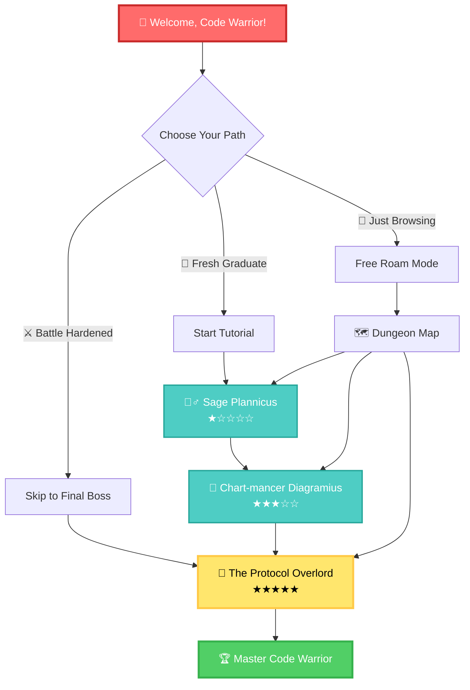
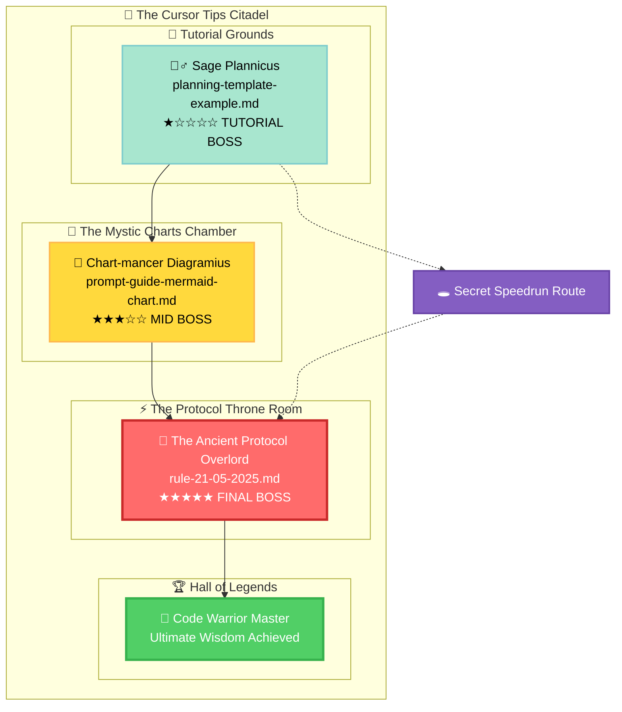
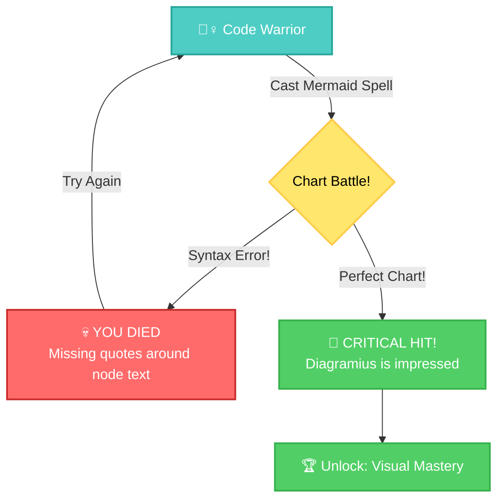
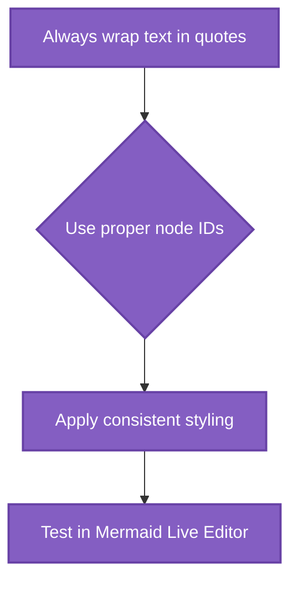
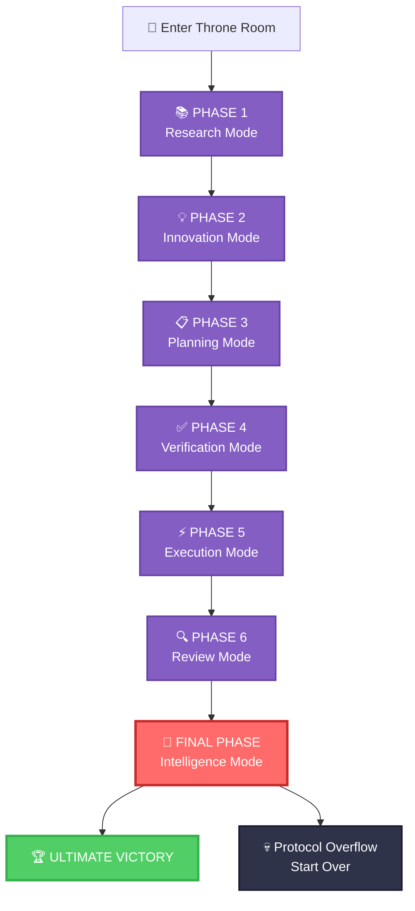

# 🎮 THE CURSOR TIPS DUNGEON CRAWLER

## _An Epic Quest Through the IDE Dimension_



---

## 📊 YOUR ADVENTURE STATS

<details>
<summary>🧬 Character Profile Generator</summary>

**Current Level:** `Ctrl+Shift+P` Novice  
**XP:** 0 / 1000  
**Health:** ████████████████████ 100/100  
**Sanity:** ███████░░░░░░░░░░░░░░ 35/100 _(perfectly normal for a developer)_

**Skills Unlocked:**

- [ ] 📋 Planning Mastery
- [ ] 🎨 Mermaid Sorcery
- [ ] 🤖 Protocol Enlightenment
- [ ] 🔥 Multi-Dimensional Thinking
- [ ] 💀 Error Debugging Fu

**Inventory:**

- 🍕 Emergency Pizza Slice x3
- ☕ Caffeine Potion x∞
- 🐛 Rubber Duck Debugger
- 💾 Legacy Code Detector _(cursed item)_

</details>

---

## 🗺️ DUNGEON MAP: The Three Sacred Trials



---

## ⚔️ QUEST 1: DEFEAT SAGE PLANNICUS

### _The Master of Organization and Templates_

<details>
<summary>🧙‍♂️ Boss Intel Report</summary>

**Sage Plannicus** _(Difficulty: ★☆☆☆☆)_

- **HP:** 89 lines of pure wisdom
- **Special Attacks:** Overwhelming Organization, Template Tornado
- **Weakness:** Developers who actually read documentation
- **Drops:** Planning Template Mastery, Markdown Fu

**Boss Quote:** _"You cannot code what you have not planned, young warrior!"_

</details>

**BATTLE ACTIONS:**

- [📖 Read the Ancient Scrolls](cursor-tip/planning-template-example.md)
- [⚔️ Challenge Accepted] - Study the planning template
- [🎨 Visualize] - Create your own planning diagram
- [✅ Mark as Defeated] - Complete the quest

**Victory Condition:** Create a project plan using the template

<details>
<summary>🏆 LOOT: Planning Template (Copy this!)</summary>

```markdown
# 🎯 Project Battle Plan

## Context

- Mission: [Your Epic Quest Here]
- Deadline: [When the world ends]
- Protocol: RIPER-5 + Multi-Dimensional Thinking

## Victory Conditions

- [ ] Feature 1: [Describe your destiny]
- [ ] Feature 2: [Define your legend]
- [ ] Feature 3: [Declare your victory]

## Battle Strategy

### Plan A: The Hero's Path

- **Principle:** Face challenges head-on
- **Steps:** [Your journey here]
- **Risks:** [What could go wrong]

### Plan B: The Ninja Route

- **Principle:** Swift and silent execution
- **Steps:** [Alternative approach]
- **Risks:** [Backup plan dangers]

## Implementation Checklist

1. [ ] Setup development environment
2. [ ] Create project structure
3. [ ] Implement core features
4. [ ] Test everything twice
5. [ ] Deploy to production
6. [ ] Celebrate victory 🎉
```

</details>

**QUEST COMPLETION:**

- [ ] I have read the planning template scrolls
- [ ] I understand the RIPER-5 protocol
- [ ] I created my own battle plan
- [ ] I'm ready for the next challenge

---

## 🎨 QUEST 2: CONFRONT CHART-MANCER DIAGRAMIUS

### _The Mystical Artist of Mermaid Magic_

<details>
<summary>🎨 Boss Intel Report</summary>

**Chart-mancer Diagramius** _(Difficulty: ★★★☆☆)_

- **HP:** 420 lines of visual sorcery
- **Special Attacks:** Syntax Error Curse, Infinite Loop Trap, Color Chaos
- **Weakness:** Developers who test their Mermaid charts first
- **Drops:** Visual Communication Mastery, Diagram Drawing Powers

**Boss Quote:** _"Your flowcharts are weak! Let me show you TRUE visual power!"_

</details>

**BATTLE ACTIONS:**

- [📖 Study the Mermaid Grimoire](cursor-tip/prompt-guide-mermaid-chart.md)
- [⚔️ Master the Syntax] - Learn proper Mermaid formatting
- [🎨 Create Art] - Draw your first battle diagram
- [✅ Prove Your Worth] - Show mastery

**Boss Battle Interface:**



**Victory Condition:** Create a flawless Mermaid diagram

<details>
<summary>🏆 LOOT: Chart Spellbook (Master These!)</summary>

**Essential Incantations:**



**Power-up Colors:**

- Primary: `fill:#3182ce,stroke:#2c5282,color:#fff`
- Success: `fill:#38a169,stroke:#2f855a,color:#fff`
- Error: `fill:#e53e3e,stroke:#c53030,color:#fff`
- Warning: `fill:#d69e2e,stroke:#b7791f,color:#fff`

</details>

**QUEST COMPLETION:**

- [ ] I have mastered Mermaid syntax
- [ ] I can create diagrams without errors
- [ ] I understand the color palette system
- [ ] My charts are tested and beautiful
- [ ] I'm ready for the final battle

---

## 👑 QUEST 3: FACE THE PROTOCOL OVERLORD

### _The Ancient Master of Multi-Dimensional Thinking_

<details>
<summary>👑 Final Boss Intel Report</summary>

**The Ancient Protocol Overlord** _(Difficulty: ★★★★★ DARK SOULS)_

- **HP:** 263 lines of concentrated wisdom
- **Special Attacks:** Pattern Confusion, Mode Switching Madness, Infinite Recursion
- **Weakness:** Developers who actually follow protocols
- **Drops:** Ultimate Development Mastery, Enlightenment

**Boss Quote:** _"You think you know code? I AM THE CODE!"_

</details>

**⚠️ WARNING: This boss has multiple phases!**



**BATTLE ACTIONS:**

- [📖 Read the Sacred Protocol](cursor-tip/rule-21-05-2025.md)
- [⚔️ Master All 7 Patterns] - The ultimate challenge
- [🎨 Demonstrate Mastery] - Show you understand
- [✅ Achieve Enlightenment] - Complete transformation

**Victory Condition:** Successfully apply the multi-dimensional thinking protocol

<details>
<summary>🏆 ULTIMATE LOOT: The Sacred Knowledge</summary>

**The Seven Sacred Patterns:** _(Use these to become unstoppable)_

1. **Research** - Gather info, understand deeply
2. **Innovation** - Generate ≥2 orthogonal solutions
3. **Planning** - Create exhaustive technical specs
4. **Verification** - Fact-check everything
5. **Execution** - Implement with 100% fidelity
6. **Review** - Confirm and validate results
7. **Intelligence** - Do it all in one response

**The Ultimate Incantation:**

```

```
