# Cursor Tips - Complete Development Enhancement Guide

## Overview

Cursor Tips is a comprehensive system for enhancing AI-assisted development workflows in the Cursor IDE. This guide provides practical tools, templates, and methodologies to improve code quality, project planning, and AI collaboration.

## Project Structure

## Getting Started

### Prerequisites

- Cursor IDE installed
- Basic understanding of AI-assisted development
- Familiarity with Markdown and Mermaid charts

### Quick Start Workflow

## Core Guides (`guide-prompt-template/`)

### Planning Template System

Location: `guide-prompt-template/planning-template-example.md`

This template provides a structured approach to project planning with AI assistance:

- **Protocol Integration**: RIPER-5 + Multi-Dimensional Thinking
- **Mode-Based Execution**: Planning → Execution → Review
- **Visualization Requirements**: Mandatory Mermaid diagrams
- **Continuation Resilience**: Handles interruptions gracefully

### Mermaid Chart Standards

Location: `guide-prompt-template/prompt-guide-mermaid-chart.md`

Comprehensive guide for creating and maintaining Mermaid charts:

- **Common Issues & Solutions**: Syntax fixes and best practices
- **Color Palette Standards**: Consistent styling across projects
- **Error Handling**: Troubleshooting common problems
- **Advanced Techniques**: Complex diagrams and interactions

## Advanced Protocols (`custom-rules/`)

### Multi-Dimensional Thinking Protocol

Location: `custom-rules/rule-21-05-2025.md`

A comprehensive development protocol implementing 7 distinct patterns:

```mermaid
graph TD
    Protocol[Multi-Dimensional Thinking Protocol] --> P1[Pattern 1: Research]
    Protocol --> P2[Pattern 2: Innovation]
    Protocol --> P3[Pattern 3: Planning]
    Protocol --> P4[Pattern 4: Verification]
    Protocol --> P5[Pattern 5: Execution]
    Protocol --> P6[Pattern 6: Review]
    Protocol --> P7[Pattern 7: Intelligence]

    P1 --> Research[Gather information, understand deeply]
    P2 --> Innovation[≥2 orthogonal solutions]
    P3 --> Planning[Exhaustive technical specifications]
    P4 --> Verification[Fact-check components]
    P5 --> Execution[Implement with 100% fidelity]
    P6 --> Review[Confirm and validate results]
    P7 --> Intelligence[Complete workflow in one response]

    classDef protocol fill:#d94dbb,stroke:#a3378a,color:white
    classDef pattern fill:#4da6ff,stroke:#0066cc,color:white
    classDef description fill:#4dbb5f,stroke:#36873f,color:white

    class Protocol protocol
    class P1,P2,P3,P4,P5,P6,P7 pattern
    class Research,Innovation,Planning,Verification,Execution,Review,Intelligence description
```

**Key Features:**

- Systematic problem-solving approach
- Automatic pattern chaining
- Quality assurance built-in
- Extensible framework

## Memory Banking System (`memory-banking/`)

### Complete AI-Enhanced Development Framework

The Memory Banking system provides a comprehensive workflow for AI-assisted development:

```mermaid
graph TD
    MemoryBank[Memory Banking System] --> Modes[6 Sacred Modes]
    Modes --> VAN[🔍 VAN Mode<br/>Verification, Analysis, Navigation]
    Modes --> PLAN[📋 PLAN Mode<br/>Strategic Planning]
    Modes --> CREATIVE[🎨 CREATIVE Mode<br/>Design & Architecture]
    Modes --> IMPLEMENT[⚙️ IMPLEMENT Mode<br/>Development Execution]
    Modes --> REFLECT[🤔 REFLECT Mode<br/>Analysis & Learning]
    Modes --> ARCHIVE[📦 ARCHIVE Mode<br/>Knowledge Preservation]

    VAN --> VanFeatures[• Project Analysis<br/>• Setup Verification<br/>• Complexity Assessment]
    PLAN --> PlanFeatures[• Strategic Planning<br/>• Task Breakdown<br/>• Resource Planning]
    CREATIVE --> CreativeFeatures[• Design Decisions<br/>• Architecture Planning<br/>• Option Analysis]
    IMPLEMENT --> ImplFeatures[• Systematic Development<br/>• Quality Assurance<br/>• Testing Integration]
    REFLECT --> ReflectFeatures[• Post-Implementation Review<br/>• Learning Extraction<br/>• Process Improvement]
    ARCHIVE --> ArchiveFeatures[• Knowledge Documentation<br/>• Project Archival<br/>• Wisdom Preservation]

    classDef system fill:#d94dbb,stroke:#a3378a,color:white
    classDef mode fill:#4da6ff,stroke:#0066cc,color:white
    classDef features fill:#4dbb5f,stroke:#36873f,color:white

    class MemoryBank system
    class VAN,PLAN,CREATIVE,IMPLEMENT,REFLECT,ARCHIVE mode
    class VanFeatures,PlanFeatures,CreativeFeatures,ImplFeatures,ReflectFeatures,ArchiveFeatures features
```

### Implementation Files

- **Core Rules**: `memory-banking/isolation_rules/Core/`
- **Level-Specific Workflows**: `memory-banking/isolation_rules/Level1-4/`
- **Creative Phase Templates**: `memory-banking/isolation_rules/Phases/CreativePhase/`
- **Visual Maps**: `memory-banking/isolation_rules/visual-maps/`

## Real-World Examples (`output-planning-4.0-generate-example/`)

### Live AI Collaboration Recordings

These examples demonstrate actual Claude Sonnet 4.0 collaboration using the planning templates:

1. **Backend Planning**: `step-1-car-stores-and-apis-planning.md`

   - API architecture design
   - Data flow visualization
   - Implementation phases

2. **UI Component Planning**: `step-2-car-selection-component-planning.md`

   - Component architecture
   - User interaction flows
   - Accessibility considerations

3. **System Integration**: `step-3-product-integration-planning.md`
   - Integration strategies
   - Risk mitigation
   - Testing approaches

### Key Learning Points

## Setup Instructions (`setup-custom-mode/`)

### Complete Mode Setup Guide

The setup-custom-mode directory provides detailed instructions for implementing the 6-mode system:

#### Available Modes

- **VAN Mode**: `setup-custom-mode/VAN/`
- **PLAN Mode**: `setup-custom-mode/PLAN/`
- **CREATIVE Mode**: `setup-custom-mode/CREATIVE/`
- **IMPLEMENT Mode**: `setup-custom-mode/IMPLEMENT/`
- **REFLECT-AND-ARCHIVE Mode**: `setup-custom-mode/REFLECT-AND-ARCHIVE/`

#### Installation Process

### Usage Commands

After setup, use these commands to activate modes:

- `VAN` - Verification, Analysis, Navigation
- `PLAN` - Strategic Planning
- `CREATIVE` - Design & Architecture
- `IMPLEMENT` - Development Execution
- `REFLECT-AND-ARCHIVE` - Reflection and ARCHIVE

## MCP Tools (`setup-mcp-tool/`)

### Model Context Protocol Integration

The MCP tools directory provides configuration for advanced AI collaboration:

- **Configuration File**: `setup-mcp-tool/mcp.json`
- **Setup Guide**: Instructions for MCP integration
- **Advanced Features**: Sequential thinking, context management

### Integration Benefits

## Implementation Workflow

### Recommended Learning Path

### Success Metrics

- **Foundation Level**: Successfully use planning templates and create Mermaid charts
- **Intermediate Level**: Implement multi-dimensional thinking protocol effectively
- **Advanced Level**: Master the 6-mode Memory Banking system
- **Mastery Level**: Optimize workflows and collaborate seamlessly with AI

## Best Practices

### Development Workflow

1. **Start with VAN Mode**: Analyze and verify project setup
2. **Use PLAN Mode**: Create comprehensive development plans
3. **Enter CREATIVE Mode**: Make design decisions systematically
4. **Execute with IMPLEMENT Mode**: Build features with quality assurance
5. **Review with REFLECT Mode**: Extract lessons and improvements
6. **Archive with ARCHIVE Mode**: Preserve knowledge for future use

### AI Collaboration

- Use structured templates for consistent results
- Provide clear context and requirements
- Iterate and refine through multiple passes
- Document decisions and rationale
- Maintain quality standards throughout

### Quality Assurance

- Always use Mermaid diagrams for complex workflows
- Follow the multi-dimensional thinking protocol
- Implement proper error handling and testing
- Maintain comprehensive documentation
- Regular review and improvement cycles

## Troubleshooting

### Common Issues

1. **File Path Errors**: Ensure correct directory structure
2. **Mermaid Chart Errors**: Use the troubleshooting guide in guide-prompt-template/
3. **Mode Configuration Issues**: Check setup-custom-mode/ instructions
4. **MCP Integration Problems**: Verify setup-mcp-tool/ configuration

### Getting Help

- Review the specific directory guides for detailed instructions
- Check the real-world examples for practical applications
- Consult the troubleshooting sections in each guide
- Practice with the provided templates and examples

## Conclusion

The Cursor Tips system provides a comprehensive framework for AI-enhanced development. By following this guide and implementing the various components, you'll develop a systematic approach to coding that combines human creativity with AI systematic thinking.

Start with the foundation guides, practice with real examples, and gradually implement the advanced features to transform your development workflow.

---

**Next Steps:**

1. Review `guide-prompt-template/` for core concepts
2. Study `output-planning-4.0-generate-example/` for practical applications
3. Implement `setup-custom-mode/` for advanced workflows
4. Master `memory-banking/` for complete system integration

**Contributing:**
This is an open-source project. Feel free to contribute improvements, examples, and enhancements to help the community grow.
