# Cursor Tips - AI-Enhanced Development Mastery Guide

> _"AI is the pen, you are the author."_

## 🎯 What is Cursor Tips?

Cursor Tips is a comprehensive, level-based system for mastering AI-enhanced development workflows in the Cursor IDE. This guide transforms developers from AI beginners to expert practitioners through structured learning paths, practical tools, and proven methodologies.

## 🗺️ Learning Journey Overview

```mermaid
graph TD
    Start[🚀 Start Your Journey] --> Choose{Choose Your Path}
    
    Choose -->|"New to AI Development"| Beginner[🌱 Beginner Level]
    Choose -->|"Some AI Experience"| Intermediate[🏗️ Intermediate Level] 
    Choose -->|"Advanced AI User"| Advanced[🚀 Advanced Level]
    
    Beginner --> B1[📚 Planning Templates]
    Beginner --> B2[🎨 Mermaid Charts]
    Beginner --> B3[🧠 Core Protocols]
    Beginner --> B4[💬 Prompt Optimization]
    
    Intermediate --> I1[🏗️ Context Engineering]
    Intermediate --> I2[⚙️ Custom Mode Setup]
    Intermediate --> I3[🔗 MCP Integration]
    
    Advanced --> A1[🏦 Memory Banking System]
    Advanced --> A2[🎬 Real-World Examples]
    Advanced --> A3[💰 Cost Optimization]
    Advanced --> A4[🎭 Creative Applications]
    
    B4 --> Intermediate
    I3 --> Advanced
    A4 --> Master[🎓 AI Development Master]
    
    classDef start fill:#ff6b6b,stroke:#c92a2a,stroke-width:3px,color:#fff
    classDef level fill:#4ecdc4,stroke:#26a69a,stroke-width:2px,color:#fff
    classDef skill fill:#ffe66d,stroke:#ffc947,stroke-width:2px,color:#000
    classDef master fill:#9f39ff,stroke:#7c2d12,stroke-width:3px,color:#fff
    
    class Start start
    class Beginner,Intermediate,Advanced level
    class B1,B2,B3,B4,I1,I2,I3,A1,A2,A3,A4 skill
    class Master master
```



---

## 🌱 Beginner Level - Foundation Skills

*Perfect for developers new to AI-assisted development*

<details>
<summary><strong>📋 What You'll Learn (Click to expand)</strong></summary>

- **Planning Templates**: Structured approach to project planning with AI
- **Mermaid Charts**: Visual communication and diagram creation
- **Core Protocols**: Multi-dimensional thinking methodology
- **Prompt Optimization**: Better AI interaction techniques

**Time Investment**: 2-4 hours  
**Prerequisites**: Basic programming knowledge, Cursor IDE installed

</details>

### 🎯 Quick Start Guide


### 📚 Core Components

<details>
<summary><strong>1. Planning Templates (`beginner/guide-prompt-template/`)</strong></summary>

**Location**: `beginner/guide-prompt-template/planning-template-example.md`

Master structured project planning with AI assistance:

- ✅ RIPER-5 + Multi-Dimensional Thinking integration
- ✅ Mode-based execution workflow (Planning → Execution → Review)
- ✅ Mandatory Mermaid diagram requirements
- ✅ Continuation resilience for long projects

**Quick Start**:
1. Copy the template
2. Adapt for your project
3. Use with AI assistant
4. Iterate and improve

</details>

<details>
<summary><strong>2. Mermaid Chart Mastery (`beginner/guide-prompt-template/`)</strong></summary>

**Location**: `beginner/guide-prompt-template/prompt-guide-mermaid-chart.md`

Create professional diagrams and flowcharts:

- 🎨 **Color Palette Standards**: Consistent project styling
- 🔧 **Syntax & Error Fixes**: Common issues and solutions
- 📊 **Chart Types**: Flowcharts, sequences, timelines, and more
- 🚀 **Advanced Techniques**: Interactive and complex diagrams

**Quick Start**:
1. Learn basic syntax
2. Practice with examples
3. Apply color standards
4. Test in Mermaid Live Editor

</details>

<details>
<summary><strong>3. Multi-Dimensional Thinking Protocol (`beginner/custom-rules/`)</strong></summary>

**Location**: `beginner/custom-rules/rule-21-05-2025.md`

Master systematic problem-solving with 7 patterns:

```mermaid
graph TD
    Protocol[🧠 Multi-Dimensional Protocol] --> P1[1. Research]
    Protocol --> P2[2. Innovation]
    Protocol --> P3[3. Planning]
    Protocol --> P4[4. Verification]
    Protocol --> P5[5. Execution]
    Protocol --> P6[6. Review]
    Protocol --> P7[7. Intelligence]
    
    P1 --> R[Gather deep understanding]
    P2 --> I[Generate ≥2 solutions]
    P3 --> PL[Create detailed specs]
    P4 --> V[Fact-check everything]
    P5 --> E[Implement with fidelity]
    P6 --> RE[Validate results]
    P7 --> IN[Complete workflow mastery]
    
    classDef protocol fill:#9f39ff,stroke:#7c2d12,color:white
    classDef pattern fill:#4da6ff,stroke:#0066cc,color:white
    
    class Protocol protocol
    class P1,P2,P3,P4,P5,P6,P7,R,I,PL,V,E,RE,IN pattern
```



</details>

<details>
<summary><strong>4. Prompt Optimization (`beginner/optimize-prompt-chat/`)</strong></summary>

**Location**: `beginner/optimize-prompt-chat/prompt-enhancer.md`

Transform basic prompts into powerful AI interactions:

- 🎯 **Clarity Techniques**: Clear, specific instructions
- 🔄 **Iterative Improvement**: Refine prompts through testing
- 📝 **Context Management**: Provide relevant background
- ⚡ **Efficiency Patterns**: Get better results faster

</details>

### ✅ Beginner Level Completion Checklist

- [ ] Successfully used planning templates for a project
- [ ] Created error-free Mermaid diagrams with proper styling
- [ ] Applied multi-dimensional thinking to solve a problem
- [ ] Optimized prompts for better AI responses
- [ ] Ready to advance to Intermediate level

---

## 🏗️ Intermediate Level - Professional Workflows

*For developers ready to implement advanced AI collaboration patterns*

<details>
<summary><strong>🎯 What You'll Master (Click to expand)</strong></summary>

- **Context Engineering**: Systematic AI context management
- **Custom Mode Setup**: 6-mode development workflow system
- **MCP Integration**: Model Context Protocol for enhanced AI collaboration

**Time Investment**: 4-8 hours  
**Prerequisites**: Completed Beginner level or equivalent experience

</details>

### 🛠️ Professional Development Path

```mermaid
graph TD
    Entry[🚪 Enter Intermediate] --> Context[🏗️ Context Engineering]
    Context --> Modes[⚙️ Custom Mode Setup]
    Modes --> MCP[🔗 MCP Integration]
    MCP --> Advanced[🚀 Ready for Advanced]
    
    Context --> ContextSub[PRD • Documentation • Rules]
    Modes --> ModesSub[VAN • PLAN • CREATIVE • IMPLEMENT • REFLECT • ARCHIVE]
    MCP --> MCPSub[Sequential Thinking • Context Management]
    
    classDef main fill:#3b82f6,stroke:#1e40af,color:white
    classDef sub fill:#10b981,stroke:#047857,color:white
    classDef ready fill:#ff6b6b,stroke:#c92a2a,color:white
    
    class Entry,Context,Modes,MCP main
    class ContextSub,ModesSub,MCPSub sub
    class Advanced ready
```



### 🏗️ Core Systems

<details>
<summary><strong>1. Context Engineering (`intermediate/context-engineer/`)</strong></summary>

**Revolutionary AI Context Management System**

Transform from prompt engineering to systematic context window management:

**📋 Core Components**:
- **PRD-Based Planning**: Product Requirements Document foundation
- **Four-File Documentation**: Implementation, Structure, UI/UX, Bug Tracking
- **Context Window Management**: Strategic information organization
- **Phase-Based Workflow**: Context Generation → Development → Ongoing

**🚀 Quick Setup**:
1. Read `intermediate/context-engineer/guide.md`
2. Create your first PRD using the template
3. Generate the four documentation files
4. Apply to a real project

**💡 Key Benefits**:
- Eliminate AI hallucinations through proper context
- Systematic project initialization
- Better context window management
- Foundation for advanced workflows

</details>

<details>
<summary><strong>2. Custom Mode Setup (`intermediate/setup-custom-mode/`)</strong></summary>

**6-Mode Development Workflow System**

Professional AI-enhanced development with distinct operational modes:

```mermaid
graph LR
    VAN[🔍 VAN<br/>Verification & Analysis] --> PLAN[📋 PLAN<br/>Strategic Planning]
    PLAN --> CREATIVE[🎨 CREATIVE<br/>Design Decisions]
    CREATIVE --> IMPLEMENT[⚙️ IMPLEMENT<br/>Development]
    IMPLEMENT --> REFLECT[🤔 REFLECT<br/>Review & Learning]
    REFLECT --> ARCHIVE[📦 ARCHIVE<br/>Knowledge Storage]
    
    classDef mode fill:#4da6ff,stroke:#0066cc,color:white
    class VAN,PLAN,CREATIVE,IMPLEMENT,REFLECT,ARCHIVE mode
```



**🛠️ Setup Process**:
1. Copy isolation rules: `cp -r advanced/memory-banking/isolation_rules .cursor/rules`
2. Configure each mode using guides in `intermediate/setup-custom-mode/`
3. Test with commands: `VAN`, `PLAN`, `CREATIVE`, `IMPLEMENT`, `QA`

**Available Modes**:
- **VAN Mode**: Project analysis and verification
- **PLAN Mode**: Strategic planning and task breakdown  
- **CREATIVE Mode**: Design and architecture decisions
- **IMPLEMENT Mode**: Development execution
- **REFLECT Mode**: Post-implementation analysis
- **ARCHIVE Mode**: Knowledge preservation

</details>

<details>
<summary><strong>3. MCP Integration (`intermediate/setup-mcp-tool/`)</strong></summary>

**Model Context Protocol for Enhanced AI Collaboration**

Advanced AI collaboration features:

- 🧠 **Sequential Thinking**: Step-by-step reasoning
- 📚 **Context Management**: Large context handling
- 🔄 **Multi-Tool Workflows**: Integrated tool usage
- ⚡ **Workflow Automation**: Streamlined processes

**Setup Guide**:
1. Review `intermediate/setup-mcp-tool/mcp.json`
2. Configure MCP settings
3. Test sequential thinking capabilities
4. Integrate with existing workflows

**📋 Detailed MCP Setup Guide**: [`advanced/claude-code-extension/mcp/guide.md`](advanced/claude-code-extension/mcp/guide.md)
- Complete 7-step setup process with visual guides
- Smithery.ai server selection and Context7 configuration
- Security best practices and GitHub Clone account usage
- Status verification and troubleshooting guide

</details>

### ✅ Intermediate Level Completion Checklist

- [ ] Implemented Context Engineering methodology
- [ ] Set up and used all 6 custom modes
- [ ] Successfully integrated MCP tools
- [ ] Applied professional workflows to real projects
- [ ] Ready to advance to Advanced level

---

## 🚀 Advanced Level - Master Practitioner

*For developers ready to achieve AI development mastery*

<details>
<summary><strong>🎯 Master-Level Capabilities (Click to expand)</strong></summary>

- **Memory Banking System**: Ultimate AI-enhanced development framework
- **Real-World Applications**: Live collaboration examples and case studies
- **Cost Optimization**: Professional development without breaking the budget
- **Creative Applications**: Innovative AI use cases and role-playing

**Time Investment**: 8+ hours  
**Prerequisites**: Completed Intermediate level, real project experience

</details>

### 🏆 Mastery Achievement Path

```mermaid
graph TD
    Master[🎓 Advanced Mastery] --> Memory[🏦 Memory Banking]
    Master --> Examples[🎬 Real Examples]
    Master --> Money[💰 Cost Optimization]
    Master --> Creative[🎭 Creative Applications]
    
    Memory --> MemoryComplete[Complete 6-Mode Workflow Mastery]
    Examples --> ExamplesComplete[Live AI Collaboration Analysis]
    Money --> MoneyComplete[Professional Cost-Effective Development]
    Creative --> CreativeComplete[Innovative AI Applications]
    
    MemoryComplete --> Ultimate[🌟 AI Development Master]
    ExamplesComplete --> Ultimate
    MoneyComplete --> Ultimate
    CreativeComplete --> Ultimate
    
    classDef master fill:#9f39ff,stroke:#7c2d12,color:white
    classDef component fill:#4da6ff,stroke:#0066cc,color:white
    classDef complete fill:#22c55e,stroke:#16a34a,color:white
    classDef ultimate fill:#ff6b6b,stroke:#c92a2a,color:white
    
    class Master master
    class Memory,Examples,Money,Creative component
    class MemoryComplete,ExamplesComplete,MoneyComplete,CreativeComplete complete
    class Ultimate ultimate
```



### 🏦 Advanced Systems

<details>
<summary><strong>1. Memory Banking System (`advanced/memory-banking/`)</strong></summary>

**The Ultimate AI-Enhanced Development Framework**

Complete workflow mastery with systematic knowledge preservation:

**🔧 System Architecture**:

```mermaid
graph LR
    VAN[🔍 VAN Mode<br/>Entry & Analysis] --> PLAN[📋 PLAN Mode<br/>Strategic Planning]
    PLAN --> CREATIVE[🎨 CREATIVE Mode<br/>Design Decisions]
    CREATIVE --> IMPLEMENT[⚙️ IMPLEMENT Mode<br/>Development]
    IMPLEMENT --> REFLECT[🤔 REFLECT Mode<br/>Analysis & Learning]
    REFLECT --> ARCHIVE[📦 ARCHIVE Mode<br/>Knowledge Storage]
    ARCHIVE --> VAN
    
    classDef mode fill:#4da6ff,stroke:#0066cc,color:white
    class VAN,PLAN,CREATIVE,IMPLEMENT,REFLECT,ARCHIVE mode
```


**🚀 Quick Setup**:
1. **Install System**: `cp -r advanced/memory-banking/isolation_rules .cursor/rules`
2. **Initialize**: Use "INIT MEMORY BANKING" command
3. **Start Session**: Begin with `VAN` mode
4. **Follow Workflow**: VAN → PLAN → CREATIVE → IMPLEMENT → REFLECT → ARCHIVE

**📋 Core Files**:
- `tasks.md` - Current project tasks
- `projectbrief.md` - Project overview and goals
- `activeContext.md` - Current working context
- `progress.md` - Development progress tracking

**🎯 Mastery Benefits**:
- Complete project lifecycle management
- Systematic knowledge preservation
- AI-enhanced decision making
- Perfect human-AI collaboration synthesis

</details>

<details>
<summary><strong>2. Real-World Examples (`advanced/output-planning-4.0-generate-example/`)</strong></summary>

**Live AI Collaboration Case Studies**

Learn from actual Claude Sonnet 4.0 collaboration sessions:

**🎬 Available Examples**:

1. **Backend Planning** (`step-1-car-stores-and-apis-planning.md`)
   - API architecture design
   - Data flow visualization  
   - Implementation phases

2. **UI Component Planning** (`step-2-car-selection-component-planning.md`)
   - Component architecture
   - User interaction flows
   - Accessibility considerations

3. **System Integration** (`step-3-product-integration-planning.md`)
   - Integration strategies
   - Risk mitigation
   - Testing approaches

**💡 Key Learning Points**:
- How to adapt templates for different project types
- Human creativity + AI systematic thinking balance
- Template flexibility and evolution
- Real-world problem-solving patterns

</details>

<details>
<summary><strong>3. Cost Optimization (`advanced/tip-money-saving-strategy/`)</strong></summary>

**Professional Development Without Breaking the Budget**

Smart resource allocation for AI-enhanced development:

**💰 Cost-Saving Strategy**:
- Use **Gemini 2.5 Pro Preview** (FREE) for planning
- Use **Claude Code Extension** for targeted implementation
- Avoid expensive subscriptions ($20/month = $240/year saved)

**🛠️ Setup Process**:
```bash
# Install Claude Code SDK
npm install -g @anthropic-ai/claude-code

# Download Claude Desktop
# Visit: https://claude.ai/download

# Authenticate
claude
```

**📊 Workflow**:


</details>

<details>
<summary><strong>4. Creative Applications (`advanced/funny-prompt/`)</strong></summary>

**Explore the Creative Side of AI Development**

Innovative applications and role-playing scenarios:

- 🎭 **Role-Playing Prompts**: Creative AI interactions
- 🌍 **Multi-Language Support**: English and Vietnamese variations
- 🎨 **Creative Templates**: Inspiration for unique AI applications
- 🧪 **Experimental Techniques**: Push the boundaries of AI interaction

**Available Content**:
- `prompt-role-play-en.md` - English role-playing scenarios
- `prompt-role-play-nho-giao-vi.md` - Vietnamese cultural prompts
- `test-prompt-vi/` - Vietnamese prompt testing examples

</details>

### ✅ Advanced Level Mastery Checklist

- [ ] Implemented complete Memory Banking workflow
- [ ] Analyzed and applied real-world collaboration examples  
- [ ] Set up cost-effective development environment
- [ ] Explored creative AI applications
- [ ] Achieved synthesis of human creativity and AI systematic thinking
- [ ] **YOU ARE NOW AN AI DEVELOPMENT MASTER! 🎓**

---

## 🎯 Getting Started - Choose Your Path

### 🤔 Not Sure Where to Start?

<details>
<summary><strong>Take This Quick Assessment (Click to expand)</strong></summary>

**Answer these questions to find your level:**

1. **Have you used AI for coding before?**
   - Never → Start with **Beginner**
   - Basic prompts → Start with **Beginner** 
   - Some experience → Consider **Intermediate**

2. **Can you create Mermaid diagrams?**
   - No → **Beginner**
   - Basic → **Beginner** or **Intermediate**
   - Advanced → **Intermediate** or **Advanced**

3. **Do you have structured development workflows?**
   - No → **Beginner**
   - Basic → **Intermediate**
   - Advanced → **Advanced**

4. **Have you worked with AI context management?**
   - No → **Intermediate** (after Beginner)
   - Yes → **Advanced**

</details>

### 🚀 Quick Start Commands

**Beginner Level**:
```bash
# Start with planning templates
cd beginner/guide-prompt-template/
# Read planning-template-example.md
```

**Intermediate Level**:
```bash
# Begin with Context Engineering
cd intermediate/context-engineer/
# Read guide.md
```

**Advanced Level**:
```bash
# Initialize Memory Banking
cp -r advanced/memory-banking/isolation_rules .cursor/rules
# Use: "INIT MEMORY BANKING" in Cursor
```

---

## 📚 Best Practices & Guidelines

### 🎯 Development Workflow
1. **Always start with planning** - Use templates and structured approaches
2. **Visualize complex systems** - Create Mermaid diagrams for better understanding
3. **Follow systematic protocols** - Apply multi-dimensional thinking
4. **Document everything** - Maintain comprehensive project documentation
5. **Iterate and improve** - Regular review and refinement cycles

### 🤖 AI Collaboration
- Use structured templates for consistent results
- Provide clear context and requirements
- Iterate and refine through multiple passes
- Document decisions and rationale
- Maintain quality standards throughout

### 🔧 Quality Assurance
- Always use Mermaid diagrams for complex workflows
- Follow the multi-dimensional thinking protocol
- Implement proper error handling and testing
- Maintain comprehensive documentation
- Regular review and improvement cycles

---

## 🆘 Troubleshooting & Support

<details>
<summary><strong>Common Issues & Solutions (Click to expand)</strong></summary>

### File Path Errors
- Ensure you're using the correct directory structure
- Check that files exist at specified paths
- Use absolute paths when needed

### Mermaid Chart Errors
- Review syntax in `beginner/guide-prompt-template/prompt-guide-mermaid-chart.md`
- Test charts in [Mermaid Live Editor](https://mermaid.live/)
- Check for proper quote usage around text

### Mode Configuration Issues
- Verify setup instructions in `intermediate/setup-custom-mode/`
- Ensure isolation rules are copied correctly
- Test each mode individually

### MCP Integration Problems
- Check configuration in `intermediate/setup-mcp-tool/mcp.json`
- Verify MCP tools are properly installed
- Test sequential thinking capabilities

</details>

### 💬 Getting Help
- Review level-specific guides for detailed instructions
- Check real-world examples for practical applications
- Practice with provided templates and examples
- Join the community for support and discussions

---

## 🎉 Next Steps

### 🌟 Your Journey Continues

1. **🌱 Beginner**: Master `beginner/` directory content
2. **🏗️ Intermediate**: Progress to `intermediate/` systems  
3. **🚀 Advanced**: Achieve mastery with `advanced/` frameworks
4. **🎓 Master**: Integrate all levels and teach others

### 🤝 Contributing

This is an open-source project. Help us improve by:
- Adding new examples and templates
- Improving documentation and guides
- Sharing your success stories
- Contributing to community discussions

---

**Created by**: [GiangBV](https://www.linkedin.com/in/buivangiang1992), [AuPMH](https://www.linkedin.com/in/pham-au-2a1bb1162)  
**Powered by**: Caffeine, Determination, AI Collaboration, and Weekend Coding Sessions  
**Special Thanks**: [vanzan01](https://github.com/vanzan01), [Smithery.ai](https://smithery.ai/), MCP Protocol, Anthropic, and the amazing developer community

---

> **Ready to transform your development workflow?** 🚀  
> Choose your level above and begin your AI development mastery journey today!