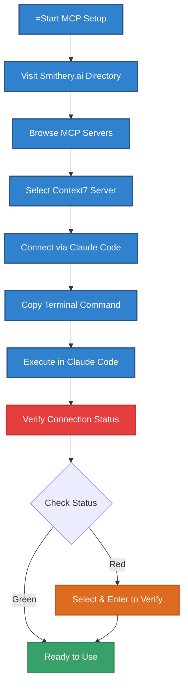
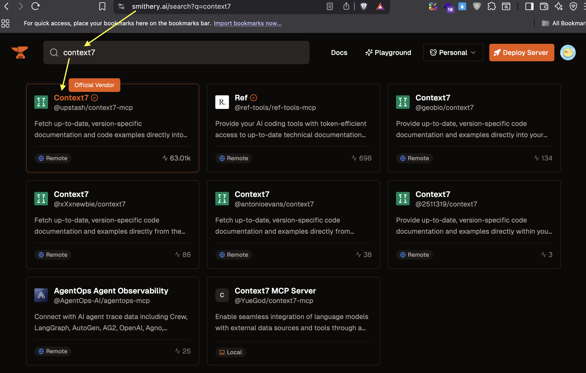
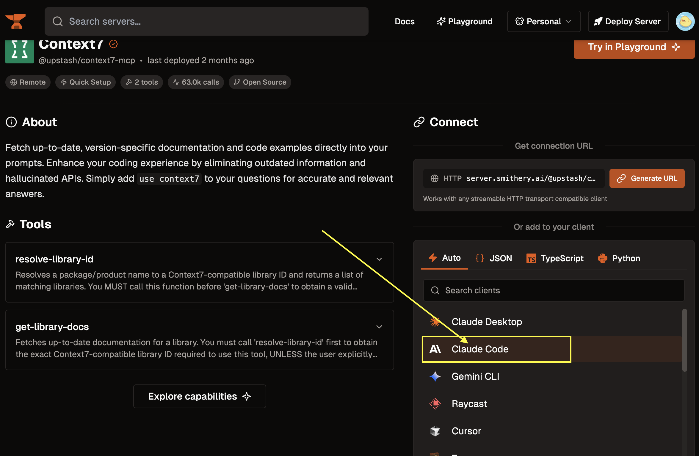
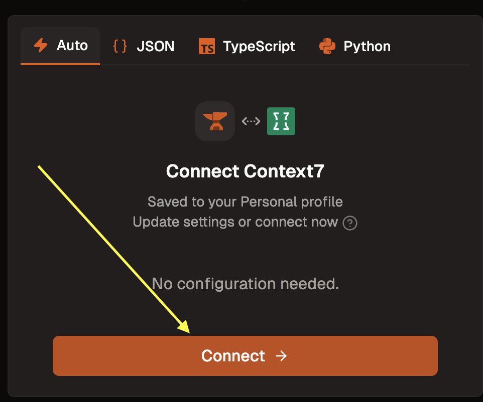
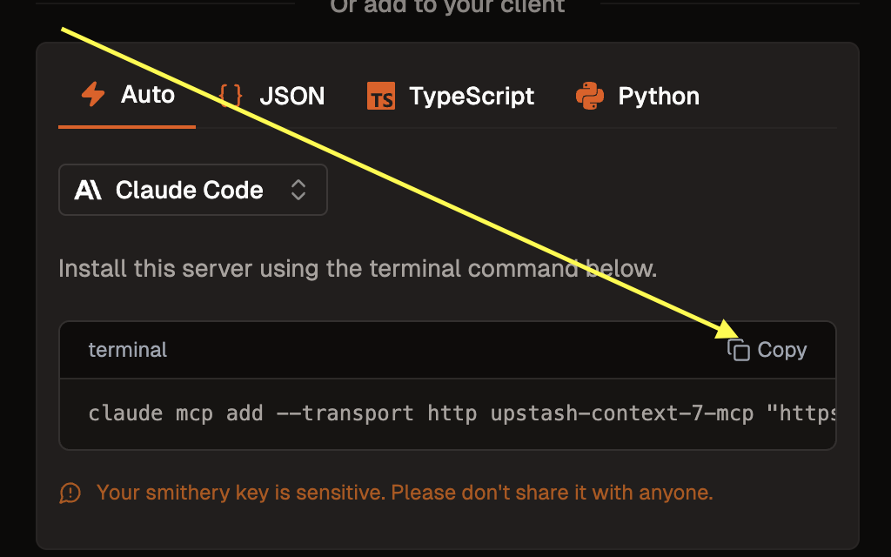
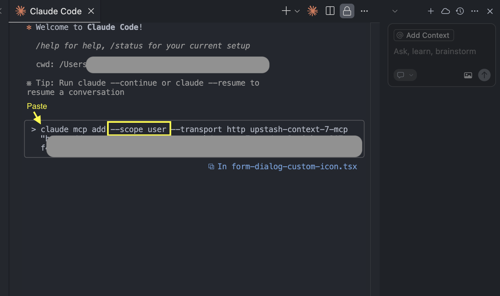
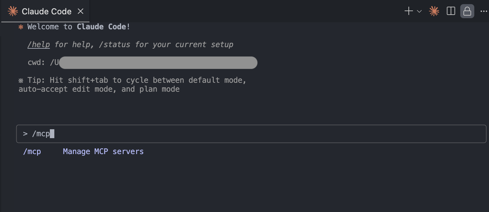
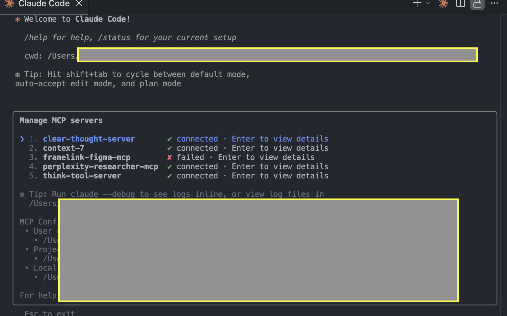

# MCP Extension Setup Guide for Claude Code

## Overview

This guide will help you set up MCP (Model Context Protocol) extensions for Claude Code using sequential thinking methodology. MCP enables enhanced AI collaboration through specialized servers and tools that extend Claude's capabilities.

## MCP Setup Workflow



---

## Step-by-Step Guide

### Step 1: Access Smithery.ai MCP Directory



Visit [Smithery.ai](https://smithery.ai) to explore the MCP server directory. Smithery provides a curated collection of MCP servers that extend Claude's capabilities with specialized tools and functions.

**What you'll see:**

- Directory of available MCP servers
- Server descriptions and capabilities
- Official vendor badges for trusted servers

---

### Step 2: Select MCP Server (Context7 Recommended)



Browse through available servers and select **Context7** for optimal performance:

**Why Context7?**

- Official vendor with up-to-date documentation
- Reliable performance and support
- Compatible with Claude Code client
- Regular updates and maintenance

**Selection Process:**

1. Click on Context7 from the server list
2. Review server details and capabilities
3. Confirm Claude Code client compatibility
4. Proceed to connection setup

---

### Step 3: Initialize Connection (Security First!)



Click the **"Connect"** button to start the MCP server connection process.

> **Safety Note**: Always use a **GitHub Clone account** for initial testing and connection setup. This provides an additional security layer and protects your primary development environment.

**Security Best Practices:**

- Use dedicated clone accounts for MCP testing
- Review server permissions before connecting
- Monitor connection status regularly
- Disconnect unused servers to maintain security

---

### Step 4: Copy Terminal Command



The system will generate a specific terminal command for your MCP setup. Click the **copy button** to get the exact command needed for your configuration.

**Command Structure:**

- Contains server-specific configuration
- Includes authentication tokens
- Specifies connection parameters
- Ready for direct terminal execution

---

### Step 5: Execute Command in Claude Code Terminal



Open your Claude Code terminal and execute the copied command with the `--scope user` flag:

```bash
# Example command structure (your actual command will be different)
claude mcp install [server-config] --scope user
```

**Important Parameters:**

- `--scope user`: Installs MCP server for current user only
- Ensures proper permission management
- Provides isolated testing environment
- Enables easy removal if needed

**Execution Steps:**

1. Open Claude Code terminal
2. Paste the copied command
3. Add `--scope user` flag if not present
4. Press Enter to execute
5. Wait for installation completion

---

### Step 6: Check MCP Status with /mcp Command



After installation, use the `/mcp` command in Claude Code to access the MCP management interface:

```bash
/mcp
```

**Interface Features:**

- List all installed MCP servers
- Show connection status for each server
- Access server-specific tools and functions
- Manage server configurations

**Status Indicators:**

- **Green checkmark**: Server connected and ready to use
- **Red X**: Server failed to connect or needs verification

---

### Step 7: Verify Connection Status



Review the connection status in the MCP interface:

**Status Types:**

#### Connected (Green)

- Server is working properly
- Ready for immediate use
- All tools and functions available
- No action required

#### Failed (Red)

- Connection issues detected
- Server needs verification
- **Action Required**:
  1. Select the failed server
  2. Press **Enter** to initiate verification
  3. Follow prompts to resolve connection issues
  4. Re-check status until green

**Verification Process:**

```bash
# If you see red status indicators:
1. Select the failed MCP server in the list
2. Press Enter to verify connection
3. Check server logs for specific error messages
4. Retry connection or reinstall if necessary
5. Confirm green status before proceeding
```

---

## Advanced Configuration

### Sequential Thinking Integration

Once MCP is properly set up, you can leverage sequential thinking for complex problem-solving:


### Context Management Best Practices

- **Large Context Handling**: Use MCP tools for managing extensive codebases
- **Multi-Tool Workflows**: Chain MCP servers for complex tasks
- **Workflow Automation**: Create reusable MCP-enhanced workflows
- **Performance Monitoring**: Track MCP server performance and optimize as needed

---

Troubleshooting

### Common Issues and Solutions

| Issue                 | Symptoms                      | Solution                                |
| --------------------- | ----------------------------- | --------------------------------------- |
| **Connection Failed** | Red status indicator          | Select server and press Enter to verify |
| **Command Not Found** | `/mcp` command not recognized | Restart Claude Code and try again       |
| **Permission Denied** | Installation fails            | Ensure `--scope user` flag is used      |
| **Server Timeout**    | Slow or no response           | Check internet connection and retry     |

### Verification Checklist

- [ ] Smithery.ai directory accessed successfully
- [ ] Context7 server selected and reviewed
- [ ] Connection initiated with GitHub Clone account
- [ ] Terminal command copied and executed with `--scope user`
- [ ] `/mcp` command working and showing interface
- [ ] All servers showing green (connected) status
- [ ] Sequential thinking capabilities tested and working

---

## Next Steps

After completing MCP setup:

1. **Explore Available Tools**: Test MCP server capabilities
2. **Integrate with Workflows**: Add MCP to your development process
3. **Monitor Performance**: Track server status and performance
4. **Share Configuration**: Help team members set up identical MCP environments
5. **Advanced Features**: Explore additional MCP servers for specialized needs

Your MCP extension is now configured and ready to enhance your AI development workflow!

---

## Additional Resources

- [Smithery.ai Documentation](https://smithery.ai/docs)
- [MCP Protocol Specification](https://modelcontextprotocol.io)
- [Claude Code MCP Integration Guide](https://docs.anthropic.com/claude-code/mcp)
