# 🏦 THE MEMORY BANKING SYSTEM GUIDE

## _Master the Art of AI-Enhanced Development Workflows_

```mermaid
graph TD
    Start[🚀 Welcome to Memory Banking!] --> Setup{Ready to Setup?}

    Setup -->|"⚡ Quick Start"| Fast[Fast Track Setup]
    Setup -->|"🎓 Learn First"| Learn[Understanding Memory Banking]
    Setup -->|"🔧 Advanced Setup"| Advanced[Advanced Configuration]

    Fast --> Copy[Copy isolation_rules to .cursor/rules]
    Learn --> Concepts[Learn Core Concepts]
    Advanced --> Customize[Customize Workflows]

    Copy --> Init[Initialize Memory Banking]
    Concepts --> Copy
    Customize --> Copy

    Init --> Verify[Verify Setup]
    Verify --> Success[🎉 Ready to Use!]

    Success --> Modes[Choose Your Mode]
    Modes --> VAN[🔍 VAN Mode]
    Modes --> PLAN[📋 PLAN Mode]
    Modes --> CREATIVE[🎨 CREATIVE Mode]
    Modes --> IMPLEMENT[⚙️ IMPLEMENT Mode]
    Modes --> REFLECT[🤔 REFLECT Mode]
    Modes --> ARCHIVE[📦 ARCHIVE Mode]

    classDef start fill:#4da6ff,stroke:#0066cc,color:white
    classDef setup fill:#ffa64d,stroke:#cc7a30,color:white
    classDef action fill:#4dbb5f,stroke:#36873f,color:white
    classDef success fill:#d94dbb,stroke:#a3378a,color:white
    classDef mode fill:#4dbbbb,stroke:#368787,color:white

    class Start start
    class Setup,Learn,Advanced setup
    class Copy,Init,Verify,Fast,Concepts,Customize action
    class Success success
    class VAN,PLAN,CREATIVE,IMPLEMENT,REFLECT,ARCHIVE mode
```



---

## 🚀 QUICK START GUIDE

### Step 1: Copy the Core System

```bash
# Navigate to your project root
cd your-project-directory

# Copy the isolation_rules folder to .cursor/rules
cp -r memory-banking/isolation_rules .cursor/rules
```

### Step 2: Initialize Memory Banking

Prompt: "INIT MEMORY BANKING"

### Step 3: Start Your First Session

Open Cursor and the Memory Banking system will automatically detect your setup!

---

## 🎮 UNDERSTANDING THE MODES

### 🔍 VAN Mode - Verification, Analysis, Navigation

- **Purpose:** Initial project analysis and setup verification
- **When to Use:** Starting new projects, analyzing existing codebases

### 📋 PLAN Mode - Strategic Planning

- **Purpose:** Comprehensive project planning and task breakdown
- **When to Use:** Complex feature development, sprint planning

### 🎨 CREATIVE Mode - Design & Architecture

- **Purpose:** Structured creative decision-making process
- **When to Use:** Design decisions, architecture planning, algorithm selection

### ⚙️ IMPLEMENT Mode - Development Execution

- **Purpose:** Systematic implementation with quality assurance
- **When to Use:** Active development, testing, integration work

### 🤔 REFLECT Mode - Analysis & Learning

- **Purpose:** Post-implementation reflection and improvement
- **When to Use:** After features, retrospectives, process improvements

### 📦 ARCHIVE Mode - Knowledge Preservation

- **Purpose:** Documentation and knowledge archival
- **When to Use:** Project completion, knowledge transfer
