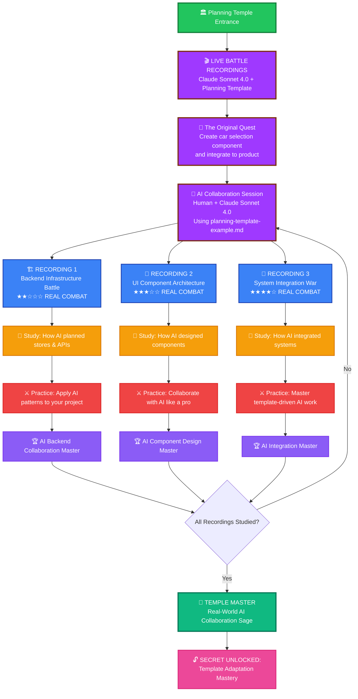
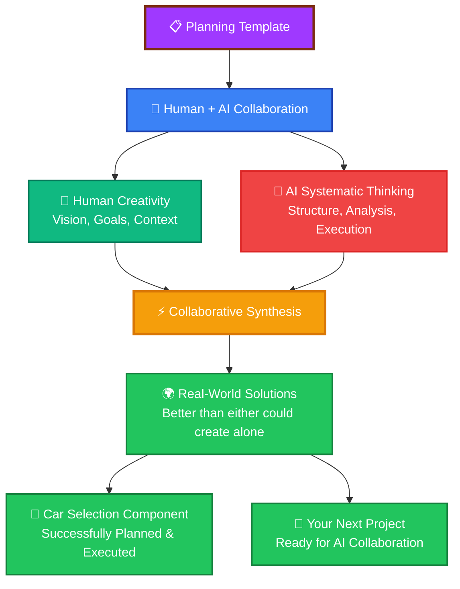
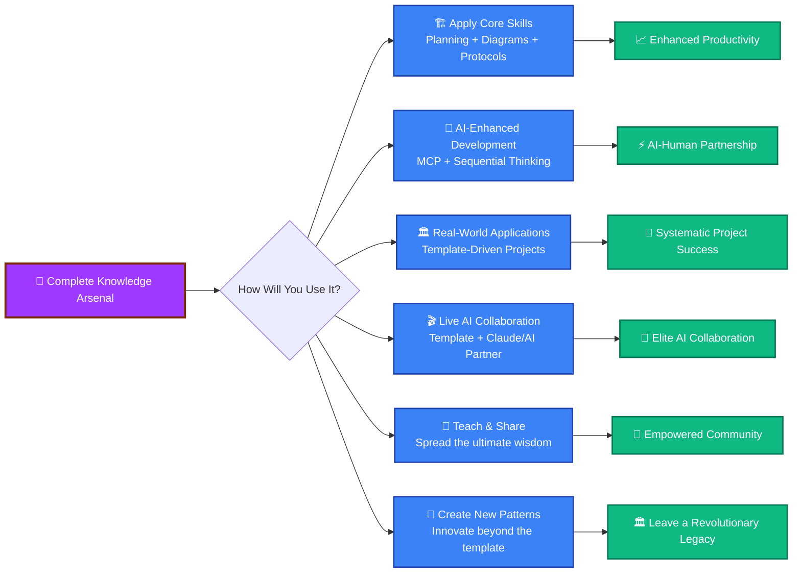

## 🏛️ TRAINING GROUNDS: The Planning Temple

### _Where AI Meets Reality - Live Battle Recordings_

> 🔓 **UNLOCKED AFTER:** Completing Core Campaign Quest 3
>
> ⚡ **SPECIAL FEATURE:** These are REAL outputs from Claude Sonnet 4.0 using the planning template!

**🎬 LIVE COMBAT FOOTAGE ALERT!** 🎬  
_What you're about to witness are actual battle recordings from when a Code Warrior collaborated with Claude Sonnet 4.0 to plan and execute a complex car selection component project. These aren't simulations - they're real AI collaboration in action!_



### 🎬 THE EPIC QUEST THAT STARTED IT ALL

**🎯 Original Mission Brief:**  
_"Help me create a car selection component and integrate it to a product system"_

**🤖 AI Collaboration Setup:**

- **Human Warrior:** You (the quest giver)
- **AI Partner:** Claude Sonnet 4.0 (the strategic mastermind)
- **Sacred Template:** [planning-template-example.md](../planning-template-example.md)
- **Battle Arena:** Cursor IDE
- **Collaboration Protocol:** Template-driven systematic planning

**🌟 What Makes This LEGENDARY:**

- These are **REAL** AI collaboration outputs, not examples
- Shows template adaptation in action across different project phases
- Demonstrates how AI interprets and applies the RIPER-5 protocol
- Reveals the power of systematic planning with AI partnership
- Each phase builds upon the previous (backend → UI → integration)

---

### 🏗️ LIVE RECORDING 1: Backend Infrastructure Battle

**Difficulty:** ★★☆☆☆ | **AI Collaboration Level:** Systematic Architecture Planning

<details>
<summary>🎬 Battle Recording Analysis</summary>

**What Claude Sonnet 4.0 Did:**

- Applied the planning template to backend infrastructure design
- Created comprehensive type definitions for car management
- Designed API architecture with proper error handling
- Built modular store patterns following existing project structure
- Generated detailed Mermaid diagrams for data flow visualization

**Template Adaptation Techniques:**

- Phase-based implementation breakdown (6 distinct phases)
- Timestamp tracking for continuation-resilient planning
- Visual architecture documentation with mandatory diagrams
- Technical specification depth appropriate for backend work
- Risk analysis specific to API integration challenges

**AI Collaboration Patterns Revealed:**

- How AI interprets abstract template requirements into concrete technical specs
- Template flexibility demonstrated across different development domains
- Systematic thinking applied to complex backend architecture
- Real-world constraint handling (existing system integration)

</details>

**MISSION ACTIONS:**

- [📖 Study the Live Backend Battle](step-1-car-stores-and-apis-planning.md)
- [🎨 Analyze] - How AI visualized complex data architecture
- [🤖 Learn] - Template adaptation techniques for backend planning
- [⚔️ Apply] - Use these patterns for your own backend projects
- [✅ Master] - Backend planning with AI collaboration

**🏆 BATTLE INSIGHTS UNLOCKED:**

- How to structure backend planning with AI partnership
- Template adaptation for different technical domains
- Systematic API design through collaborative planning
- Visual documentation strategies for complex systems

---

### 🎨 LIVE RECORDING 2: UI Component Architecture Battle

**Difficulty:** ★★★☆☆ | **AI Collaboration Level:** Advanced UX Design Planning

<details>
<summary>🎬 Battle Recording Analysis</summary>

**What Claude Sonnet 4.0 Did:**

- Transformed template for UI/UX component planning
- Created sophisticated user interaction workflow designs
- Applied Material-UI patterns with accessibility considerations
- Designed cascading dropdown logic with performance optimization
- Generated multiple diagram types (workflow, architecture, accessibility)

**Template Evolution Demonstrated:**

- Adaptation from backend to frontend planning methodology
- User experience focus integrated into technical planning
- Component hierarchy visualization techniques
- Accessibility requirements woven into planning phases
- Performance considerations embedded in design process

**Advanced AI Collaboration Techniques:**

- How AI balances technical constraints with user experience
- Template flexibility for different development paradigms
- Systematic approach to complex UI interaction design
- Integration of multiple stakeholder concerns (developers, users, accessibility)

</details>

**MISSION ACTIONS:**

- [📖 Study the Live UI Battle](step-2-car-selection-component-planning.md)
- [🎨 Analyze] - Advanced user workflow visualization techniques
- [🤖 Learn] - How AI approaches UX planning systematically
- [⚔️ Apply] - Template-driven component design for your projects
- [✅ Master] - AI-collaborative UI architecture planning

**🏆 BATTLE INSIGHTS UNLOCKED:**

- Template adaptation for user experience planning
- How to balance technical and UX requirements systematically
- AI-human collaboration in complex component design
- Advanced visualization techniques for UI workflows

---

### 🔗 LIVE RECORDING 3: System Integration War

**Difficulty:** ★★★★☆ | **AI Collaboration Level:** Master-Tier System Design

<details>
<summary>🎬 Battle Recording Analysis</summary>

**What Claude Sonnet 4.0 Did:**

- Evolved template for complex system integration planning
- Designed backward-compatible integration strategies
- Created comprehensive risk mitigation frameworks
- Built multi-system data flow architectures
- Planned testing strategies across integration boundaries

**Template Mastery Demonstrated:**

- Most sophisticated template adaptation across all recordings
- Integration of multiple planning domains (backend, frontend, system)
- Advanced risk analysis and mitigation planning
- Performance and compatibility considerations throughout
- End-to-end system thinking with template framework

**Elite AI Collaboration Patterns:**

- How AI handles complex constraint satisfaction problems
- Template evolution across project complexity levels
- Systematic approach to integration challenges
- Balance of innovation with stability requirements

</details>

**MISSION ACTIONS:**

- [📖 Study the Live Integration War](step-3-product-integration-planning.md)
- [🎨 Analyze] - Master-level system integration visualization
- [🤖 Learn] - Elite AI collaboration for complex system design
- [⚔️ Apply] - Template-driven integration planning for your systems
- [✅ Master] - AI partnership for enterprise-level system design

**🏆 BATTLE INSIGHTS UNLOCKED:**

- Master-tier template adaptation and evolution
- Complex system integration planning with AI
- Risk mitigation strategies for system-level changes
- Elite collaboration patterns for enterprise development

---

### 🌟 TEMPLE MASTER ACHIEVEMENT: The Ultimate Lesson

> **🔮 THE SECRET REVEALED:** The planning template isn't just a document—it's a **collaboration protocol** between human creativity and AI systematic thinking!

**What These Live Recordings Prove:**



**TRAINING GROUNDS COMPLETION:**

- [ ] I've studied all three AI collaboration recordings
- [ ] I understand how the template adapts across different project types
- [ ] I can see the evolution from backend → UI → integration planning
- [ ] I recognize the patterns of human creativity + AI systematic thinking
- [ ] I'm ready to collaborate with AI using the template myself
- [ ] I AM THE REAL-WORLD AI COLLABORATION MASTER!

**🔓 SECRET UNLOCKED: Template Adaptation Mastery**  
_You now understand that the template is not rigid—it's a flexible framework that evolves with your project needs while maintaining systematic thinking structure. The real power comes from the human-AI collaboration it enables!_

---

## 🎒 ENHANCED INVENTORY & ACHIEVEMENTS

### 🏆 Updated Achievement Gallery

<details>
<summary>🏅 Unlock Your Expanded Badges</summary>

| Badge | Achievement                                                       | Status |
| ----- | ----------------------------------------------------------------- | ------ |
| 🥉    | **First Steps** - Read any tip file                               | ⬜     |
| 🥈    | **Chart Master** - Create perfect Mermaid diagram                 | ⬜     |
| 🥇    | **Planning Guru** - Use template in real project                  | ⬜     |
| 💎    | **Protocol Adept** - Apply all 7 patterns                         | ⬜     |
| 👑    | **Core Campaign Master** - Complete all core quests               | ⬜     |
| ⚡    | **MCP Collaboration Master** - Master AI partnership              | ⬜     |
| 🏛️    | **Temple Master** - Complete all training missions                | ⬜     |
| 🎬    | **Live Recording Analyst** - Study all AI collaboration examples  | ⬜     |
| 🤖    | **AI Collaboration Expert** - Apply template with AI successfully | ⬜     |
| 🌟    | **Ultimate Code Warrior** - Master all campaigns                  | ⬜     |
| 🦄    | **Secret Speedrunner** - Find hidden shortcuts                    | ⬜     |
| 🐉    | **Dragon Slayer** - Fix someone else's broken Mermaid             | ⬜     |
| 🧙‍♂️    | **Meme Lord** - Reference this README in a PR                     | ⬜     |
| 📋    | **Planning Sensei** - Share template with your team               | ⬜     |
| ⚔️    | **Template Adapter** - Modify template for your domain            | ⬜     |

</details>

### 🎒 Enhanced Skills & Tools Collected

<details>
<summary>📦 Your Expanded Developer Arsenal</summary>

**Core Planning Skills:**

- [ ] 📋 Template Creation
- [ ] 🎯 Goal Definition
- [ ] ⚖️ Risk Analysis
- [ ] 📊 Progress Tracking

**Visual Communication:**

- [ ] 🎨 Mermaid Mastery
- [ ] 🖼️ Diagram Design
- [ ] 🌈 Color Theory
- [ ] 🔗 Interactive Charts

**Protocol Mastery:**

- [ ] 🧠 Multi-Dimensional Thinking
- [ ] 🔄 Pattern Recognition
- [ ] ⚡ Mode Switching
- [ ] 🎯 Systematic Problem Solving

**🌟 AI Collaboration Powers:**

- [ ] 🤖 MCP Protocol Mastery
- [ ] 🧠 Sequential Thinking
- [ ] 📚 Context Management
- [ ] 💭 Clear Thought Processing
- [ ] ⚡ Multi-Tool AI Workflows

**🏛️ Real-World Application:**

- [ ] 🏗️ Backend Architecture Planning
- [ ] 🎨 Component Design Mastery
- [ ] 🔗 System Integration Expertise
- [ ] 📋 Template Adaptation Skills
- [ ] 🎬 **Live AI Collaboration Analysis** _(NEW)_
- [ ] 🤖 **AI Partnership Patterns** _(NEW)_

**Legendary Items:**

- [ ] 🔥 The Auto-Decision Algorithm
- [ ] ⚔️ The Debugging Blade of Truth
- [ ] 🛡️ Shield of Code Quality
- [ ] 👑 Crown of Documentation
- [ ] 🤖 **The MCP Collaboration Orb**
- [ ] 📋 **Master Planning Scroll**
- [ ] ⚡ **Sequential Thinking Crystal**
- [ ] 🎬 **Live Battle Recording Archive** _(NEW)_
- [ ] 🌟 **Template Adaptation Toolkit** _(NEW)_

</details>

---

## 🚪 ENHANCED EXIT PORTAL: Apply Your Ultimate Knowledge

### Ready to Use Your Enhanced Powers?



### 🎯 Ultimate Real-World Missions

1. **🏗️ Master Your Next Project**

   - Use the planning template for complex development projects
   - Apply MCP collaboration for AI-enhanced development
   - Create comprehensive documentation with Mermaid diagrams
   - Watch your team's productivity soar

2. **🤖 Become an AI Collaboration Expert**

   - Use the template with Claude, GPT-4, or your preferred AI
   - Apply sequential thinking for complex problem solving
   - Master context management for large projects
   - Become the go-to person for AI-enhanced development

3. **🏛️ Transform Your Development Process**

   - Implement template-driven planning across your organization
   - Train your team in visual communication with Mermaid
   - Establish systematic protocols for all development work
   - Create a culture of thoughtful, planned development

4. **🎬 Start Your Own Live AI Collaboration**

   - Choose a complex project like the car selection component
   - Use the template as your collaboration framework
   - Document your AI partnership journey
   - Share your own "live battle recordings" with the community

5. **🌟 Innovate Beyond the Template**
   - Adapt the planning template for your specific domain
   - Create new MCP collaboration patterns
   - Develop novel visualization techniques
   - Push the boundaries of systematic development

---

## 💀 ENHANCED DEVELOPER'S GRAVEYARD

### _Learn from the Fallen Warriors (Updated with AI Collaboration Wisdom)_

<details>
<summary>⚰️ Classic Deaths & New AI-Era Failures</summary>

**💀 Death by Semicolon**

```
Cause: Inconsistent semicolon usage in Mermaid charts
Solution: Pick a style and stick to it
Resurrection: Use the Chart-mancer's color palette
```

**💀 Death by Scope Creep**

```
Cause: Adding features without planning
Solution: Use the Planning Template religiously
Resurrection: Apply the Protocol Overlord's wisdom
```

**💀 Death by Context Overload**

```
Cause: Trying to work with AI without proper context management
Solution: Master MCP context synthesis techniques
Resurrection: Learn from the MCP Mystic's teachings
```

**💀 Death by AI Dependency**

```
Cause: Relying on AI without understanding the fundamentals
Solution: Master the core skills first, then enhance with AI
Resurrection: Complete the core campaign before advanced MCP
```

**💀 Death by Template Rigidity**

```
Cause: Following the template too literally without adaptation
Solution: Study the live recordings to see template flexibility
Resurrection: Learn template adaptation from the Training Grounds
```

**💀 Death by Planning Paralysis**

```
Cause: Over-planning without executing
Solution: Use the template but start executing phases
Resurrection: Follow the training ground mission examples
```

**💀 Death by Poor AI Collaboration**

```
Cause: Treating AI as a magic solution instead of a partner
Solution: Learn systematic AI collaboration from live recordings
Resurrection: Master the human creativity + AI systematic thinking balance
```

</details>

---

## 🤝 JOIN THE ENHANCED GUILD

### Contribute to the Ultimate Adventure

Found a new boss we missed? Discovered advanced MCP techniques? Want to add your own training missions or live AI collaboration recordings?

**How to Contribute:**

1. Fork this ultimate dungeon
2. Add your wisdom to the appropriate campaign
3. Test your Mermaid spells in the [Live Editor](https://mermaid.live/)
4. Apply the planning template to document your additions
5. Submit a pull request with proper MCP collaboration
6. Become a legend

**Enhanced Contribution Ideas:**

- 🐲 New legendary bosses (advanced tips & techniques)
- 🤖 MCP collaboration patterns and examples
- 🏛️ More real-world training missions
- 🎬 Your own live AI collaboration recordings
- 📋 Template adaptations for different domains (mobile, DevOps, ML, etc.)
- 🗺️ Enhanced dungeon maps and navigation
- 🎨 Advanced interactive elements
- 🏆 New achievement categories and progression paths
- 😂 More developer humor (we can never have enough)

---

## 📜 ENHANCED CREDITS & EASTER EGGS

**Created by:** The Ultimate Code Warriors Guild  
**Powered by:** Caffeine, Determination, AI Collaboration, and Questionable Life Choices  
**Special Thanks:** Stack Overflow, GitHub Copilot, MCP Protocol, Sequential Thinking, Claude Sonnet 4.0, and the Power of Systematic Planning

**🎬 Live Recordings Featured:**

- **Claude Sonnet 4.0** - The AI partner that demonstrated template mastery
- **The Car Selection Quest** - The epic mission that showcased real AI collaboration
- **Template Evolution** - Proof that systematic thinking adapts and grows

**Hidden Secrets:**

- Try the Konami Code: ↑↑↓↓←→←→BA (now unlocks MCP debug mode!)
- There's a secret speedrun route from Quest 1 to MCP Mystic
- The Protocol Overlord's weakness is actually reading the documentation
- This README was written using its own planning template (meta!)
- The MCP Mystic can be defeated by perfect AI collaboration
- Each training mission contains hidden efficiency techniques
- The live recordings reveal the secret to template adaptation
- The real treasure
