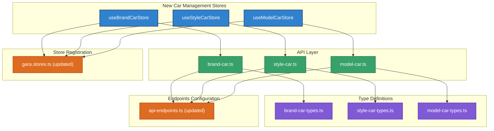
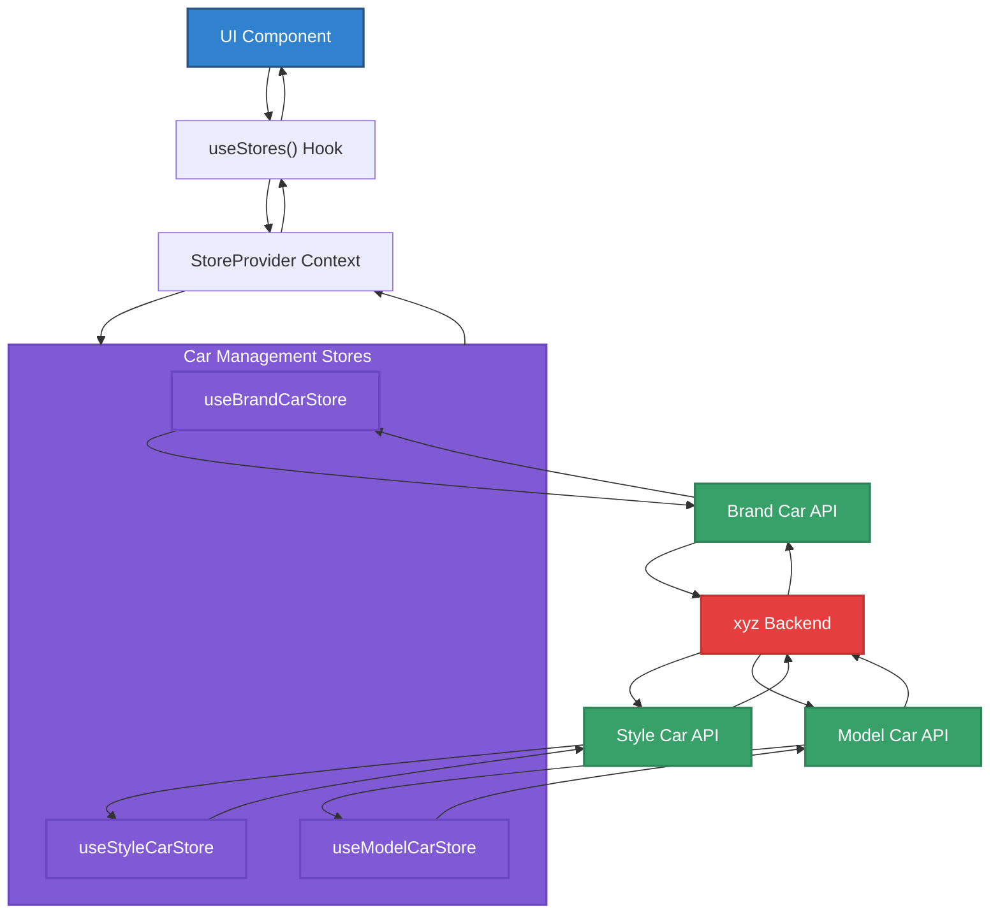
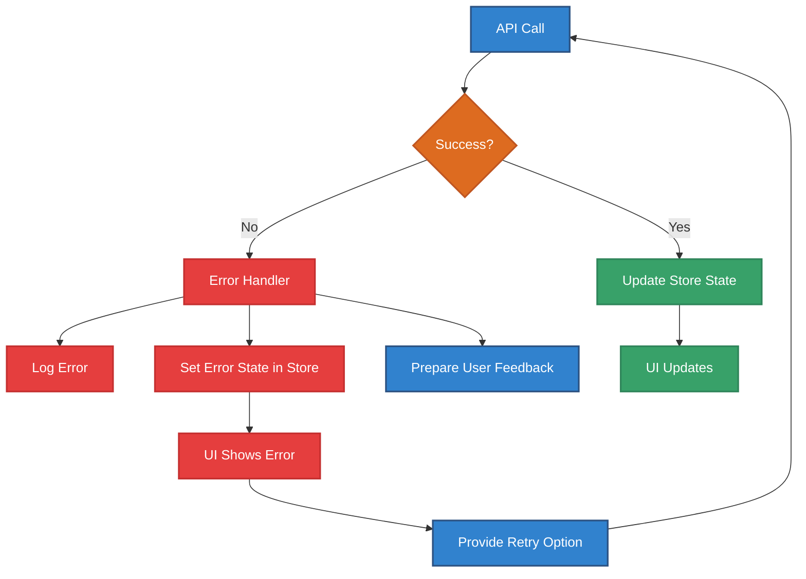

# Context

Protocol: RIPER-5 + Multi-Dimensional Thinking + Agent Execution + Clean Architecture  
Mode: Planning → Execution → Review  
Target: Create stores, APIs, and types for Brand Car, Style Car, and Model Car management  
Visualization Protocol: Mandatory in all steps (Mermaid / PlantUML / Markdown)

# Objective

You are Cursor AI acting as a world-class Senior Developer with extensive experience in Vite, TypeScript, and React.  
Your goal is to create comprehensive car data management infrastructure (Brand, Style, Model) following the established xyz store architecture patterns and API structures, ensuring seamless integration with the existing system.

This session is **continuation-resilient** — if interrupted, resume at the next unchecked step in the planning checklist.  
Test code is **skipped**. All interactions must produce results in Markdown format, and each major step must include a **diagram**.

# Instructions

---

## 🧠 [Planning Mode]

### Store Architecture Overview

Following the guide-store.md pattern, we need to create a complete car data management system that integrates with the existing xyz-GARA store architecture.



### Data Flow Architecture



### Implementation Checklist

#### Phase 1: Type Definitions ✅ Completed 🕒 2024-12-19 15:30

- [x] Create `src/lib/api/xyz-gara/types/brand-car-types.ts` ✅ 2024-12-19 15:30

  - [x] Define `BrandCarResponse` interface ✅
  - [x] Define `BrandCarListResponse` interface ✅
  - [x] Define `BrandCarDetailResponse` interface ✅
  - [x] Define `BrandCarActionResponse` interface ✅
  - [x] Define `CreateBrandCarRequest` interface ✅
  - [x] Define `UpdateBrandCarRequest` interface ✅

- [x] Create `src/lib/api/xyz-gara/types/style-car-types.ts` ✅ 2024-12-19 15:30

  - [x] Define `StyleCarResponse` interface ✅
  - [x] Define `StyleCarListResponse` interface ✅
  - [x] Define `StyleCarDetailResponse` interface ✅
  - [x] Define `CreateStyleCarRequest` interface ✅
  - [x] Define `UpdateStyleCarRequest` interface ✅

- [x] Create `src/lib/api/xyz-gara/types/model-car-types.ts` ✅ 2024-12-19 15:30
  - [x] Define `ModelCarResponse` interface ✅
  - [x] Define `ModelCarListResponse` interface ✅
  - [x] Define `ModelCarDetailResponse` interface ✅
  - [x] Define `CreateModelCarRequest` interface ✅
  - [x] Define `UpdateModelCarRequest` interface ✅

#### Phase 2: API Endpoints Configuration ✅ Completed 🕒 2024-12-19 15:35

- [x] Update `src/lib/api/core/api-endpoints.ts` ✅ 2024-12-19 15:35
  - [x] Add `brandCar` endpoint configuration in `garaEndpoints` ✅
  - [x] Add `styleCar` endpoint configuration in `garaEndpoints` ✅
  - [x] Add `modelCar` endpoint configuration in `garaEndpoints` ✅

#### Phase 3: API Implementation ✅ Completed 🕒 2024-12-19 15:40

- [x] Create `src/lib/api/xyz-gara/brand-car.ts` ✅ 2024-12-19 15:40

  - [x] Implement `BrandCarApi` class extending `Api` ✅
  - [x] Implement `getBrands` method with pagination and search ✅
  - [x] Implement `getBrandById` method ✅
  - [x] Implement `createBrand` method (if needed) ✅
  - [x] Implement `updateBrand` method (if needed) ✅
  - [x] Implement `deleteBrand` method (if needed) ✅
  - [x] Export `brandCarApi` instance ✅

- [x] Create `src/lib/api/xyz-gara/style-car.ts` ✅ 2024-12-19 15:40

  - [x] Implement `StyleCarApi` class extending `Api` ✅
  - [x] Implement `getStyles` method with pagination and search ✅
  - [x] Implement `getStyleById` method ✅
  - [x] Export `styleCarApi` instance ✅

- [x] Create `src/lib/api/xyz-gara/model-car.ts` ✅ 2024-12-19 15:40
  - [x] Implement `ModelCarApi` class extending `Api` ✅
  - [x] Implement `getModels` method with pagination, search, and filters (brand, style) ✅
  - [x] Implement `getModelById` method ✅
  - [x] Export `modelCarApi` instance ✅

#### Phase 4: Store Implementation ✅ Completed 🕒 2024-12-19 15:50

- [x] Create `src/store/xyz-gara/use-brand-car-store.ts` ✅ 2024-12-19 15:50

  - [x] Follow `use-label-store.ts` pattern exactly ✅
  - [x] Implement state interface with brands, selectedBrand, loading, error, pagination ✅
  - [x] Implement `getBrands` action with refresh logic ✅
  - [x] Implement `getBrandById` action ✅
  - [x] Implement search and filter state management ✅
  - [x] Export `useGaraBrandCarStore` ✅

- [x] Create `src/store/xyz-gara/use-style-car-store.ts` ✅ 2024-12-19 15:50

  - [x] Follow `use-label-store.ts` pattern exactly ✅
  - [x] Implement state interface with styles, selectedStyle, loading, error, pagination ✅
  - [x] Implement `getStyles` action with refresh logic ✅
  - [x] Implement `getStyleById` action ✅
  - [x] Export `useGaraStyleCarStore` ✅

- [x] Create `src/store/xyz-gara/use-model-car-store.ts` ✅ 2024-12-19 15:50
  - [x] Follow `use-label-store.ts` pattern exactly ✅
  - [x] Implement state interface with models, selectedModel, loading, error, pagination ✅
  - [x] Implement `getModels` action with brand and style filtering ✅
  - [x] Implement `getModelById` action ✅
  - [x] Add brand and style filter state management ✅
  - [x] Export `useGaraModelCarStore` ✅

#### Phase 5: Store Registration ✅ Completed 🕒 2024-12-19 15:55

- [x] Update `src/store/xyz-gara/gara.stores.ts` ✅ 2024-12-19 15:55

  - [x] Import all three new stores ✅
  - [x] Add `useBrandCarStore: useGaraBrandCarStore` to garaStores object ✅
  - [x] Add `useStyleCarStore: useGaraStyleCarStore` to garaStores object ✅
  - [x] Add `useModelCarStore: useGaraModelCarStore` to garaStores object ✅

#### Phase 6: API Index Update ✅ Completed 🕒 2024-12-19 15:35

- [x] Update `src/lib/api/xyz-gara/index.ts` ✅ 2024-12-19 15:35
  - [x] Export `brandCarApi` ✅
  - [x] Export `styleCarApi` ✅
  - [x] Export `modelCarApi` ✅

### Technical Specifications

#### API Response Formats

Based on the provided API documentation, the expected response formats are:

**Brand Car API Response:**

```typescript
interface BrandCarListResponse {
  status: boolean;
  data: {
    brands: BrandCarResponse[];
    currentPage: number;
    totalPage: number;
    totalRow: number;
  };
}

interface BrandCarResponse {
  _id: string;
  name: string;
  logo: string;
  description: string;
  status: boolean;
  priority: number;
  createdAt: string;
  updatedAt: string;
}
```

**Style Car API Response:**

```typescript
interface StyleCarListResponse {
  status: boolean;
  data: {
    styles: StyleCarResponse[];
    currentPage: number;
    totalPage: number;
    totalRow: number;
  };
}

interface StyleCarResponse {
  _id: string;
  name: string;
  icon: string;
  description: string;
  status: boolean;
  priority: number;
  createdAt: string;
  updatedAt: string;
}
```

**Model Car API Response:**

```typescript
interface ModelCarListResponse {
  status: boolean;
  data: {
    cars: ModelCarResponse[];
    currentPage: number;
    totalPage: number;
    totalRow: number;
  };
}

interface ModelCarResponse {
  _id: string;
  name: string;
  model: string;
  years: number[];
  description: string;
  transmission: 'MANUAL' | 'AUTOMATIC' | 'SEMI_AUTOMATIC' | null;
  fuelType: 'PETROL' | 'DIESEL' | 'ELECTRIC' | 'HYBRID' | null;
  engineSize: number;
  doors: number;
  seats: number;
  features: string[];
  status: boolean;
  brand: {
    _id: string;
    name: string;
    logo: string;
  };
  style: string;
  createdAt: string;
  updatedAt: string;
}
```

### Error Handling Strategy



---

## ⚙️ [Execution Mode]

- Implement **one checklist item per run**
- After each step:
  1. Update this planning file and check `[x]` with timestamp (🕒)
  2. Paste modified source code and file path
  3. Include updated diagram if structure or logic changed
- Important:
  - Follow the exact patterns from `use-label-store.ts`
  - Use consistent naming conventions
  - Ensure proper TypeScript typing
  - Maintain error handling standards

---

## 🔍 [Review Mode]

When all tasks are checked:

- Verify all stores are properly registered in `gara.stores.ts`
- Confirm TypeScript compilation without errors
- Test API endpoints with proper response handling
- Ensure consistent error handling across all stores
- Validate that the stores follow the established architecture patterns
- Confirm integration with the existing StoreProvider system

---

## 🚨 Constraints

- Diagrams are required in **every step**, no exceptions
- Use only Mermaid format for diagrams
- Follow the exact patterns from `use-label-store.ts`
- Maintain consistency with existing API structure
- No placeholder code or incomplete logic
- All stores must be compatible with the StoreProvider architecture

---

## ✅ Output Format

- Markdown
- ✅ Updated planning checklist with completion timestamps
- 📄 Source code with file path
- 📊 Mermaid diagram for each major implementation
- 💬 Commentary with clear reasoning for architectural decisions

---

## 🏁 Start

> 🚀 **Beginning Implementation: [Planning Mode Complete]**  
> ↪️ **Next Task:** `Phase 1: Type Definitions - Create brand-car-types.ts`
> 🎯 Ready to proceed with systematic implementation of car management infrastructure
