# Global Rules Setup Guide for Cursor IDE

## 🎯 Overview

This guide shows you how to set up global rules in Cursor IDE that will apply the Multi-Dimensional Thinking Protocol across all your projects. Once configured, these rules will automatically enhance your AI interactions with systematic thinking patterns.

## 🗺️ Setup Workflow

```mermaid
graph TD
    Start["🚀 Start Setup"] --> CheckCursor{"Cursor IDE Installed?"}
    CheckCursor -- "No" --> InstallCursor["📥 Install Cursor IDE"]
    CheckCursor -- "Yes" --> LocateRules["📍 Locate .cursor Folder"]

    InstallCursor --> LocateRules
    LocateRules --> CreateRulesDir["📁 Create rules Directory"]
    CreateRulesDir --> CopyRule["📋 Copy Global Rule File"]
    CopyRule --> ConfigureRule["⚙️ Configure Rule Content"]
    ConfigureRule --> TestRule["🧪 Test Rule Application"]
    TestRule --> Verify{"Rule Working?"}

    Verify -- "No" --> Troubleshoot["🔧 Troubleshoot Issues"]
    Verify -- "Yes" --> Success["✅ Global Rules Active"]

    Troubleshoot --> TestRule
    Success --> UseInProjects["🚀 Use in All Projects"]

    classDef secondary fill:#2d3748,stroke:#4a5568,stroke-width:2px,color:#fff
    classDef decision fill:#dd6b20,stroke:#c05621,stroke-width:2px,color:#fff
    classDef primary fill:#3182ce,stroke:#2c5282,stroke-width:2px,color:#fff
    classDef success fill:#38a169,stroke:#2f855a,stroke-width:2px,color:#fff
    classDef error fill:#e53e3e,stroke:#c53030,stroke-width:2px,color:#fff

    class Start,LocateRules,CreateRulesDir,CopyRule,ConfigureRule,UseInProjects secondary
    class CheckCursor,Verify decision
    class InstallCursor,TestRule,Troubleshoot primary
    class Success success
```



## 📋 Step-by-Step Instructions

### Step 1: Locate Your Cursor Configuration Directory

First, you need to find where Cursor stores its configuration files:

**Windows:**

```bash
# Navigate to Cursor config directory
cd %APPDATA%\Cursor\User
```

**macOS:**

```bash
# Navigate to Cursor config directory
cd ~/Library/Application\ Support/Cursor/User
```

**Linux:**

```bash
# Navigate to Cursor config directory
cd ~/.config/Cursor/User
```

### Step 2: Create the Rules Directory

Create a `rules` directory in your Cursor configuration folder:

```bash
# Create rules directory
mkdir -p rules

# Navigate to rules directory
cd rules
```

### Step 3: Create the Global Rule File

Create a global rule file that applies to all projects:

```bash
# Create the global rule file
touch global-multi-dimensional-thinking.md
```

### Step 4: Add the Multi-Dimensional Thinking Protocol

Copy the following content into your `global-multi-dimensional-thinking.md` file:

```markdown
# Global Multi-Dimensional Thinking Protocol

This rule applies to all AI interactions in Cursor IDE, enhancing responses with systematic thinking patterns.

## Core Protocol

When responding to any coding question or request, apply this systematic approach:

### Pattern 1: Research Mode

- Gather comprehensive information about the problem
- Understand the context, requirements, and constraints
- Identify relevant technologies, frameworks, and best practices

### Pattern 2: Innovation Mode

- Generate at least 2 orthogonal solution approaches
- Consider different architectural patterns and methodologies
- Explore creative alternatives and edge cases

### Pattern 3: Planning Mode

- Create exhaustive technical specifications
- Break down complex tasks into manageable steps
- Define clear success criteria and acceptance tests

### Pattern 4: Verification Mode

- Fact-check all technical details and assumptions
- Validate compatibility with existing systems
- Review for potential security and performance issues

### Pattern 5: Execution Mode

- Implement solutions with 100% fidelity to specifications
- Follow established coding standards and best practices
- Include comprehensive error handling and logging

### Pattern 6: Review Mode

- Confirm implementation meets all requirements
- Test functionality and edge cases
- Document decisions and rationale

### Pattern 7: Intelligence Mode

- Synthesize all previous patterns into coherent responses
- Provide complete solutions in single interactions when possible
- Include follow-up suggestions and optimization opportunities

## Application Guidelines

- Always identify which pattern(s) are most relevant to the current request
- Chain patterns logically for complex problems
- Provide clear reasoning for chosen approaches
- Include visual diagrams (Mermaid) for complex workflows
- Maintain consistency with project-specific requirements

## Code Quality Standards

- Write clean, readable, and maintainable code
- Include appropriate comments and documentation
- Follow language-specific conventions and best practices
- Implement proper error handling and input validation
- Consider performance implications and optimization opportunities
```

### Step 5: Verify Rule Application

To test that your global rule is working:

1. **Open Cursor IDE**
2. **Create a new file or open an existing project**
3. **Ask the AI a coding question** (e.g., "How should I structure a React component?")
4. **Check if the response follows the multi-dimensional thinking patterns**

Expected behavior: The AI should provide more systematic, thorough responses that consider multiple approaches and include proper planning.

## 🔧 Rule Configuration Workflow

```mermaid
graph LR
    Configure["🔧 Configure Rule"] --> Apply["📤 Apply to Projects"]
    Apply --> Test["🧪 Test Effectiveness"]
    Test --> Analyze{"Response Quality?"}

    Analyze -- "Good" --> Document["📝 Document Success"]
    Analyze -- "Needs Improvement" --> Refine["✏️ Refine Rule Content"]

    Refine --> Apply
    Document --> Share["🤝 Share with Team"]

    classDef primary fill:#3182ce,stroke:#2c5282,stroke-width:2px,color:#fff
    classDef decision fill:#dd6b20,stroke:#c05621,stroke-width:2px,color:#fff
    classDef success fill:#38a169,stroke:#2f855a,stroke-width:2px,color:#fff
    classDef secondary fill:#2d3748,stroke:#4a5568,stroke-width:2px,color:#fff

    class Configure,Apply,Test,Refine primary
    class Analyze decision
    class Document,Share success
```



## 🎛️ Advanced Configuration Options

### Project-Specific Rule Overrides

You can create project-specific rules that extend or override the global rules:

1. **Create `.cursor/rules/` in your project root**
2. **Add project-specific rule files**
3. **Rules are applied in order: global → project-specific**

### Multiple Global Rules

You can create multiple global rule files for different purposes:

```bash
# In your global rules directory
touch global-multi-dimensional-thinking.md
touch global-code-review-standards.md
touch global-documentation-guidelines.md
touch global-testing-protocols.md
```

### Rule Activation and Deactivation

To temporarily disable a rule:

- Rename the file with `.disabled` extension
- Example: `global-multi-dimensional-thinking.md.disabled`

To reactivate:

- Remove the `.disabled` extension

## 🔍 Troubleshooting Common Issues

```mermaid
graph TD
    Issue["🚨 Rule Not Working"] --> Check1{"Rules Directory Exists?"}
    Check1 -- "No" --> CreateDir["📁 Create rules Directory"]
    Check1 -- "Yes" --> Check2{"Rule File Present?"}

    Check2 -- "No" --> CreateFile["📝 Create Rule File"]
    Check2 -- "Yes" --> Check3{"Correct File Format?"}

    Check3 -- "No" --> FixFormat["✏️ Fix Markdown Format"]
    Check3 -- "Yes" --> Check4{"Cursor Restarted?"}

    Check4 -- "No" --> Restart["🔄 Restart Cursor IDE"]
    Check4 -- "Yes" --> CheckContent["📋 Review Rule Content"]

    CreateDir --> CreateFile
    CreateFile --> TestAgain["🧪 Test Again"]
    FixFormat --> TestAgain
    Restart --> TestAgain
    CheckContent --> TestAgain

    classDef error fill:#e53e3e,stroke:#c53030,stroke-width:2px,color:#fff
    classDef decision fill:#dd6b20,stroke:#c05621,stroke-width:2px,color:#fff
    classDef primary fill:#3182ce,stroke:#2c5282,stroke-width:2px,color:#fff
    classDef success fill:#38a169,stroke:#2f855a,stroke-width:2px,color:#fff

    class Issue error
    class Check1,Check2,Check3,Check4 decision
    class CreateDir,CreateFile,FixFormat,Restart,CheckContent primary
    class TestAgain success
```



### Common Problems and Solutions

| Problem               | Cause                         | Solution                                    |
| --------------------- | ----------------------------- | ------------------------------------------- |
| Rules not applying    | Rules directory doesn't exist | Create `.cursor/User/rules/` directory      |
| Inconsistent behavior | Multiple conflicting rules    | Review and prioritize rule hierarchy        |
| Performance impact    | Too many complex rules        | Optimize rule content, disable unused rules |
| Syntax errors         | Invalid Markdown format       | Validate Markdown syntax                    |

## ✅ Verification Checklist

Before considering your global rules setup complete:

- [ ] **Rules directory created** in correct Cursor config location
- [ ] **Global rule file** created and properly formatted
- [ ] **Rule content** includes Multi-Dimensional Thinking Protocol
- [ ] **Cursor IDE restarted** to apply changes
- [ ] **Test interactions** show improved systematic responses
- [ ] **Backup created** of rule files for team sharing
- [ ] **Documentation updated** with team-specific customizations

## 🚀 Next Steps

Once your global rules are working:

1. **Share with team members** - Help colleagues set up identical rules
2. **Create project-specific extensions** - Add rules for specific technologies
3. **Monitor effectiveness** - Track improvement in AI response quality
4. **Iterate and improve** - Refine rules based on real-world usage
5. **Explore advanced features** - Custom rules for different development phases

Your global rules are now set up and ready to enhance your AI development workflow across all projects! 🎉
