# Planning Template Adaptation Guide

## 🎯 Overview

This guide shows you how to transform the generic planning template into a project-specific template that understands your tech stack, coding style, and project requirements. Once adapted, you'll have a personalized planning template that generates perfectly tailored plans for your projects.

## 🗺️ Two-Step Adaptation Workflow

```mermaid
graph TD
    Start["🚀 Start Adaptation"] --> Step1["📋 STEP 1<br/>Template Customization"]
    Step1 --> GatherFiles["📁 Gather Project Files"]
    GatherFiles --> DragTemplate["🖱️ Drag Template to Chat"]
    DragTemplate --> DragProjectFiles["📂 Drag Project Files"]
    DragProjectFiles --> RequestCustomization["🤖 Request AI Customization"]
    RequestCustomization --> ReviewCustomized["👀 Review Customized Template"]

    ReviewCustomized --> Step2["🎯 STEP 2<br/>Template Usage"]
    Step2 --> SaveTemplate["💾 Save Customized Template"]
    SaveTemplate --> UseForPlanning["📋 Use for Project Planning"]
    UseForPlanning --> DragCustomTemplate["🖱️ Drag Custom Template"]
    DragCustomTemplate --> RequestPlan["🗣️ Request Planning"]
    RequestPlan --> GetCleanPlan["📄 Get Clean Planning File"]
    GetCleanPlan --> ImplementCode["⚙️ Implement Following Plan"]

    classDef step fill:#9f39ff,stroke:#7c2d12,stroke-width:3px,color:#fff
    classDef primary fill:#3182ce,stroke:#2c5282,stroke-width:2px,color:#fff
    classDef secondary fill:#2d3748,stroke:#4a5568,stroke-width:2px,color:#fff
    classDef success fill:#38a169,stroke:#2f855a,stroke-width:2px,color:#fff

    class Step1,Step2 step
    class DragTemplate,DragProjectFiles,RequestCustomization,DragCustomTemplate,RequestPlan primary
    class GatherFiles,ReviewCustomized,SaveTemplate,UseForPlanning secondary
    class GetCleanPlan,ImplementCode success
```



## 📋 STEP 1: Template Customization

### What You'll Need

Before starting, gather these files from your project:

```mermaid
graph LR
    ProjectFiles["📁 Your Project Files"] --> Essential["🔥 Essential Files"]
    ProjectFiles --> Optional["📝 Optional Files"]

    Essential --> PackageJson["📦 package.json<br/>(Dependencies & Scripts)"]
    Essential --> SourceCode["📂 src/ folder<br/>(Main Code Structure)"]
    Essential --> Config["⚙️ Config files<br/>(Build & Environment)"]

    Optional --> ReadMe["📖 README.md<br/>(Project Description)"]
    Optional --> Types["🏷️ TypeScript files<br/>(Type Definitions)"]
    Optional --> Tests["🧪 Test files<br/>(Testing Patterns)"]

    classDef essential fill:#e53e3e,stroke:#c53030,stroke-width:2px,color:#fff
    classDef optional fill:#dd6b20,stroke:#c05621,stroke-width:2px,color:#fff
    classDef primary fill:#3182ce,stroke:#2c5282,stroke-width:2px,color:#fff

    class Essential,PackageJson,SourceCode,Config essential
    class Optional,ReadMe,Types,Tests optional
    class ProjectFiles primary
```



### Step 1.1: Prepare Your Files

1. **Open your project in file explorer**
2. **Locate key files**:
   - `package.json` (for Node.js projects)
   - `requirements.txt` (for Python projects)
   - `Cargo.toml` (for Rust projects)
   - Main source directory (`src/`, `app/`, etc.)
   - Configuration files (`.env`, `config/`, etc.)

### Step 1.2: Start the Customization Process

1. **Open Cursor IDE**
2. **Start a new chat session**
3. **Drag the planning template** (`planning-template-example.md`) into the chat box
4. **Drag your project files** (package.json, src folder, config files) into the same chat
5. **Use this customization prompt**:

```
I want to customize this planning template to be specific for my project. Please analyze my project files and update the template to:

1. Include my specific tech stack and dependencies
2. Reference my actual project structure and conventions
3. Add relevant build/deploy commands from my scripts
4. Include project-specific best practices and patterns
5. Adapt the examples to match my coding style and architecture

Please keep the same overall structure but make it perfectly tailored to my project. The customized template should understand my project context and generate plans that fit my existing codebase.
```

### Step 1.3: Review and Refine

The AI will generate a customized template. Review it for:

- ✅ **Correct tech stack references** (React, Vue, Angular, etc.)
- ✅ **Proper file structure understanding** (your actual folder names)
- ✅ **Relevant build commands** (npm scripts, make commands, etc.)
- ✅ **Project-specific terminology** (your domain language)
- ✅ **Coding conventions** (your preferred patterns)

If something needs adjustment, ask the AI to refine specific sections.

## 🎯 STEP 2: Template Usage for Planning

### Workflow for Creating Project Plans

```mermaid
graph TD
    NewFeature["🆕 New Feature Request"] --> PrepareContext["📋 Prepare Context"]
    PrepareContext --> DragCustomTemplate["🖱️ Drag Custom Template"]
    DragCustomTemplate --> DragRelevantFiles["📂 Drag Relevant Files"]
    DragRelevantFiles --> ProvideRequest["🗣️ Provide Feature Request"]

    ProvideRequest --> AIProcessing["🤖 AI Processing"]
    AIProcessing --> GeneratePlan["📄 Generate Clean Plan"]
    GeneratePlan --> ReviewPlan["👀 Review Generated Plan"]
    ReviewPlan --> AdjustPlan{"Need Adjustments?"}

    AdjustPlan -- "Yes" --> RefineRequest["✏️ Refine Request"]
    AdjustPlan -- "No" --> ImplementPlan["⚙️ Start Implementation"]

    RefineRequest --> AIProcessing
    ImplementPlan --> FollowSteps["📝 Follow Plan Steps"]

    classDef primary fill:#3182ce,stroke:#2c5282,stroke-width:2px,color:#fff
    classDef secondary fill:#2d3748,stroke:#4a5568,stroke-width:2px,color:#fff
    classDef decision fill:#dd6b20,stroke:#c05621,stroke-width:2px,color:#fff
    classDef success fill:#38a169,stroke:#2f855a,stroke-width:2px,color:#fff

    class NewFeature,PrepareContext,DragCustomTemplate,DragRelevantFiles,ProvideRequest,AIProcessing,GeneratePlan primary
    class ReviewPlan,RefineRequest secondary
    class AdjustPlan decision
    class ImplementPlan,FollowSteps success
```



### Step 2.1: Using Your Custom Template

1. **Save your customized template** in an easily accessible location
2. **When you need to plan a new feature**:
   - Open Cursor IDE chat
   - Drag your **customized template** into the chat
   - Drag **relevant existing files** that relate to your new feature
   - Describe what you want to build

### Step 2.2: Example Planning Request

```
Please use this template to create a detailed plan for adding a user authentication system to my project. I want to include:

- User registration and login
- JWT token management
- Protected routes
- Password reset functionality
- Integration with my existing user profile components

Generate a complete planning document following the template structure.
```

### Step 2.3: What You'll Get

The AI will generate a comprehensive planning document with:

- ✅ **Project-specific implementation steps**
- ✅ **Accurate file paths and component names**
- ✅ **Correct dependencies and commands**
- ✅ **Mermaid diagrams tailored to your architecture**
- ✅ **Testing strategies that match your setup**
- ✅ **Deployment steps using your actual scripts**

## 🔄 Template Usage Cycle

```mermaid
graph LR
    CustomTemplate["📋 Custom Template"] --> PlanningRequest["🗣️ Planning Request"]
    PlanningRequest --> GeneratedPlan["📄 Generated Plan"]
    GeneratedPlan --> Implementation["⚙️ Implementation"]
    Implementation --> Feedback["📝 Implementation Feedback"]
    Feedback --> TemplateUpdate["🔄 Template Updates"]
    TemplateUpdate --> CustomTemplate

    classDef primary fill:#3182ce,stroke:#2c5282,stroke-width:2px,color:#fff
    classDef success fill:#38a169,stroke:#2f855a,stroke-width:2px,color:#fff
    classDef secondary fill:#2d3748,stroke:#4a5568,stroke-width:2px,color:#fff

    class CustomTemplate,PlanningRequest,GeneratedPlan primary
    class Implementation,Feedback success
    class TemplateUpdate secondary
```



## 📁 File Organization Best Practices

### Recommended Structure

```
your-project/
├── docs/
│   ├── planning-templates/
│   │   ├── custom-template-v1.md          # Your customized template
│   │   ├── feature-plans/                 # Generated plans
│   │   │   ├── auth-system-plan.md
│   │   │   ├── dashboard-redesign-plan.md
│   │   │   └── api-integration-plan.md
│   │   └── template-archive/              # Template versions
│   └── project-specific-examples/
└── [your existing project structure]
```

### Template Versioning

As your project evolves, update your template:

```mermaid
graph TD
    V1["📋 Template v1.0<br/>(Initial Setup)"] --> ProjectGrowth["🚀 Project Evolution"]
    ProjectGrowth --> NewRequirements["📝 New Requirements"]
    NewRequirements --> V2["📋 Template v2.0<br/>(Updated Features)"]
    V2 --> MoreGrowth["📈 Continued Growth"]
    MoreGrowth --> V3["📋 Template v3.0<br/>(Advanced Features)"]

    classDef version fill:#9f39ff,stroke:#7c2d12,stroke-width:2px,color:#fff
    classDef growth fill:#38a169,stroke:#2f855a,stroke-width:2px,color:#fff

    class V1,V2,V3 version
    class ProjectGrowth,NewRequirements,MoreGrowth growth
```



## 🧪 Testing Your Template

### Validation Checklist

Test your customized template with a simple feature:

- [ ] **Template loads correctly** when dragged to chat
- [ ] **AI understands your tech stack** and suggests appropriate solutions
- [ ] **Generated plans reference actual files** in your project
- [ ] **Build commands match your package.json** (or equivalent)
- [ ] **Code examples follow your conventions** (naming, structure, etc.)
- [ ] **Dependencies are realistic** for your project
- [ ] **Testing approaches match your setup** (Jest, Pytest, etc.)

### Quick Test Example

Try this simple test:

1. Drag your custom template + a simple component file
2. Ask: "Plan a small improvement to this component - add a loading state"
3. Check if the generated plan:
   - Uses your actual file paths
   - Suggests libraries you already have
   - Follows your coding patterns
   - Includes appropriate tests

## 🔧 Troubleshooting Common Issues

```mermaid
graph TD
    Issue["🚨 Template Issues"] --> Generic{"Plan Too Generic?"}
    Generic -- "Yes" --> AddMoreFiles["📁 Add More Project Files"]
    Generic -- "No" --> WrongStack{"Wrong Tech Stack?"}

    WrongStack -- "Yes" --> ClearInstructions["📝 Give Clearer Instructions"]
    WrongStack -- "No" --> FileStructure{"Wrong File Paths?"}

    FileStructure -- "Yes" --> UpdateStructure["🔄 Update Project Structure"]
    FileStructure -- "No" --> CodeStyle{"Wrong Code Style?"}

    CodeStyle -- "Yes" --> ProvideExamples["📖 Provide Style Examples"]
    CodeStyle -- "No" --> Success["✅ Template Working"]

    classDef error fill:#e53e3e,stroke:#c53030,stroke-width:2px,color:#fff
    classDef decision fill:#dd6b20,stroke:#c05621,stroke-width:2px,color:#fff
    classDef action fill:#3182ce,stroke:#2c5282,stroke-width:2px,color:#fff
    classDef success fill:#38a169,stroke:#2f855a,stroke-width:2px,color:#fff

    class Issue error
    class Generic,WrongStack,FileStructure,CodeStyle decision
    class AddMoreFiles,ClearInstructions,UpdateStructure,ProvideExamples action
    class Success success
```



### Common Problems & Solutions

| Problem                      | Cause                                | Solution                                                   |
| ---------------------------- | ------------------------------------ | ---------------------------------------------------------- |
| Plans are too generic        | Not enough project context           | Include more project files (package.json, main components) |
| Wrong technology suggestions | AI misunderstood tech stack          | Be explicit about your stack in customization prompt       |
| Incorrect file paths         | Template doesn't know your structure | Include your actual directory structure                    |
| Wrong coding style           | Template lacks style examples        | Provide example files with your preferred patterns         |

## 🚀 Advanced Usage Tips

### Multi-Project Templates

If you work on different types of projects:

```mermaid
graph LR
    BaseTemplate[📋 Base Template] --> ReactTemplate["⚛️ React Template"]
    BaseTemplate --> NodeTemplate["🟢 Node.js Template"]
    BaseTemplate --> PythonTemplate["🐍 Python Template"]
    BaseTemplate --> RustTemplate["🦀 Rust Template"]

    classDef base fill:#9f39ff,stroke:#7c2d12,stroke-width:2px,color:#fff
    classDef specific fill:#3182ce,stroke:#2c5282,stroke-width:2px,color:#fff

    class BaseTemplate base
    class ReactTemplate,NodeTemplate,PythonTemplate,RustTemplate specific
```



### Team Collaboration

Share your customized templates with team members:

1. **Version control your templates** in your project repository
2. **Create team-specific sections** for different roles
3. **Document template usage** in your project README
4. **Regular template reviews** to keep them updated

## ✅ Success Metrics

You'll know your template is working well when:

- [ ] **Generated plans require minimal editing** before implementation
- [ ] **AI suggestions match your architecture** and coding patterns
- [ ] **Dependencies and tools suggested** are ones you actually use
- [ ] **File paths and structure references** are accurate
- [ ] **Team members can use the template** effectively without training
- [ ] **Planning time reduced** by 50%+ compared to manual planning
- [ ] **Implementation follows plans** without major deviations

## 🎉 You're Ready!

Once you complete both steps, you'll have:

1. ✅ **A personalized planning template** that understands your project
2. ✅ **A streamlined planning workflow** for new features
3. ✅ **Consistent, actionable plans** that match your codebase
4. ✅ **Faster development cycles** with better upfront planning

Your template will evolve with your project, becoming more accurate and useful over time! 🚀
