# Mermaid Chart Guide for Projects

## Overview

This guide provides standards and troubleshooting steps for creating and fixing Mermaid charts in our project documentation. Following these guidelines will ensure consistent, readable charts across all planning documents.

## Common Mermaid Chart Issues & Solutions

### 1. Syntax Issues

| Issue                                  | Solution                                                     |
| -------------------------------------- | ------------------------------------------------------------ |
| Semicolons (`;`) at line ends          | Make them consistent - either use them everywhere or nowhere |
| Missing quotes around text with spaces | Always wrap node text in double quotes: `A["Node text"]`     |
| Incorrect direction statements         | Use `direction TB/TD/LR/RL` inside subgraphs                 |

### 2. Styling Best Practices

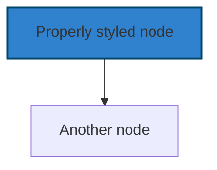

- Use descriptive node IDs: `ProcessData` instead of `A`
- Always wrap node text in double quotes
- Use consistent color schemes across related diagrams
- Specify both fill and stroke colors

### 3. Subgraph Guidelines

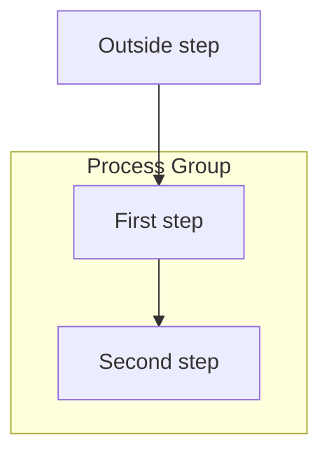

- Always wrap subgraph titles in quotes
- Specify direction explicitly
- End subgraphs with `end` keyword
- Maintain consistent indentation

### 4. Line/Arrow Best Practices

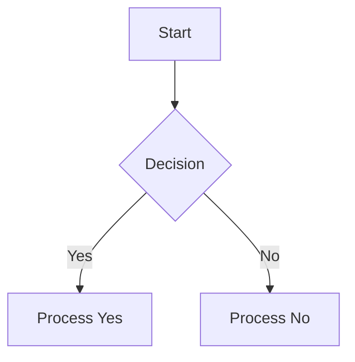

- Use descriptive text on decision lines
- Wrap line text in quotes for better readability
- For arrows use `-->`, `---`, `===`, etc.
- For special edge types use: `-.->`(dotted), `==>`(thick), `-.->` (dotted with arrow)

### 5. Sequence Diagram Specific Issues

#### Participant Definition and Reference

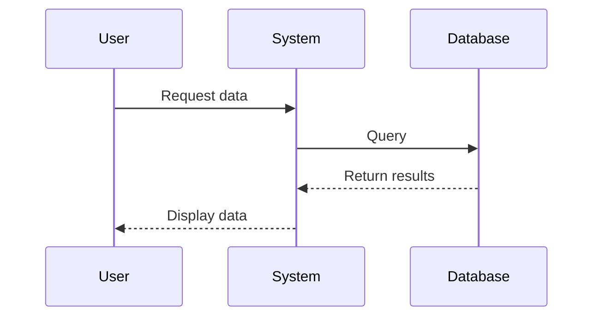

| Issue                             | Error Message                        | Solution                                                                                              |
| --------------------------------- | ------------------------------------ | ----------------------------------------------------------------------------------------------------- |
| Using aliases incorrectly         | `Expecting 'ACTOR', got 'alias'`     | Use full participant name in messages or define aliases properly with `participant Alias as FullName` |
| Referencing undefined participant | `Expecting 'ACTOR', got 'undefined'` | Make sure all participants are defined before being referenced                                        |
| Inconsistent capitalization       | `Expecting 'ACTOR', got 'details'`   | Maintain consistent capitalization between definition and reference                                   |

**Common fixes:**

1. Define all participants at the beginning of the diagram
2. When using aliases, reference the alias consistently in messages
3. If you encounter issues with aliases, try using the full name without aliases
4. Check for typos and capitalization differences between definition and reference

## Fixing Chart Checklist

When fixing a Mermaid chart, follow this checklist:

1. **Consistency**: Remove/add semicolons consistently
2. **Text Formatting**: Wrap all node text in double quotes
3. **Node IDs**: Ensure node IDs are valid (no spaces, start with letter)
4. **Subgraphs**: Check subgraph syntax and direction
5. **Connections**: Verify arrows and connections between nodes
6. **Styling**: Ensure style declarations are correctly formatted
7. **Line breaks**: For long labels, use `<br/>` for line breaks

## Examples of Fixed Charts

### Before (Problematic)

```
graph TD
    A[User does something] --> B{Check condition};
    B --> C{Is valid?};
    C -- No --> D[Show error];
    C -- Yes --> E[Process data];
```

### After (Fixed)

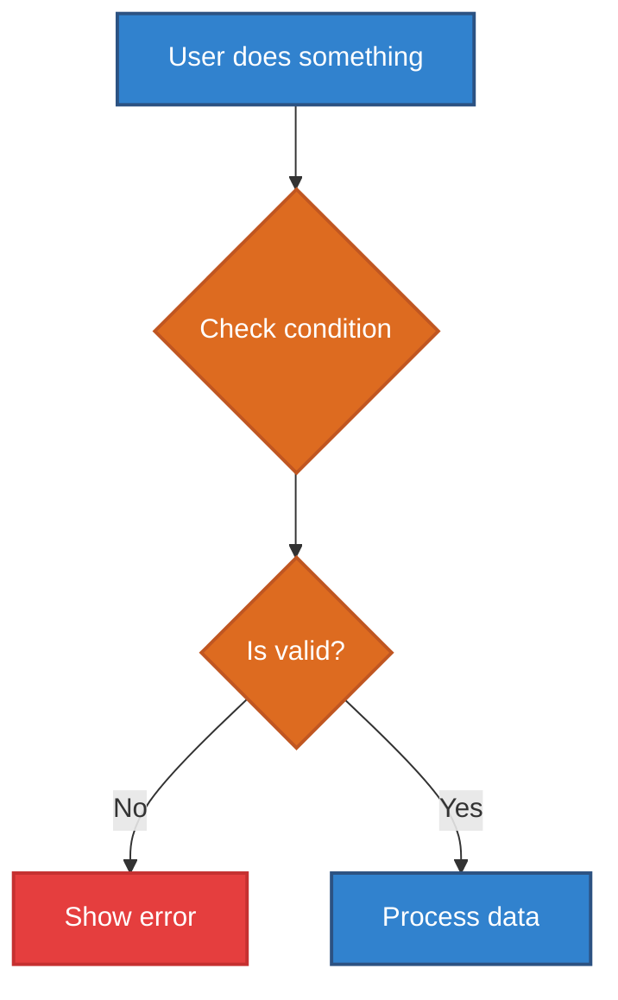

## Special Scenarios

### 1. Complex Node Text

For nodes with complex text including code or special characters:

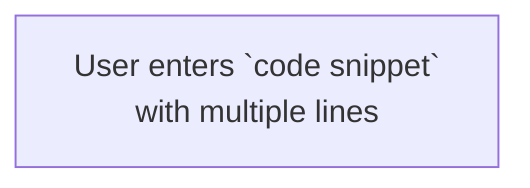

### 2. Click Interactions

For interactive diagrams with click events:

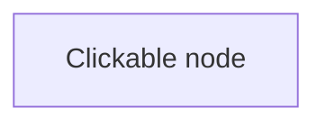

### 3. Font Awesome Icons

Using icons in nodes:

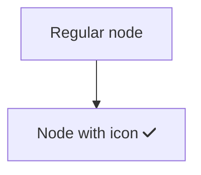

## Common Error Messages and Solutions

| Error Message                | Likely Cause                          | Solution                            |
| ---------------------------- | ------------------------------------- | ----------------------------------- |
| "Syntax error in graph"      | Missing quotes or improper syntax     | Add quotes around text with spaces  |
| "Invalid node id"            | Space or invalid character in node ID | Use alphanumeric IDs without spaces |
| "Expecting 'end', got '...'" | Unclosed subgraph                     | Add missing `end` to subgraph       |

## Applying These Guidelines in Our Project

### Files That Use Mermaid Charts

In our project, Mermaid charts are primarily used in:

- Task planning documents (`tasks-planning/*.md`)
- Feature specifications
- Architecture documentation
- README files for complex components

### Project Color Palette for Mermaid Charts

For consistency across all diagrams, use this standard color palette. Define these classes at the end of your chart and apply them to nodes.

| Element Type  | Class Name  | Fill Color | Stroke Color | Text Color | Notes                                            |
| :------------ | :---------- | :--------- | :----------- | :--------- | :----------------------------------------------- |
| **Primary**   | `primary`   | `#3182ce`  | `#2c5282`    | `#ffffff`  | Use for primary actions or processes.            |
| **Secondary** | `secondary` | `#2d3748`  | `#4a5568`    | `#ffffff`  | Use for start/end nodes or neutral steps.        |
| **Decision**  | `decision`  | `#dd6b20`  | `#c05621`    | `#ffffff`  | Use for diamond-shaped decision nodes.           |
| **Success**   | `success`   | `#38a169`  | `#2f855a`    | `#ffffff`  | Use for successful outcomes or completion steps. |
| **Warning**   | `warning`   | `#d69e2e`  | `#b7791f`    | `#ffffff`  | Use for steps that require caution.              |
| **Error**     | `error`     | `#e53e3e`  | `#c53030`    | `#ffffff`  | Use for error states or failure paths.           |
| **Info**      | `info`      | `#805ad5`  | `#6b46c1`    | `#ffffff`  | Use for informational or alternative steps.      |
| **Accent**    | `accent`    | `#2b6cb0`  | `#2c5282`    | `#ffffff`  | Use for highlighted or special-interest nodes.   |

### Highlighting Workflow Steps and Errors

When documenting a workflow, you can use the color palette to draw attention to specific parts of the chart.

**To pinpoint an error**, use the `error` class. This will color the node red, making it immediately obvious where the problem occurred.

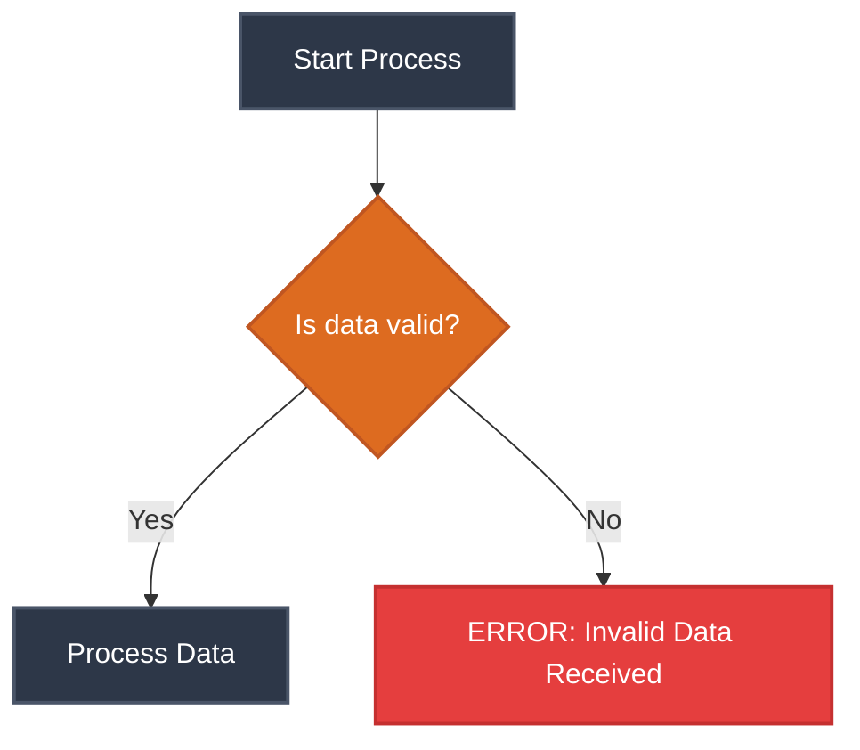

### How to Check Your Charts

Before committing your changes:

1. Copy your Mermaid code to [Mermaid Live Editor](https://mermaid.live/)
2. Verify the diagram renders correctly
3. Check for any syntax errors or warnings
4. Review for adherence to our project guidelines

### Automation for Fixing Charts

For batch fixing of multiple Mermaid charts, consider using this script pattern:

```bash
# Example sed command to fix common issues in Mermaid charts
sed -i 's/\(\w\+\)\[\([^]]*\)\]/\1["\2"]/g' your-file.md
```

Remember to test your Mermaid charts in a preview tool like the [Mermaid Live Editor](https://mermaid.live/) before committing them to documentation.

## Advanced Readability Guidelines

### Visual Hierarchy & Readability

Making charts readable is critical for effective communication. Here are key techniques:

#### 1. Descriptive Node IDs

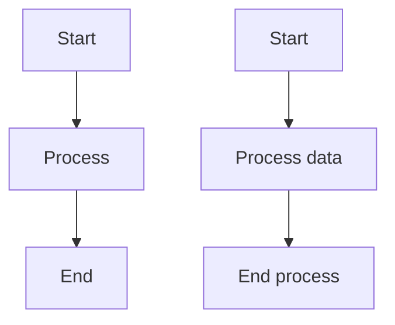

- Use meaningful IDs that describe the node's purpose
- Avoid single-letter IDs (A, B, C) in complex diagrams
- IDs should make sense even without the node text

#### 2. Line Breaks for Complex Text

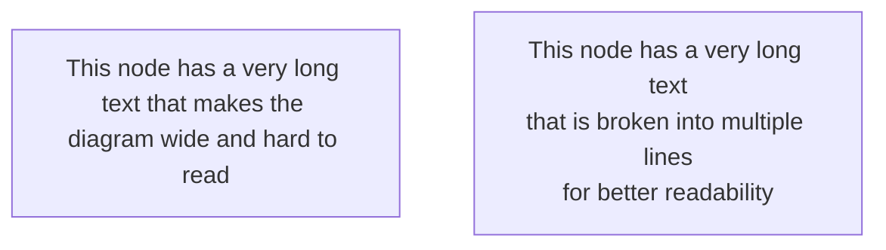

- Use `<br/>` for line breaks in node text
- Keep lines to 30 characters or less when possible
- Balance line lengths for visual appeal

#### 3. Comments for Documentation

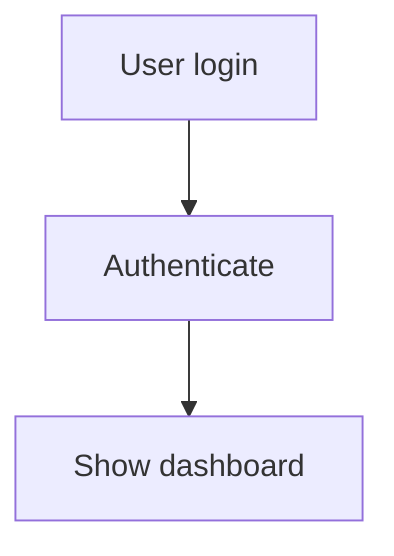

- Use `%%` to add comments to your diagrams
- Group related nodes with comment sections
- Document complex logic or non-obvious flows

### Using CSS Classes for Consistent Styling

Mermaid supports CSS-like classes to maintain consistent styling across nodes:

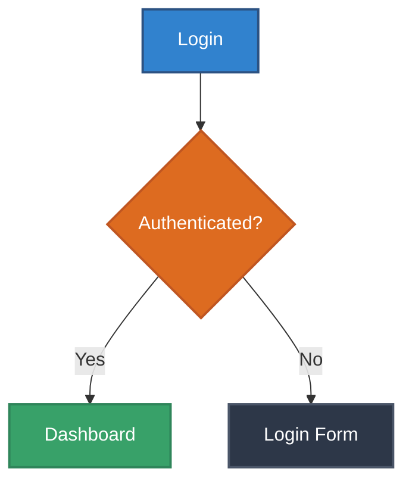

#### Class Definition Syntax

```
classDef className fill:#color,stroke:#color,stroke-width:Npx,font-size:Npx;
```

#### Applying Classes

Apply to a single node:

```
class nodeId className;
```

Apply to multiple nodes:

```
class nodeId1,nodeId2,nodeId3 className;
```

### Accessibility Considerations

#### 1. Color Contrast

Ensure sufficient contrast between:

- Text and background colors
- Node fill and stroke colors
- Background and node colors

**Recommended minimum contrast ratio:** 4.5:1 for normal text

#### 2. Multiple Visual Cues

Don't rely solely on color to convey information:

- Use different node shapes (rectangles, diamonds, circles)
- Add icons or text labels
- Use line styles (solid, dashed) to differentiate flows

#### 3. Text Size and Font

- Keep text readable at different zoom levels
- Avoid overly decorative fonts
- Consider adding `font-size` to your class definitions

### Complex Chart Example: Before and After

#### Before (Hard to Read)

```
graph TD
    A[Start] --> B{Check?}
    B -- Y --> C[Process1]
    B -- N --> D[Process2]
    C --> E{Another check}
    D --> E
    E -- Y --> F[End Success]
    E -- N --> G[End Failure]
```

#### After (Improved Readability)

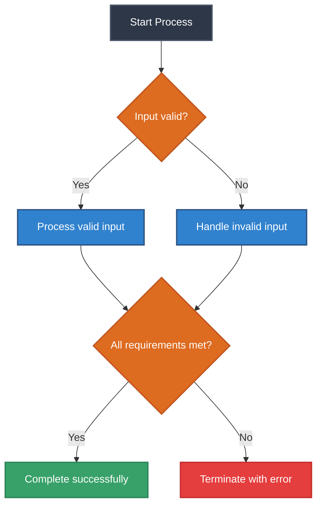

Key improvements:

- Descriptive node IDs
- Consistent styling with classes
- Proper spacing and flow direction
- Comments to organize sections
- Quoted edge labels
- Clear visual hierarchy

Remember to test your Mermaid charts in a preview tool like the [Mermaid Live Editor](https://mermaid.live/) before committing them to documentation.
