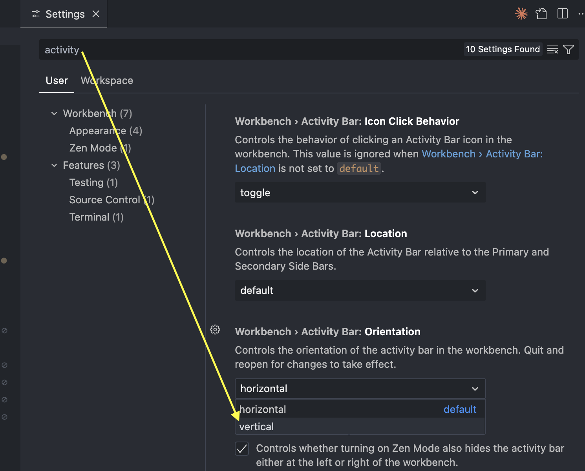
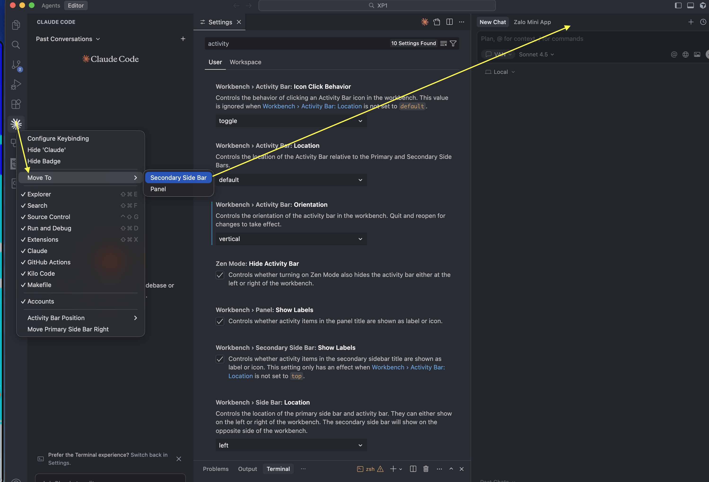

# 📍 How to Move Claude Code Extension to the Right Side

This guide will show you how to move the Claude Code extension to the right sidebar in Cursor IDE.

---

## 🎯 Prerequisites

- Cursor IDE installed on your Mac
- Claude Code extension installed

---

## 📝 Step-by-Step Instructions

### Step 1: Open Cursor Settings

Press `Command + ,` (or `Cmd + ,`) on your MacOS keyboard to open the Cursor Settings panel.

---

### Step 2: Search for Activity Bar Settings

1. In the Settings search bar at the top, type **"activity"**
2. Look for **"Workbench > Activity Bar: Orientation"** setting
3. Change the Orientation from **"horizontal"** to **"vertical"** (or your preferred orientation)
4. Follow the configuration shown in the image above

**Important Note:** You can also find the option to **"Move To > Secondary Side Bar"** in the activity bar settings.

---

### Step 3: Restart Cursor

After making the changes:

1. Close Cursor completely
2. Wait a few seconds
3. Reopen Cursor IDE

---

### Step 4: Move Claude Code Extension to Right Side

1. Locate the **Claude Code** extension icon in the left sidebar
2. **Right-click** on the Claude Code extension icon
3. Select **"Move To"** from the context menu
4. Choose **"Secondary Side Bar"** option

---

## ✅ Result

Once completed, the Claude Code extension will be permanently positioned on the **right sidebar**.

**Additional Tip:** You can change the Activity Bar orientation to **vertical** anytime, and the Claude Code extension will remain on the right side without moving back to the left.

---

## 🔄 Reverting Changes

If you want to move the extension back to the left sidebar:

1. Right-click on the Claude Code extension icon (now on the right)
2. Select **"Move To"** → **"Panel"** or **"Primary Side Bar"**

---

## 📸 Reference Images

- `1.png` - Activity Bar settings configuration
- `2.png` - Moving extension to Secondary Side Bar

---

## 💡 Notes

- This configuration persists across Cursor restarts
- Other extensions can also be moved using the same method
- The Activity Bar orientation and extension positions are independent settings

---

**Happy Coding! 🚀**
