# Multi-Platform AI Prompt Optimization Guide

## 🎯 Overview

This guide shows you how to use different AI platforms (Grok, Claude, Gemini, ChatGPT Web) to optimize and enhance your prompts. You'll learn to leverage each platform's strengths to create more effective prompts that get better results across all AI systems.

## 🌐 Multi-Platform Optimization Workflow

```mermaid
graph TD
    Start["🚀 Start Optimization"] --> OriginalPrompt["📝 Your Original Prompt"]
    OriginalPrompt --> Step1["🎯 STEP 1: Foundation Enhancement"]
    Step1 --> EnhancerMethod["📋 Use Prompt-Enhancer Methodology"]
    EnhancerMethod --> EnhancedPrompt["✨ Enhanced Base Prompt"]
    
    EnhancedPrompt --> ChoosePlatform{"Choose AI Platform"}
    
    ChoosePlatform -->|"Creative & Real-time"| Grok["🤖 Grok X AI"]
    ChoosePlatform -->|"Analytical & Detailed"| Claude["🧠 Claude AI"]
    ChoosePlatform -->|"Research & Factual"| Gemini["💎 Google Gemini"]
    ChoosePlatform -->|"General & Popular"| ChatGPT["💬 ChatGPT Web"]
    
    Grok --> GrokOptimize["🎭 Creativity Enhancement"]
    Claude --> ClaudeOptimize["📊 Structure & Analysis"]
    Gemini --> GeminiOptimize["🔍 Accuracy & Research"]
    ChatGPT --> ChatGPTOptimize["⚖️ Balance & Clarity"]
    
    GrokOptimize --> CompareResults["📋 Compare Results"]
    ClaudeOptimize --> CompareResults
    GeminiOptimize --> CompareResults
    ChatGPTOptimize --> CompareResults
    
    CompareResults --> SelectBest["✨ Select Best Elements"]
    SelectBest --> FinalPrompt["🎯 Optimized Final Prompt"]
    FinalPrompt --> TestEverywhere["🧪 Test Across Platforms"]

    classDef start fill:#9f39ff,stroke:#7c2d12,stroke-width:3px,color:#fff
    classDef platform fill:#3182ce,stroke:#2c5282,stroke-width:2px,color:#fff
    classDef optimize fill:#dd6b20,stroke:#c05621,stroke-width:2px,color:#fff
    classDef process fill:#2d3748,stroke:#4a5568,stroke-width:2px,color:#fff
    classDef success fill:#38a169,stroke:#2f855a,stroke-width:2px,color:#fff
    classDef foundation fill:#805ad5,stroke:#6b46c1,stroke-width:2px,color:#fff

    class Start,FinalPrompt start
    class Grok,Claude,Gemini,ChatGPT platform
    class GrokOptimize,ClaudeOptimize,GeminiOptimize,ChatGPTOptimize optimize
    class OriginalPrompt,CompareResults,SelectBest process
    class TestEverywhere success
    class Step1,EnhancerMethod,EnhancedPrompt foundation
```



## 🎯 STEP 1: Foundation Enhancement with Prompt-Enhancer Methodology

Before optimizing across platforms, first enhance your original prompt using the structured prompt engineering methodology. This creates a solid foundation for platform-specific optimizations.

### Foundation Enhancement Workflow

```mermaid
graph TD
    OriginalPrompt["📝 Your Original Prompt"] --> PasteContent["📋 Paste Prompt-Enhancer Content"]
    PasteContent --> RequestEnhancement["🤖 Request AI Enhancement"]
    RequestEnhancement --> AIAnalysis["🔍 AI Analysis & Understanding"]
    AIAnalysis --> IterativeProcess["🔄 Iterative Improvement Process"]
    IterativeProcess --> EnhancedPrompt["✨ Enhanced Base Prompt"]
    EnhancedPrompt --> ReadyForPlatforms["🚀 Ready for Platform Optimization"]

    classDef secondary fill:#2d3748,stroke:#4a5568,stroke-width:2px,color:#fff
    classDef foundation fill:#805ad5,stroke:#6b46c1,stroke-width:2px,color:#fff
    classDef process fill:#3182ce,stroke:#2c5282,stroke-width:2px,color:#fff
    classDef success fill:#38a169,stroke:#2f855a,stroke-width:2px,color:#fff

    class OriginalPrompt secondary
    class PasteContent,RequestEnhancement,AIAnalysis,IterativeProcess foundation
    class EnhancedPrompt process
    class ReadyForPlatforms success
```



### How to Use Step 1: Foundation Enhancement

1. **Choose any AI platform** (Grok, Claude, Gemini, or ChatGPT)
2. **Copy your original prompt** that you want to enhance
3. **Use this enhancement request template**:

```
I want to enhance this prompt using professional prompt engineering methodology. Please follow the structured approach outlined below to help me create the most optimal version.

ORIGINAL PROMPT:
[PASTE YOUR ORIGINAL PROMPT HERE]

PROMPT ENGINEERING METHODOLOGY:
Your task is to become a Prompt Engineer for users, with the goal of helping them create the most optimal prompts for their specific needs. These prompts will be used by ChatGPT. You will follow this process:

## Starting the Conversation
- Begin by asking users about the topic or purpose of the prompt they want to create
- Use a friendly and professional tone to create a comfortable environment for users to share their ideas

## Initial Analysis and Improvement
- Listen carefully to the user's response and quickly analyze to identify key elements and potential improvements
- Apply your professional knowledge to suggest optimal approaches for the stated topic or purpose

## Creating Structured and Focused Responses (Technique 1: No yapping)
- **Revised Prompt**:
  - Rewrite the user's prompt, ensuring it is clear, concise, and easy to understand for ChatGPT
  - Apply effective prompt design principles and advanced prompting techniques as appropriate
  - Ensure the new prompt includes sufficient context and necessary instructions
- **Questions**:
  - Ask relevant and valuable questions to gather additional information from users
  - Focus on aspects that can improve or clarify the prompt
  - Avoid rambling, provide focused responses to help AI give accurate and effective feedback

## Iterating the Improvement Process
- Continue the iterative process, with users providing additional information and you updating the prompt in the "Revised Prompt" section
- In each iteration, apply different prompting techniques to improve the prompt's effectiveness
- Briefly explain the reasoning behind each change or improvement so users understand the optimization process

## Refinement, Completion, and Additional Suggestions (Technique 2: Always provide useful links)
- Continuously evaluate and refine the prompt based on user feedback and additional information
- Use your professional knowledge to anticipate possible use scenarios and adjust the prompt to meet various situations
- Ensure the final prompt not only meets users' specific needs but also has flexibility and scalability
- After each response, automatically provide **3 helpful suggestions** for the user's question based on the conversation content

## Ending the Process
- Continue the iterative process until users confirm they are satisfied with the final prompt
- Suggest effective ways to use the prompt and possible variations for different situations

## Notes on Response Quality (Technique 3: Ensure fairness and accuracy)
- Recognize that providing accurate answers that meet user expectations is very important
- If the answer is accurate and helpful, this will be acknowledged and appreciated
- Conversely, if the answer is incorrect or doesn't meet needs, consideration and adjustment are needed for improvement

Throughout this process, demonstrate patience, understanding, and high adaptability. Your goal is not only to create an effective prompt but also to help users better understand good prompting principles, enabling them to interact effectively with ChatGPT.

---

Please analyze my original prompt above and help me enhance it following this methodology. Start by understanding the prompt's purpose and provide your initial analysis and improvements.
```

### What You'll Get from Step 1

The AI will provide:

- ✅ **Structured analysis** of your original prompt's strengths and weaknesses
- ✅ **Revised prompt** with clear improvements using professional techniques
- ✅ **Focused questions** to help you refine the prompt further
- ✅ **3 helpful suggestions** for additional improvements
- ✅ **Iterative refinement** until you're satisfied with the enhanced version

### Example: Before and After Step 1

**Original Prompt:**
```
Help me write code for a login system
```

**After Step 1 Enhancement:**
```
I need assistance creating a secure user authentication system with the following requirements:

**Context**: Building a web application using [specify your tech stack]
**Authentication Type**: [Email/username + password, social login, etc.]
**Security Requirements**: [Password hashing, session management, etc.]
**User Experience Goals**: [Smooth flow, error handling, etc.]

Please provide:
1. Complete code implementation with security best practices
2. Database schema for user management
3. Error handling for common authentication failures
4. Basic session/token management
5. Input validation and sanitization

Include explanations for security decisions and suggest additional features like password reset, email verification, or two-factor authentication if appropriate.
```

## 🤖 Platform-Specific Optimization Strategies

### 🎭 Grok X AI - Creative & Real-time Enhancement

**Best for**: Creative prompts, humor, real-time information, unconventional approaches

```mermaid
graph LR
    GrokInput["📝 Your Prompt"] --> GrokRequest["🎭 Grok Enhancement Request"]
    GrokRequest --> GrokProcess["🚀 Grok Processing"]
    GrokProcess --> GrokOutput["✨ Creative Optimized Prompt"]
    
    GrokOutput --> CreativeElements["🎨 Creative Elements"]
    GrokOutput --> RealtimeContext["⚡ Real-time Context"]
    GrokOutput --> HumorTouch["😄 Humor & Engagement"]

    classDef input fill:#2d3748,stroke:#4a5568,stroke-width:2px,color:#fff
    classDef process fill:#3182ce,stroke:#2c5282,stroke-width:2px,color:#fff
    classDef output fill:#38a169,stroke:#2f855a,stroke-width:2px,color:#fff

    class GrokInput input
    class GrokRequest,GrokProcess process
    class GrokOutput,CreativeElements,RealtimeContext,HumorTouch output
```



**How to use Grok for optimization**:

1. **Go to X.com (Twitter) and access Grok**
2. **Use this optimization prompt**:

```
I have this prompt that I want to make more creative and engaging:

[PASTE YOUR ORIGINAL PROMPT HERE]

Please help me optimize it to be:
- More creative and inspiring
- More engaging and conversational
- Include real-time context where relevant
- Add personality without losing professionalism
- Make it more likely to get innovative responses

Provide 2-3 variations with explanations of why each approach works better.
```

**Grok's strengths**:
- ✅ Adds creative flair and personality
- ✅ Incorporates current events and trends
- ✅ Suggests unconventional approaches
- ✅ Improves engagement and humor

### 🧠 Claude AI - Analytical & Detailed Enhancement

**Best for**: Structured prompts, complex analysis, detailed instructions, systematic approaches

```mermaid
graph LR
    ClaudeInput["📝 Your Prompt"] --> ClaudeRequest["📊 Claude Enhancement Request"]
    ClaudeRequest --> ClaudeProcess["🔍 Claude Analysis"]
    ClaudeProcess --> ClaudeOutput["📋 Structured Optimized Prompt"]
    
    ClaudeOutput --> LogicalFlow["🔄 Logical Flow"]
    ClaudeOutput --> DetailedSteps["📝 Detailed Steps"]
    ClaudeOutput --> ClearStructure["🏗️ Clear Structure"]

    classDef input fill:#2d3748,stroke:#4a5568,stroke-width:2px,color:#fff
    classDef process fill:#3182ce,stroke:#2c5282,stroke-width:2px,color:#fff
    classDef output fill:#38a169,stroke:#2f855a,stroke-width:2px,color:#fff

    class ClaudeInput input
    class ClaudeRequest,ClaudeProcess process
    class ClaudeOutput,LogicalFlow,DetailedSteps,ClearStructure output
```



**How to use Claude for optimization**:

1. **Go to Claude.ai**
2. **Use this optimization prompt**:

```
I need help optimizing this prompt to be more structured and analytically effective:

[PASTE YOUR ORIGINAL PROMPT HERE]

Please analyze and improve it by:
- Making the structure more logical and clear
- Adding specific, actionable instructions
- Including examples where helpful
- Ensuring completeness and precision
- Making it suitable for complex analytical tasks
- Adding proper context and constraints

Provide the optimized version with a breakdown of improvements made.
```

**Claude's strengths**:
- ✅ Creates logical, well-structured prompts
- ✅ Adds comprehensive detail and examples
- ✅ Improves analytical depth
- ✅ Ensures completeness and precision

### 💎 Google Gemini - Research & Factual Enhancement

**Best for**: Factual accuracy, research-based prompts, data analysis, technical precision


**How to use Gemini for optimization**:

1. **Go to Gemini.google.com**
2. **Use this optimization prompt**:

```
I want to optimize this prompt to be more factually accurate and research-based:

[PASTE YOUR ORIGINAL PROMPT HERE]

Please enhance it by:
- Ensuring all information is factually correct
- Adding relevant research context
- Including specific data points or statistics where applicable
- Making technical terms more precise
- Adding credible sources or references
- Ensuring scientific accuracy

Provide the improved prompt with explanations of factual enhancements.
```

**Gemini's strengths**:
- ✅ Ensures factual accuracy and current data
- ✅ Adds research-backed context
- ✅ Improves technical precision
- ✅ Provides credible sources and references

### 💬 ChatGPT Web - Balanced & Clear Enhancement

**Best for**: General optimization, clarity, balance, accessibility, universal appeal

```mermaid
graph LR
    ChatGPTInput["📝 Your Prompt"] --> ChatGPTRequest["⚖️ ChatGPT Enhancement Request"]
    ChatGPTRequest --> ChatGPTProcess["🔄 ChatGPT Balancing"]
    ChatGPTProcess --> ChatGPTOutput["🎯 Balanced Optimized Prompt"]
    
    ChatGPTOutput --> ClearCommunication["💬 Clear Communication"]
    ChatGPTOutput --> BalancedApproach["⚖️ Balanced Approach"] 
    ChatGPTOutput --> UniversalAppeal["🌍 Universal Appeal"]

    classDef input fill:#2d3748,stroke:#4a5568,stroke-width:2px,color:#fff
    classDef process fill:#3182ce,stroke:#2c5282,stroke-width:2px,color:#fff
    classDef output fill:#38a169,stroke:#2f855a,stroke-width:2px,color:#fff

    class ChatGPTInput input
    class ChatGPTRequest,ChatGPTProcess process
    class ChatGPTOutput,ClearCommunication,BalancedApproach,UniversalAppeal output
```



**How to use ChatGPT for optimization**:

1. **Go to chat.openai.com**
2. **Use this optimization prompt**:

```
Please help me optimize this prompt to be clearer and more effective:

[PASTE YOUR ORIGINAL PROMPT HERE]

Make it better by:
- Improving clarity and readability
- Making it more universally understandable
- Balancing detail with conciseness
- Ensuring it works well across different AI systems
- Making instructions more actionable
- Improving overall effectiveness

Provide the optimized version with clear improvements highlighted.
```

**ChatGPT's strengths**:
- ✅ Creates universally clear and understandable prompts
- ✅ Balances detail with conciseness perfectly
- ✅ Ensures broad compatibility across AI systems
- ✅ Improves general effectiveness and usability

## 🔄 Comprehensive Optimization Process

### The Complete 4-Platform Enhancement Cycle

```mermaid
graph TD
    OriginalPrompt["📝 Original Prompt"] --> Step1Foundation["🎯 STEP 1: Foundation Enhancement"]
    Step1Foundation --> EnhancedBase["✨ Enhanced Base Prompt"]
    
    EnhancedBase --> Round1["🔄 ROUND 2: Individual Platform Enhancement"]
    
    Round1 --> GrokV1["🎭 Grok Version 1"]
    Round1 --> ClaudeV1["🧠 Claude Version 1"] 
    Round1 --> GeminiV1["💎 Gemini Version 1"]
    Round1 --> ChatGPTV1["💬 ChatGPT Version 1"]
    
    GrokV1 --> Analysis["📊 Compare & Analyze"]
    ClaudeV1 --> Analysis
    GeminiV1 --> Analysis
    ChatGPTV1 --> Analysis
    
    Analysis --> BestElements["✨ Extract Best Elements"]
    BestElements --> HybridPrompt["🔄 Create Hybrid Prompt"]
    
    HybridPrompt --> Round2["🔄 ROUND 3: Refinement"]
    Round2 --> FinalOptimization["🎯 Final Cross-Platform Test"]
    FinalOptimization --> OptimizedPrompt["🏆 Ultimate Optimized Prompt"]

    classDef original fill:#2d3748,stroke:#4a5568,stroke-width:3px,color:#fff
    classDef foundation fill:#805ad5,stroke:#6b46c1,stroke-width:2px,color:#fff
    classDef platform fill:#3182ce,stroke:#2c5282,stroke-width:2px,color:#fff
    classDef process fill:#dd6b20,stroke:#c05621,stroke-width:2px,color:#fff
    classDef final fill:#38a169,stroke:#2f855a,stroke-width:3px,color:#fff

    class OriginalPrompt original
    class Step1Foundation,EnhancedBase foundation
    class GrokV1,ClaudeV1,GeminiV1,ChatGPTV1 platform
    class Round1,Analysis,BestElements,HybridPrompt,Round2,FinalOptimization process
    class OptimizedPrompt final
```



### Step-by-Step Process

1. **Start with your original prompt**
2. **Apply Step 1: Foundation Enhancement** using the prompt-enhancer methodology to create a solid base
3. **Use the enhanced base prompt** and run it through each platform using their specific optimization prompts
4. **Compare the 4 platform-enhanced versions**:
   - Note what each platform improved beyond the foundation
   - Identify complementary strengths across platforms
   - Look for consistent recommendations
5. **Create a hybrid version** combining the best elements from all platforms
6. **Test the hybrid** on all platforms to ensure universal effectiveness

## 📋 Optimization Comparison Template

Use this template to track improvements across platforms:

```markdown
# Prompt Optimization Comparison

## Original Prompt
[Your original prompt here]

## Step 1: Foundation Enhancement
**Enhanced Base Prompt**: 
[Enhanced prompt using prompt-enhancer methodology]
**Key Improvements**:
- [List foundational improvements from Step 1]

## Platform Enhancements

### 🎭 Grok Version
**Improvements**: 
- [List creative/engagement improvements]
**Best Elements**:
- [Elements to keep]

### 🧠 Claude Version  
**Improvements**:
- [List structure/analytical improvements]
**Best Elements**:
- [Elements to keep]

### 💎 Gemini Version
**Improvements**:
- [List factual/research improvements]  
**Best Elements**:
- [Elements to keep]

### 💬 ChatGPT Version
**Improvements**:
- [List clarity/balance improvements]
**Best Elements**:
- [Elements to keep]

## Final Optimized Prompt
[Your hybrid optimized prompt combining best elements]

## Effectiveness Test Results
- Grok: [Rating/notes]
- Claude: [Rating/notes]  
- Gemini: [Rating/notes]
- ChatGPT: [Rating/notes]
```

## 🎯 Practical Examples

### Example 1: Coding Help Prompt

**Original**: "Help me write a function"

**After Optimization**:

```
I need assistance creating a well-structured function with the following requirements:

**Context**: [Describe your project/language]
**Function Purpose**: [Specific goal]
**Input Parameters**: [What goes in]  
**Expected Output**: [What should come out]
**Constraints**: [Any limitations or requirements]

Please provide:
1. Clean, commented code following best practices
2. Error handling considerations
3. Test cases or usage examples  
4. Performance considerations if relevant

Make the solution production-ready and explain any design decisions.
```

### Example 2: Creative Writing Prompt

**Original**: "Write a story about AI"

**After Optimization**:

```
Create an engaging short story (800-1200 words) exploring the relationship between humans and AI:

**Setting**: [Near future, current day, or specify]
**Perspective**: [First person, third person, or AI perspective]
**Tone**: [Optimistic, cautionary, balanced, humorous]
**Theme Focus**: [Human-AI collaboration, ethical dilemmas, daily life impact]

**Story Requirements**:
- Realistic character development
- Plausible technology portrayal  
- Emotional resonance with readers
- Clear narrative arc with satisfying resolution

**Style Preferences**:
- [Specify if you want literary, sci-fi, dramatic, etc.]
- Include dialogue and internal thoughts
- Show rather than tell key concepts

Please craft a story that feels both imaginative and believable.
```

## 🧪 Testing & Validation

### Cross-Platform Testing Workflow

```mermaid
graph LR
    OptimizedPrompt["🎯 Optimized Prompt"] --> TestPlatform1["🎭 Test on Grok"]
    OptimizedPrompt --> TestPlatform2["🧠 Test on Claude"]  
    OptimizedPrompt --> TestPlatform3["💎 Test on Gemini"]
    OptimizedPrompt --> TestPlatform4["💬 Test on ChatGPT"]
    
    TestPlatform1 --> Score1["📊 Score Results"]
    TestPlatform2 --> Score2["📊 Score Results"]
    TestPlatform3 --> Score3["📊 Score Results"] 
    TestPlatform4 --> Score4["📊 Score Results"]
    
    Score1 --> FinalAnalysis["📋 Final Analysis"]
    Score2 --> FinalAnalysis
    Score3 --> FinalAnalysis
    Score4 --> FinalAnalysis

    classDef prompt fill:#9f39ff,stroke:#7c2d12,stroke-width:2px,color:#fff
    classDef test fill:#3182ce,stroke:#2c5282,stroke-width:2px,color:#fff
    classDef score fill:#dd6b20,stroke:#c05621,stroke-width:2px,color:#fff
    classDef analysis fill:#38a169,stroke:#2f855a,stroke-width:2px,color:#fff

    class OptimizedPrompt prompt
    class TestPlatform1,TestPlatform2,TestPlatform3,TestPlatform4 test
    class Score1,Score2,Score3,Score4 score
    class FinalAnalysis analysis
```



### Evaluation Criteria

Rate each platform's response (1-5 scale):

- **Relevance**: How well did it address the prompt?
- **Quality**: How good was the output quality?
- **Completeness**: Did it cover all requested aspects?
- **Creativity**: How innovative/interesting was the response?
- **Accuracy**: How factually correct was the information?

## 🔧 Advanced Optimization Techniques

### Prompt Chaining Across Platforms

```mermaid
graph TD
    Start["🎯 Complex Task"] --> PlatformA["🧠 Claude: Structure & Plan"]
    PlatformA --> PlatformB["💎 Gemini: Research & Facts"]
    PlatformB --> PlatformC["🎭 Grok: Creative Enhancement"]
    PlatformC --> PlatformD["💬 ChatGPT: Final Polish"]
    PlatformD --> Result["🏆 Superior Result"]

    classDef platform fill:#3182ce,stroke:#2c5282,stroke-width:2px,color:#fff
    classDef process fill:#dd6b20,stroke:#c05621,stroke-width:2px,color:#fff
    classDef result fill:#38a169,stroke:#2f855a,stroke-width:2px,color:#fff

    class PlatformA,PlatformB,PlatformC,PlatformD platform
    class Start process
    class Result result
```



### Specialized Platform Usage

- **Use Grok for**: Brainstorming, creative writing, trend analysis, humor
- **Use Claude for**: Code reviews, complex analysis, structured planning
- **Use Gemini for**: Research, fact-checking, data analysis, technical docs
- **Use ChatGPT for**: General tasks, explanations, tutorials, balanced perspectives

## 📊 Optimization Success Metrics

Track your improvement with these metrics:

```mermaid
graph LR
    Metrics["📊 Success Metrics"] --> Relevance["🎯 Response Relevance<br/>Before vs After"]
    Metrics --> Speed["⚡ Task Completion Speed<br/>Time Saved"]
    Metrics --> Quality["✨ Output Quality<br/>Professional Rating"]
    Metrics --> Satisfaction["😊 User Satisfaction<br/>Personal Rating"]

    classDef metric fill:#3182ce,stroke:#2c5282,stroke-width:2px,color:#fff
    classDef result fill:#38a169,stroke:#2f855a,stroke-width:2px,color:#fff

    class Metrics metric
    class Relevance,Speed,Quality,Satisfaction result
```



### Before/After Comparison

| Aspect | Before Optimization | After Optimization |
|--------|-------------------|-------------------|
| **Clarity** | Vague instructions | Specific, actionable steps |
| **Context** | Missing background | Rich contextual information |
| **Results** | Hit-or-miss quality | Consistently high quality |
| **Efficiency** | Multiple iterations | Single, effective prompt |
| **Usability** | Platform-specific | Works across all platforms |

## ✅ Optimization Checklist

Before considering your prompt optimized:

- [ ] **Applied Step 1: Foundation Enhancement** using prompt-enhancer methodology
- [ ] **Created enhanced base prompt** with structured improvements
- [ ] **Tested enhanced base on all 4 major platforms** (Grok, Claude, Gemini, ChatGPT)
- [ ] **Incorporated creative elements** from Grok
- [ ] **Added structural improvements** from Claude  
- [ ] **Ensured factual accuracy** with Gemini
- [ ] **Achieved universal clarity** via ChatGPT
- [ ] **Created comparison document** tracking all improvements
- [ ] **Validated effectiveness** with real-world testing
- [ ] **Documented best practices** for future use

## 🎉 Next Steps

Once you master multi-platform optimization:

1. **Build a library** of optimized prompts for different use cases
2. **Share with your team** to improve everyone's AI interactions
3. **Create templates** for common optimization patterns
4. **Experiment with advanced techniques** like prompt chaining
5. **Track ROI** by measuring time saved and quality improved

You now have a systematic approach to creating prompts that work excellently across all major AI platforms! 🚀