# Safe File Deletion Guide for Claude Code CLI on macOS

This guide shows you how to create a **double-layered safety system** that prevents accidental permanent file deletion when using Claude Code CLI on macOS. By following these steps, you'll ensure that files are safely moved to the Trash instead of being permanently deleted.

---

## 🗂 Workflow Overview

```mermaid
flowchart TD
    A["🚀 Start Adaptation"] --> B["📋 STEP 1<br/>Install trash CLI"]
    B --> C["⚙️ Open Claude Code Settings"]
    C --> D["🚫 Add rm Command Permissions Deny"]
    D --> E{"📄 CLAUDE.md exists?"}
    E -->|❌ No| F["🆕 Run /init command"]
    E -->|✅ Yes| G["⏭ Skip initialization"]
    F --> H["✏️ Add Constraint to CLAUDE.md"]
    G --> H
    H --> I["🛡 Double Protection Active"]

    subgraph ProtectionLayers ["🛡 Protection Layers"]
        J["🔄 Layer 1: CLAUDE.md Constraint<br/>rm → trash conversion"]
        K["⛔ Layer 2: Settings Permission<br/>Block rm if constraint fails"]
    end

    I --> J
    I --> K

    classDef step fill:#9f39ff,stroke:#7c2d12,stroke-width:3px,color:#fff
    classDef primary fill:#3182ce,stroke:#2c5282,stroke-width:2px,color:#fff
    classDef secondary fill:#2d3748,stroke:#4a5568,stroke-width:2px,color:#fff
    classDef success fill:#38a169,stroke:#2f855a,stroke-width:2px,color:#fff

    class A,B step
    class C,D,F,H primary
    class G,J secondary
    class I,K success
    class ProtectionLayers step
```



---

## 📋 Step-by-Step Implementation

### **Step 1: Install the Trash CLI Tool**

First, install the `trash` command using Homebrew, which safely moves files to the macOS Trash instead of permanently deleting them.

```bash
brew install trash
```

**What this does:** Installs a CLI tool that moves files or folders to the Trash from [https://formulae.brew.sh/formula/trash](https://formulae.brew.sh/formula/trash).

---

### **Step 2: Open Claude Code Settings**

Open your Claude Code settings file using this command:

```bash
code ~/.claude/settings.json
```

This opens the global configuration file for Claude Code in your default editor.


---

### **Step 3: Configure Permissions (Security Layer 2)**

Add the following permissions configuration to your `settings.json` file to deny the `rm` command:

```json
{
  "feedbackSurveyState": {
    "lastShownTime": 1754036700150
  },
  "$schema": "https://json.schemastore.org/claude-code-settings.json",
  "permissions": {
    "deny": ["Bash(rm:+*)"]
  }
}
```

**What this does:** Creates a permission-level block that prevents Claude Code from executing any `rm` commands, providing an additional safety layer.


---

### **Step 4: Initialize CLAUDE.md (If Needed)**

Check if your project already has a `CLAUDE.md` file. If it doesn't exist, run this command in your project directory:

```bash
/init
```

**What this does:** Initializes a new `CLAUDE.md` file with codebase documentation. This is a special file that Claude automatically includes in its context when starting a conversation.


---

### **Step 5: Add Safety Constraint (Security Layer 1)**

Add this constraint to your `CLAUDE.md` file:

```markdown
## Critical File Operations Rule

**🚫 NEVER use `rm` command for file deletion — ALWAYS use `trash` command instead.**

- ✅ **Correct**: `trash file.txt` or `trash /path/to/file` or `trash directory/`
- ❌ **Never use**: `rm file.txt` or `rm -rf directory/` or any `rm` variants

The `trash` command safely moves files to the Trash/Recycle Bin, allowing recovery if needed.  
This prevents accidental permanent file deletion and data loss.
```


---

## 🛡 How the Double Protection System Works

```mermaid
graph TD
    UserRequest["👤 User Deletion Request"] --> Layer1Check["🔄 Layer 1: CLAUDE.md Check"]
    Layer1Check --> ConvertToTrash["✅ Convert rm → trash"]
    ConvertToTrash --> Layer2Check["🛡️ Layer 2: Permissions Check"]
    Layer2Check --> AllowTrash["✅ Execute trash command"]

    Layer1Check --> DirectRM["❌ Direct rm command"]
    DirectRM --> Layer2Block["🚫 Permission DENY"]
    Layer2Block --> Error["⚠️ Return Error"]

    AllowTrash --> SafeDelete["🗑️ Move to Trash"]
    SafeDelete --> Recovery["🔄 Recovery Possible"]

    classDef primary fill:#3182ce,stroke:#2c5282,stroke-width:2px,color:#fff
    classDef secondary fill:#2d3748,stroke:#4a5568,stroke-width:2px,color:#fff
    classDef success fill:#38a169,stroke:#2f855a,stroke-width:2px,color:#fff
    classDef step fill:#9f39ff,stroke:#7c2d12,stroke-width:3px,color:#fff

    class UserRequest,ConvertToTrash,Layer2Check,AllowTrash primary
    class Layer1Check,DirectRM,Layer2Block secondary
    class SafeDelete,Recovery success
    class Error step
```



### **Layer 1: Context-Level Protection**

- **CLAUDE.md Constraint**: Instructs Claude Code to always use `trash` instead of `rm`
- **Automatic Conversion**: Claude Code will convert deletion requests to use the safer `trash` command
- **Recovery Possible**: Files moved to Trash can be recovered if needed

### **Layer 2: Permission-Level Protection**

- **Settings Deny Rule**: Blocks `rm` command execution at the system level
- **Fail-Safe Mechanism**: If Layer 1 fails, this layer prevents accidental deletions
- **Error Response**: Returns an error instead of executing dangerous commands

---

## 🌟 Benefits

1. **Automatic Safety** – Claude Code automatically uses safe deletion methods
2. **Recovery Option** – Files can be restored from Trash if accidentally deleted
3. **Fail-Safe Protection** – Double-layered security prevents bypassing safety measures
4. **Zero Learning Curve** – Works transparently without changing your workflow
5. **macOS Integration** – Uses native macOS Trash functionality

---

## ✅ Verification

```mermaid
graph TD
    StartTest["🧪 Start Verification"] --> CreateTest["📝 Create test file"]
    CreateTest --> TestTrash["🗑️ Test trash command"]
    TestTrash --> CheckTrash["👀 Check file in Trash"]
    CheckTrash --> TestRM["⚡ Test rm command"]
    TestRM --> ShouldError["❌ Should return error"]
    ShouldError --> VerificationComplete["✅ Verification Complete"]

    classDef primary fill:#3182ce,stroke:#2c5282,stroke-width:2px,color:#fff
    classDef secondary fill:#2d3748,stroke:#4a5568,stroke-width:2px,color:#fff
    classDef success fill:#38a169,stroke:#2f855a,stroke-width:2px,color:#fff
    classDef step fill:#9f39ff,stroke:#7c2d12,stroke-width:3px,color:#fff

    class StartTest,CreateTest,CheckTrash primary
    class TestTrash,TestRM secondary
    class VerificationComplete success
    class ShouldError step
```



1. **Test the trash command**:

   ```bash
   echo "test file" > test.txt
   trash test.txt
   # Check that file appears in Trash, not permanently deleted
   ```

2. **Verify permission blocking**:
   ```bash
   rm test.txt
   # Should return an error due to permissions deny rule
   ```

---

## 📝 Notes

- The `CLAUDE.md` file is automatically included in Claude Code's context for every conversation.
- You can store additional project-specific information in `CLAUDE.md` like:
  - Common Bash commands
  - Code style rules
  - Project-specific constraints
- This setup works specifically for macOS; Linux users should consider using `trash-cli` package instead.

---

**⚠️ Important:** This guide creates comprehensive protection against accidental file deletion. However, always maintain proper backups of important files and directories.
