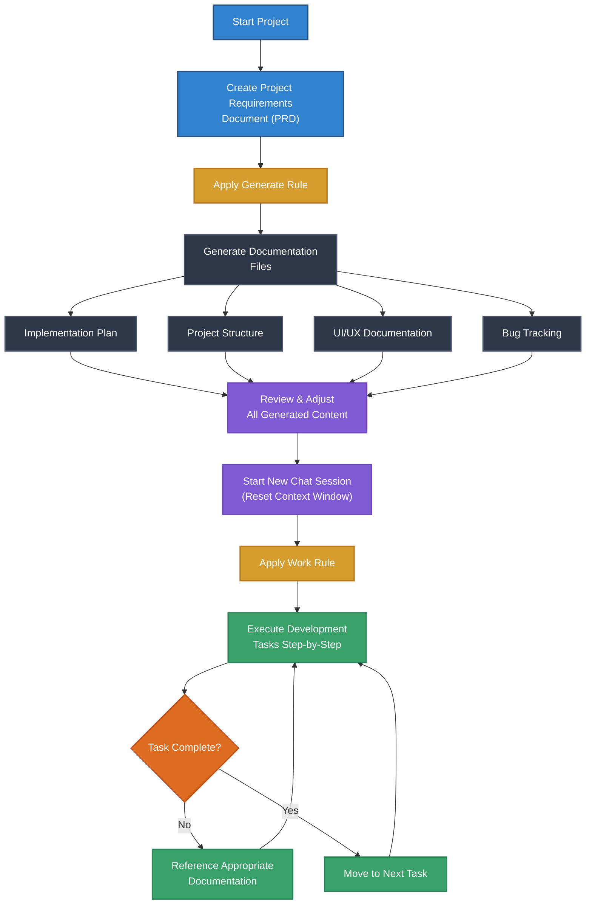
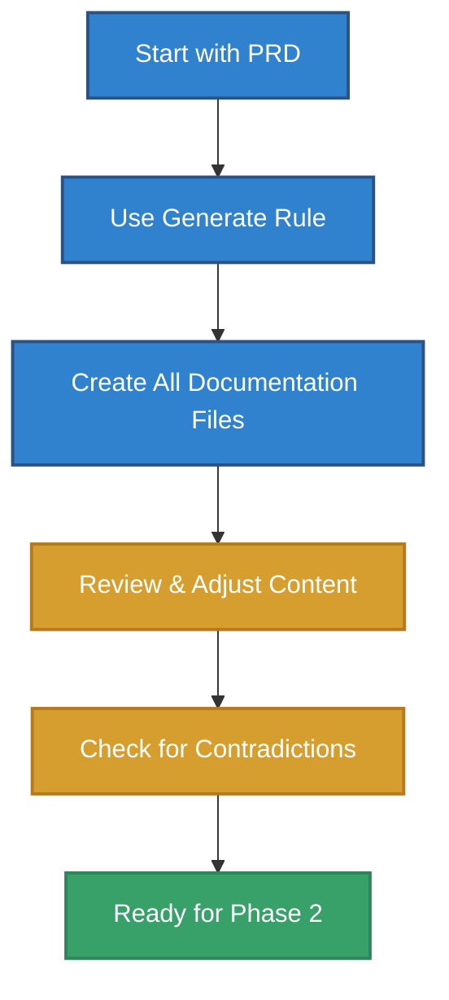
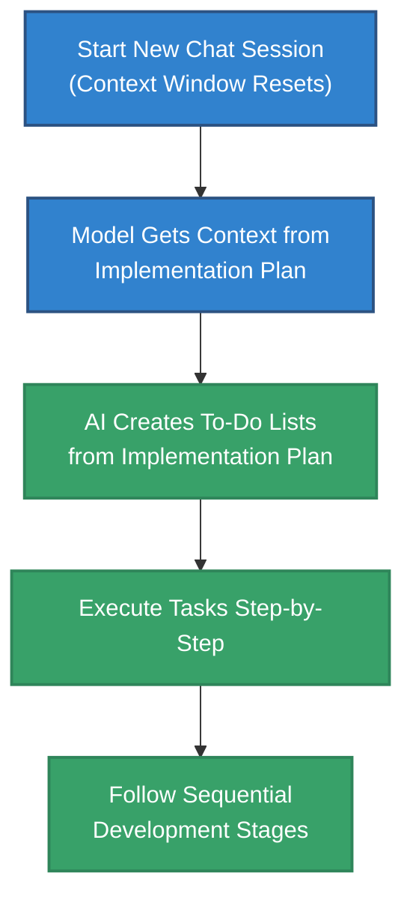
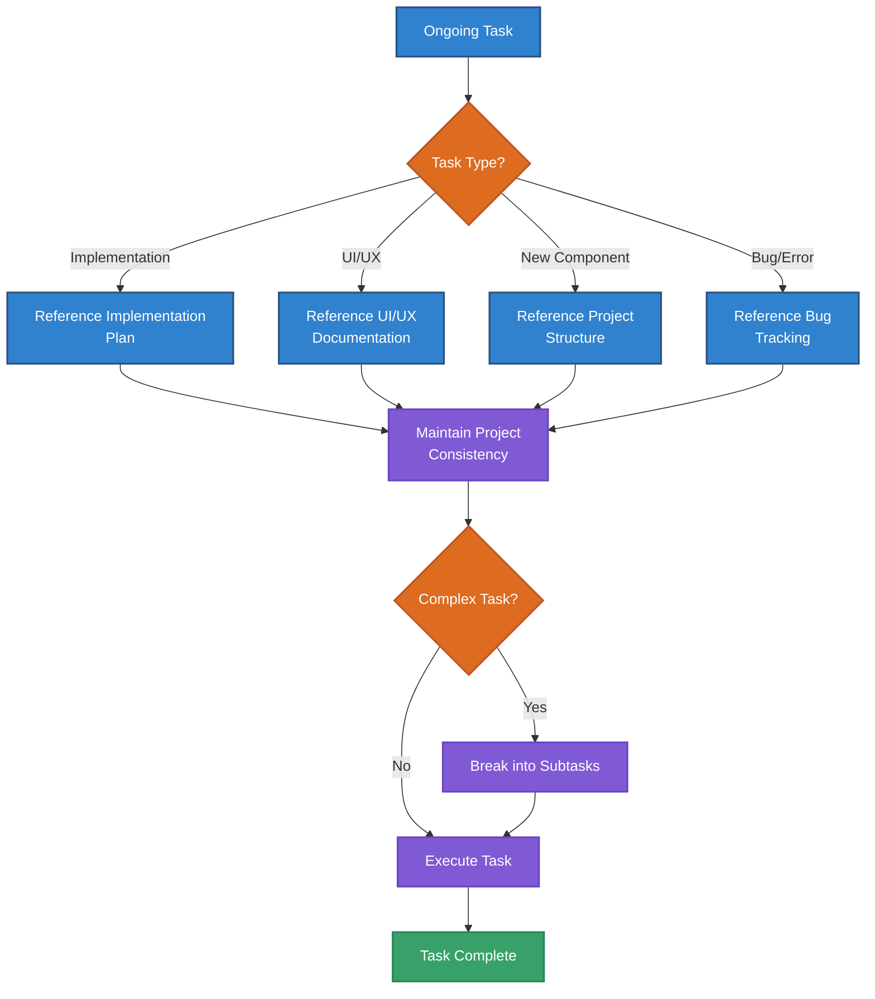
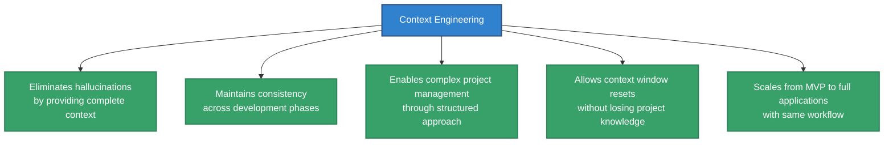

# Guide:

# Context Engineering Workflow Guide

## What is Context Engineering?

Context engineering is a revolutionary approach that shifts from traditional prompt engineering to a comprehensive system that fills the AI model's context window with all relevant facts, rules, tools, and information. Instead of crafting specific prompts for single responses, context engineering provides complete context to eliminate hallucinations and ensure the model knows exactly what it needs to do.

## Core Concepts

### Context Window Management

All AI models have context windows - the amount of text they can remember. Once the context window fills up, chances of hallucination increase dramatically. Efficient management is crucial:

- **Don't dump everything into one file** - this breaks context window management
- **Break context into pieces** and provide only when needed
- **Strategic file organization** prevents information overload

### Key Difference from Prompt Engineering

Context engineering is broader than prompt engineering and includes:

- **RAG (Retrieval-Augmented Generation)** - pulling relevant information dynamically
- **Memory systems** - maintaining consistent project knowledge
- **Prompt engineering** (as a subset) - crafting effective queries
- **External documentation integration** - connecting to existing project resources

## The Context Engineering Workflow

## Step 1: Project Requirements Document (PRD)

The PRD is your starting point that defines what you want to build.

### Contents Include:

- **Feature list** - specific functionalities you want
- **Technical requirements** - if you're a developer, include technical constraints
- **Tech stack preferences** - e.g., Next.js for frontend, FastAPI for backend
- **Project scope** - clearly define MVP vs full application

### Best Practice:

Be explicit about your scope. Don't let the AI assume whether you want an MVP or full application.

## Step 2: Documentation Folder Structure

Create a documentation folder with these four essential files:

### 2.1 Implementation Plan

**Most important file for execution**

Contains:

- Step-by-step tasks and subtasks
- Broader task lists with detailed subtasks
- Timeline estimates (3-4 weeks for full app, hours for MVP)
- Sequential development stages

This file guides the model through the entire development process.

### 2.2 Project Structure

**Initially empty, gets populated during generation**

Purpose:

- Maintains consistency across the project
- Referenced when creating new components or running commands
- Ensures scalable foundation
- Prevents architectural inconsistencies

### 2.3 UI and UX Documentation

**Design specifications and guidelines**

Contains:

- User interface guidelines
- User experience requirements
- Design patterns and standards
- Referenced during frontend development

### 2.4 Bug Tracking

**Quality assurance documentation**

Functions:

- Documents known issues and errors
- Prevents duplicate bug reporting
- Maintains project quality standards
- Provides context for debugging

## Step 3: Rule Files

### 3.1 Generate Rule

**Purpose:** Converts PRD into all other documentation files

**Function:**

- Generates complete context for development process
- Creates implementation plan, UI/UX docs, and bug tracking setup
- Fills up context window during generation phase
- Should be comprehensive but used only once

**Important:** This rule is used only during the initial generation phase.

### 3.2 Work Rule (Workflow Rule)

**Purpose:** Always attached to the AI tool, tells it how to use each file

**Instructions:**

- **Implementation tasks:** Look at implementation plan file
- **UI/UX work:** Refer to UI/UX documentation
- **New components:** Check project structure for consistency
- **Errors/bugs:** First check bug tracking file

**Key Feature:** Kept intentionally small to minimize context window usage.

## Implementation Process

### Phase 1: Context Generation

**Steps:**

1. Start with your PRD
2. Use the Generate Rule to create all documentation files
3. **Review and adjust** all generated content carefully
4. Ensure no contradictions or conflicts in instructions

### Phase 2: Development Execution

**Steps:**

1. Start a new chat session (context window resets)
2. Model gets context from implementation plan
3. AI creates to-do lists from implementation plan
4. Execute tasks step-by-step
5. Follow sequential development stages

### Phase 3: Ongoing Development

**Key Benefits:**

- Model references appropriate documentation for each task
- Maintains project consistency through structured approach
- Can handle complex tasks by breaking them into subtasks
- Doesn't forget project context due to written documentation

## Best Practices

### 1. Review Everything Carefully

**Critical Steps:**

- Never blindly accept AI-generated files
- Read through all generated content thoroughly
- Adjust to your specific workflow and requirements
- Spend time understanding what needs to be done

### 2. Decide Tech Stack Yourself

**Why This Matters:**

- Don't let AI choose your technology stack
- Ensure compatibility with your tools and access
- Research and decide based on your specific needs
- Maintain control over technical decisions

### 3. Context Window Management

**Strategies:**

- Keep workflow rule file small
- Use multiple files instead of one large file
- Provide context only when needed
- Separate generation phase from implementation phase

### 4. Handle Conflicts

**Important Considerations:**

- AI models follow instructions blindly
- If there are contradictions, results are unpredictable
- Be explicit about scope (MVP vs full application)
- Maintain consistency across all documentation

## Tool Compatibility

### Cursor

**Strengths:**

- Recently added to-do list features
- Good for step-by-step implementation
- Works well with this workflow

**Limitations:**

- Limited context window requires careful management
- Requires more manual context management

### Claude Code

**Strengths:**

- More powerful as an agent
- Better context window management
- Can spin up multiple agents for parallel tasks
- Includes cloud.md for codebase documentation
- Better for tasks that can be parallelized

**Best Use Cases:**

- Complex projects requiring parallel development
- Projects with extensive documentation needs

## Key Advantages

## Common Pitfalls to Avoid

### ❌ Don't Do These:

- **Don't dump everything into one file** - breaks context window management
- **Don't skip the review phase** - AI-generated content needs human oversight
- **Don't ignore contradictions** - resolve conflicts before implementation
- **Don't let AI choose your tech stack** - maintain control over technical decisions

### ✅ Do These Instead:

- **Use strategic file organization** for context management
- **Thoroughly review all generated content** before implementation
- **Resolve all contradictions** in documentation
- **Make informed technical decisions** yourself

## Troubleshooting Common Issues

### Context Window Overflow

**Problem:** Too much information in context window
**Solution:** Break information into smaller, focused files

### Inconsistent Instructions

**Problem:** Contradictory instructions across files
**Solution:** Review all files for conflicts and resolve them

### Hallucinations During Development

**Problem:** AI creating incorrect or non-existent functionality
**Solution:** Provide more specific context and reference documentation

### Loss of Project Context

**Problem:** AI forgetting project requirements mid-development
**Solution:** Always reference appropriate documentation files

## Conclusion

Context engineering transforms AI coding from reactive prompt-response interactions to proactive, structured development with comprehensive planning and execution phases. By following this workflow, you can maintain consistency, eliminate hallucinations, and successfully manage complex projects from MVP to full applications.

The key is to invest time in the planning and documentation phase, which pays dividends during the execution phase by providing clear, consistent context that guides the AI through every step of development.

[How to Use](https://www.youtube.com/watch?v=QgA55EnmUp4).
