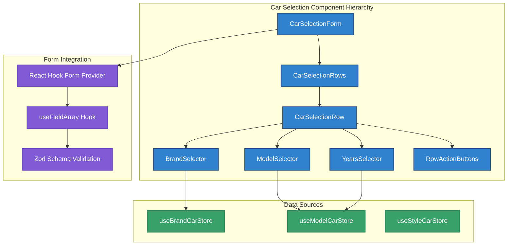
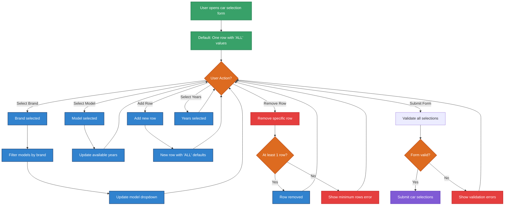
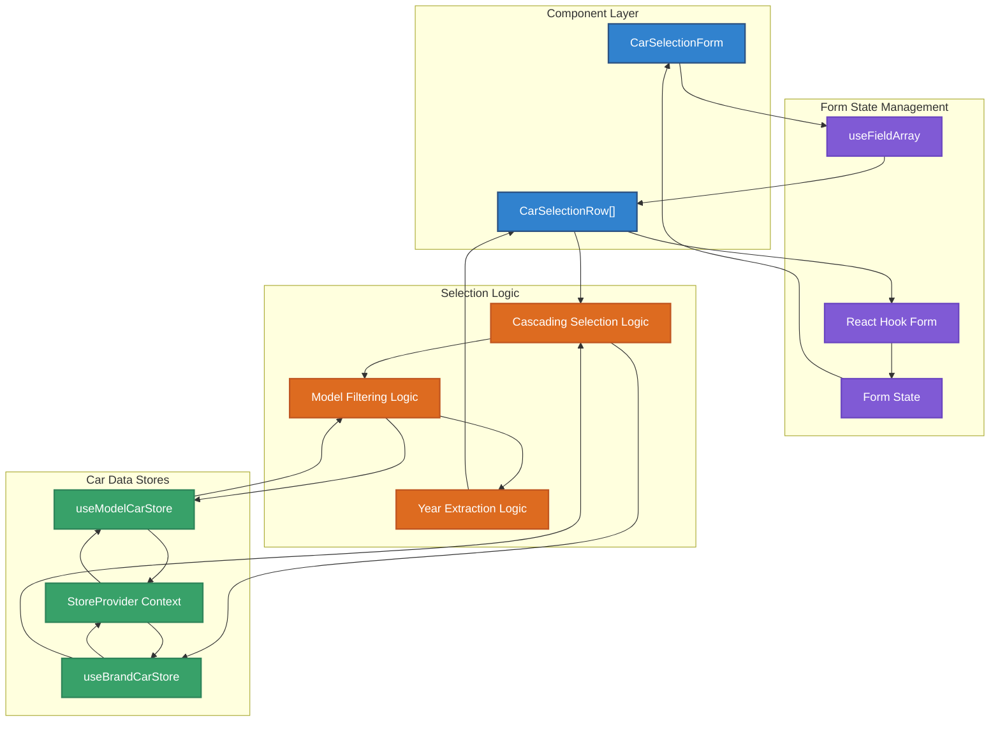
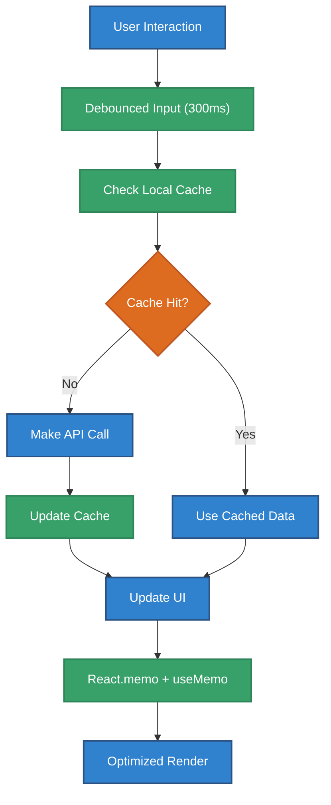

# Context

Protocol: RIPER-5 + Multi-Dimensional Thinking + Agent Execution + Clean Architecture  
Mode: Planning → Execution → Review  
Target: Create improved car selection component with dynamic rows and enhanced UX  
Visualization Protocol: Mandatory in all steps (Mermaid / PlantUML / Markdown)

# Objective

You are Cursor AI acting as a world-class Senior Developer with extensive experience in Vite, TypeScript, React, and UX Design.  
Your goal is to design and implement a superior car selection component that provides an intuitive, flexible, and user-friendly interface for managing multiple car selections with cascading dropdowns and dynamic row management.

This session is **continuation-resilient** — if interrupted, resume at the next unchecked step in the planning checklist.  
Test code is **skipped**. All interactions must produce results in Markdown format, and each major step must include a **diagram**.

# Instructions

---

## 🧠 [Planning Mode]

### Component Architecture Overview

The car selection component will be a sophisticated, reusable form component that leverages the existing `rhf-select-single-loading-page.tsx` pattern while providing enhanced UX for multiple car selections.



### User Interaction Workflow



### Data Flow Architecture



### Material-UI Component Structure Design

#### Overall Layout Using Material-UI Components

**Container Structure:**

- FormControl (fullWidth) as main container
- FormLabel with consistent styling (fontSize: '13px', theme.palette.grey[500])
- Stack component for vertical row arrangement
- Each row uses Paper component with elevation and hover effects

**Individual Row Layout:**

- Paper container with sx props for styling and hover effects
- Grid container with responsive columns: `size={{ xs: 12, sm: 4 }}` for each selector
- Grid item for remove button: `size={{ xs: 12, sm: 'auto' }}`

**Component Integration:**

- Brand Selector: Extended RHFSelectSingleLoadingPage with car store integration
- Model Selector: Extended RHFSelectSingleLoadingPage with brand filtering
- Years Selector: Extended RHFSelectMultiLoadingPage with model-based years
- Add Button: Material-UI Button with dashed border styling
- Remove Button: IconButton with error color theme

#### Styling Specifications

**Row Container Styling:**

```typescript
const rowContainerSx = {
  p: 2,
  border: '1px solid',
  borderColor: 'divider',
  borderRadius: 1,
  mb: 1,
  '&:hover': {
    borderColor: 'primary.main',
    bgcolor: (theme) => alpha(theme.palette.primary.main, 0.02),
  },
};
```

**Add Button Styling:**

```typescript
const addButtonSx = {
  borderStyle: 'dashed',
  borderColor: 'primary.main',
  color: 'primary.main',
  '&:hover': {
    bgcolor: (theme) => alpha(theme.palette.primary.main, 0.05),
  },
};
```

### Implementation Checklist

#### Phase 1: Type Definitions and Interfaces ✅ Completed 🕒 2024-12-19 16:00

- [x] Create `src/components/car-selection/types.ts` ✅ 2024-12-19 16:00
  - [x] Define `CarSelection` interface ✅
  - [x] Define `CarSelectionFormData` interface ✅
  - [x] Define `CarSelectionRowProps` interface ✅
  - [x] Define `BrandOption`, `ModelOption`, `YearOption` interfaces ✅
  - [x] Define validation schemas for car selection ✅

#### Phase 2: Core Components ✅ Completed 🕒 2024-12-19 16:10

- [x] Create `src/components/car-selection/car-selection-form.tsx` ✅ 2024-12-19 16:05

  - [x] Implement React Hook Form integration with useFieldArray ✅
  - [x] Add dynamic row management (add/remove functionality) ✅
  - [x] Implement form validation and error handling ✅
  - [x] Add Material-UI styling integration ✅

- [x] Create `src/components/car-selection/car-selection-row.tsx` ✅ 2024-12-19 16:08

  - [x] Implement individual row component with Grid layout ✅
  - [x] Add cascading selector integration placeholders ✅
  - [x] Implement remove button with proper state management ✅
  - [x] Add Material-UI Paper container with hover effects ✅

- [x] Create placeholder selector components ✅ 2024-12-19 16:10
  - [x] `brand-selector.tsx` placeholder ✅
  - [x] `model-selector.tsx` placeholder ✅
  - [x] `years-selector.tsx` placeholder ✅

#### Phase 3: Specialized Selectors

- [ ] Create `src/components/car-selection/brand-selector.tsx`

  - [ ] Extend `rhf-select-single-loading-page.tsx` pattern
  - [ ] Integrate with `useBrandCarStore`
  - [ ] Add custom rendering for brand options
  - [ ] Implement search and pagination

- [ ] Create `src/components/car-selection/model-selector.tsx`

  - [ ] Extend `rhf-select-single-loading-page.tsx` pattern
  - [ ] Integrate with `useModelCarStore`
  - [ ] Implement brand-based filtering
  - [ ] Add custom rendering for model options
  - [ ] Handle dependent data loading

- [ ] Create `src/components/car-selection/years-selector.tsx`
  - [ ] Implement multi-select years component
  - [ ] Extract years from selected model data
  - [ ] Add "ALL" option handling
  - [ ] Implement custom styling for multi-select

#### Phase 4: Enhanced UX Features

- [ ] Create `src/components/car-selection/add-row-button.tsx`

  - [ ] Implement styled add button
  - [ ] Add smooth animations
  - [ ] Handle maximum row limits
  - [ ] Provide visual feedback

- [ ] Create `src/components/car-selection/row-actions.tsx`
  - [ ] Implement remove row functionality
  - [ ] Add confirmation dialogs for destructive actions
  - [ ] Handle minimum row validation
  - [ ] Provide clear visual feedback

#### Phase 5: Styling System Integration

- [ ] Apply consistent Material-UI sx prop styling patterns

  - [ ] Follow existing component styling from `rhf-select-single-loading-page.tsx`
  - [ ] Use theme-based colors: `(theme) => theme.palette.grey[500]`
  - [ ] Implement standard 42px input height and borderRadius: 1
  - [ ] Apply alpha transparency for hover states: `alpha(theme.palette.primary.main, 0.05)`

- [ ] Implement responsive design using Material-UI Grid
  - [ ] Use Grid with `size={{ xs: 12, sm: 6 }}` props for responsive layout
  - [ ] Apply responsive sx props where needed
  - [ ] Use Material-UI spacing units consistently (mr: 1.5, p: 1, etc.)
  - [ ] Follow FormControl + FormLabel pattern from existing components

#### Phase 6: Validation and Logic

- [ ] Create `src/components/car-selection/validation.ts`

  - [ ] Implement Zod validation schemas
  - [ ] Add custom validation rules
  - [ ] Handle cross-field validation
  - [ ] Export validation utilities

- [ ] Create `src/components/car-selection/utils.ts`
  - [ ] Implement cascading dropdown logic
  - [ ] Add data transformation utilities
  - [ ] Create year extraction functions
  - [ ] Handle default value logic

#### Phase 7: Hooks and State Management

- [ ] Create `src/components/car-selection/hooks/use-car-selection.ts`

  - [ ] Implement main component logic hook
  - [ ] Handle form state management
  - [ ] Integrate with stores
  - [ ] Manage loading and error states

- [ ] Create `src/components/car-selection/hooks/use-cascading-selectors.ts`
  - [ ] Implement cascading dropdown logic
  - [ ] Handle brand-to-model filtering
  - [ ] Manage model-to-years extraction
  - [ ] Optimize performance with memoization

#### Phase 8: Integration and Export

- [ ] Create `src/components/car-selection/index.ts`
  - [ ] Export main components with proper TypeScript interfaces
  - [ ] Export types and interfaces including SxProps support
  - [ ] Export utility functions for styling and validation
  - [ ] Create barrel exports following existing component patterns
  - [ ] Export styling constants for consistent sx prop usage

### Technical Specifications

#### Component Props Interface

```typescript
interface CarSelectionFormProps {
  name: string;
  label?: string;
  defaultValue?: CarSelection[];
  maxRows?: number;
  minRows?: number;
  required?: boolean;
  disabled?: boolean;
  onCarSelectionChange?: (selections: CarSelection[]) => void;
  helperText?: string;
  error?: string;
  // Material-UI styling props following existing patterns
  labelSx?: SxProps<Theme>;
  sx?: SxProps<Theme>;
}

interface CarSelection {
  brand: {
    id: string;
    name: string;
  };
  model: {
    id: string;
    name: string;
  };
  years: string[]; // ['2020', '2021'] or ['ALL']
}
```

#### Validation Schema

```typescript
const carSelectionSchema = z.object({
  cars: z
    .array(
      z.object({
        brand: z.object({
          id: z.string().min(1, 'Brand is required'),
          name: z.string().min(1, 'Brand name is required'),
        }),
        model: z.object({
          id: z.string().min(1, 'Model is required'),
          name: z.string().min(1, 'Model name is required'),
        }),
        years: z.array(z.string()).min(1, 'At least one year must be selected'),
      })
    )
    .min(1, 'At least one car selection is required'),
});
```

#### Performance Optimization Strategy



### Accessibility Considerations

#### ARIA Implementation

```mermaid
flowchart TD
    Component["Car Selection Component"] --> AriaLabel["aria-label: 'Car Selection Form'"]
    Component --> AriaDescribedBy["aria-describedby: helper text"]

    DropdownComponents["Dropdown Components"] --> AriaExpanded["aria-expanded state"]
    DropdownComponents --> AriaHasPopup["aria-haspopup='listbox'"]
    DropdownComponents --> AriaLabelledBy["aria-labelledby field labels"]

    MultiSelect["Years Multi-Select"] --> AriaMultiSelectable["aria-multiselectable='true'"]
    MultiSelect --> AriaSelected["aria-selected state"]

    ActionButtons["Action Buttons"] --> AriaLabel2["Descriptive aria-labels"]
    ActionButtons --> KeyboardNav["Keyboard navigation support"]

    FormValidation["Form Validation"] --> AriaInvalid["aria-invalid state"]
    FormValidation --> AriaErrorMessage["aria-errormessage links"]

    %% Styling
    classDef accessibility fill:#805ad5,stroke:#6b46c1,stroke-width:2px,color:#fff
    classDef component fill:#3182ce,stroke:#2c5282,stroke-width:2px,color:#fff

    class AriaLabel,AriaDescribedBy,AriaExpanded,AriaHasPopup,AriaLabelledBy,AriaMultiSelectable,AriaSelected,AriaLabel2,KeyboardNav,AriaInvalid,AriaErrorMessage accessibility
    class Component,DropdownComponents,MultiSelect,ActionButtons,FormValidation component
```



---

## ⚙️ [Execution Mode]

- Implement **one checklist item per run**
- After each step:
  1. Update this planning file and check `[x]` with timestamp (🕒)
  2. Paste modified source code and file path
  3. Include updated diagram if structure or logic changed
- Important:
  - Follow React best practices and performance optimization
  - Maintain accessibility standards (WCAG 2.1 AA)
  - Use TypeScript for all components
  - Implement responsive design
  - Follow the existing component patterns

---

## 🔍 [Review Mode]

When all tasks are checked:

- Test component with various car selection scenarios
- Verify cascading dropdown functionality works correctly
- Confirm accessibility standards are met
- Test responsive design on different screen sizes
- Validate form integration with react-hook-form
- Ensure performance optimization is effective
- Verify error handling and validation messages
- Test keyboard navigation and screen reader compatibility

---

## 🚨 Constraints

- Diagrams are required in **every step**, no exceptions
- Use only Mermaid format for diagrams
- Follow established component patterns from the project
- Maintain TypeScript type safety throughout
- No placeholder code or incomplete logic
- Component must be fully responsive and accessible
- Performance must be optimized for large datasets

---

## ✅ Output Format

- Markdown
- ✅ Updated planning checklist with completion timestamps
- 📄 Source code with file path
- 📊 Mermaid diagram for each major implementation
- 💬 Commentary with UX/accessibility reasoning
- 🎨 Wireframe updates when UI changes

---

## 🏁 Start

> 🚀 **Beginning Implementation: [Planning Mode Complete]**  
> ↪️ **Next Task:** `Phase 1: Type Definitions - Create car selection types`
> 🎯 Ready to proceed with superior car selection component development
