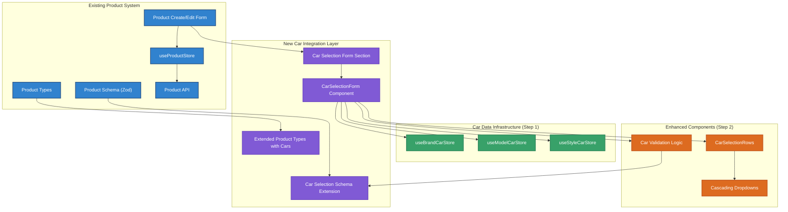
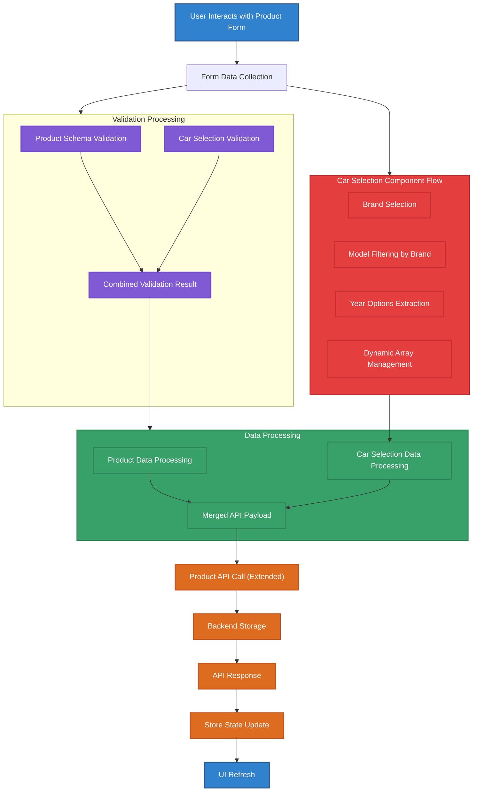
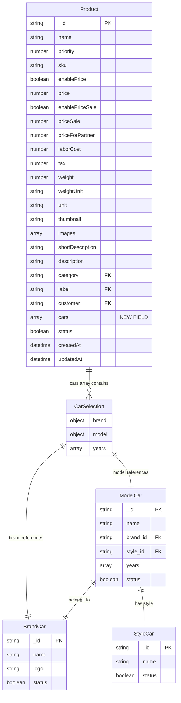

# Context

Protocol: RIPER-5 + Multi-Dimensional Thinking + Agent Execution + Clean Architecture  
Mode: Planning → Execution → Review  
Target: Integrate car selection component into existing product management system  
Visualization Protocol: Mandatory in all steps (Mermaid / PlantUML / Markdown)

# Objective

You are Cursor AI acting as a world-class Senior Developer with extensive experience in Vite, TypeScript, React, and enterprise system integration.  
Your goal is to seamlessly integrate the enhanced car selection component from Step 2 into the existing xyz-GARA product management system, ensuring proper data flow, validation, and user experience while maintaining existing functionality.

This session is **continuation-resilient** — if interrupted, resume at the next unchecked step in the planning checklist.  
Test code is **skipped**. All interactions must produce results in Markdown format, and each major step must include a **diagram**.

# Instructions

---

## 🧠 [Planning Mode]

### Integration Architecture Overview

The integration involves extending the existing product management system with car selection capabilities, maintaining the current FormSection structure while adding the new car selection component.



### Data Flow Integration



### Form Structure Integration

```mermaid
flowchart TD
    subgraph "Product Form Layout"
        FormDialogCustom["FormDialogCustom Container"]

        subgraph "Form Sections"
            BasicInfoSection["Basic Information Section"]
            VisualIdentitySection["Visual Identity Section"]
            PricingSection["Pricing & Inventory Section"]
            CarSelectionSection["🆕 Car Selection Section"]
            DescriptionSection["Description Section"]
        end

        ActionButtons["Form Action Buttons"]
    end

    FormDialogCustom --> BasicInfoSection
    BasicInfoSection --> VisualIdentitySection
    VisualIdentitySection --> PricingSection
    PricingSection --> CarSelectionSection
    CarSelectionSection --> DescriptionSection
    DescriptionSection --> ActionButtons

    subgraph "Car Selection Section Detail"
        SectionTitle["Section Title: 'Compatible Vehicles'"]
        SectionDescription["Optional helper text"]
        CarSelectionComponent["CarSelectionForm Component"]

        subgraph "Car Component Internal"
            CarRows["Dynamic Car Selection Rows"]
            AddRemoveButtons["Add/Remove Row Controls"]
            ValidationDisplay["Validation Error Display"]
        end
    end

    CarSelectionSection --> SectionTitle
    SectionTitle --> SectionDescription
    SectionDescription --> CarSelectionComponent
    CarSelectionComponent --> CarRows
    CarRows --> AddRemoveButtons
    AddRemoveButtons --> ValidationDisplay

    %% Styling
    classDef container fill:#3182ce,stroke:#2c5282,stroke-width:2px,color:#fff
    classDef section fill:#805ad5,stroke:#6b46c1,stroke-width:2px,color:#fff
    classDef new fill:#38a169,stroke:#2f855a,stroke-width:2px,color:#fff
    classDef component fill:#dd6b20,stroke:#c05621,stroke-width:2px,color:#fff

    class FormDialogCustom,ActionButtons container
    class BasicInfoSection,VisualIdentitySection,PricingSection,DescriptionSection section
    class CarSelectionSection,SectionTitle,SectionDescription,CarSelectionComponent new
    class CarRows,AddRemoveButtons,ValidationDisplay component
```



### Database Schema Extension



### Implementation Checklist

#### Phase 1: Product Type Enhancement ✅ Completed 🕒 2024-12-19 16:20

- [x] Update `src/lib/api/xyz-gara/types/product-types.ts` ✅ 2024-12-19 16:15

  - [x] Add `compatibleVehicles?: CarSelection[]` field to Product interface ✅
  - [x] Add `vehicleCompatibilityType` enum field ('SPECIFIC' | 'UNIVERSAL' | 'NOT_SPECIFIED') ✅
  - [x] Update CreateProductRequest interface ✅
  - [x] Update UpdateProductRequest interface ✅

- [x] Update `src/pages/dashboard/xyz-gara/product-page/product-schema.ts` ✅ 2024-12-19 16:18
  - [x] Import car selection validation schemas ✅
  - [x] Add compatible vehicles validation to productBaseSchema ✅
  - [x] Add vehicle compatibility type validation ✅
  - [x] Update form data types ✅

#### Phase 2: Product Form Integration ✅ Completed 🕒 2024-12-19 16:30

- [x] Update `src/pages/dashboard/xyz-gara/product-page/form/product-create-form.tsx` ✅ 2024-12-19 16:25

  - [x] Import CarSelectionForm component ✅
  - [x] Add Vehicle Compatibility section to form ✅
  - [x] Add vehicleCompatibilityType radio group (UNIVERSAL/SPECIFIC/NOT_SPECIFIED) ✅
  - [x] Add compatibleVehicles car selection component ✅
  - [x] Implement conditional visibility for car selection ✅
  - [x] Update form default values ✅

- [x] Create `src/components/car-selection/index.ts` ✅ 2024-12-19 16:28
  - [x] Export all car selection components ✅
  - [x] Export car selection types ✅

#### Phase 3: Car Selection Component Integration

- [ ] **Create Car Selection Form Section**

  - [ ] Create `src/components/input/rhf-car-selection.tsx`
    - [ ] Implement CarSelectionForm component following Step 2 design
    - [ ] Integrate with React Hook Form using useFieldArray
    - [ ] Connect to car data stores (brand, model, style)
    - [ ] Implement cascading dropdown logic
    - [ ] Add dynamic row management (add/remove)
    - [ ] Implement validation display

- [ ] **Component Features Implementation**
  - [ ] Dynamic rows with "ALL" default values
  - [ ] Brand selection triggers model filtering
  - [ ] Model selection updates available years
  - [ ] Add row functionality with validation
  - [ ] Remove row functionality with minimum row validation
  - [ ] Loading states for all dropdowns
  - [ ] Error handling and display

#### Phase 4: Form Integration

- [ ] **Update Product Create Form**

  - [ ] Modify `src/pages/dashboard/xyz-gara/product-page/form/product-create-form.tsx`
    - [ ] Import new CarSelectionForm component
    - [ ] Add new FormSection for car selection
    - [ ] Position car selection section appropriately in form layout
    - [ ] Update default values to include empty cars array
    - [ ] Ensure form submission includes car data

- [ ] **Update Product Edit Form**
  - [ ] Modify `src/pages/dashboard/xyz-gara/product-page/form/product-edit-form.tsx`
    - [ ] Add car selection section
    - [ ] Implement data loading for existing car selections
    - [ ] Handle car data editing and updates
    - [ ] Ensure proper form reset functionality

#### Phase 5: API Integration

- [ ] **Update Product API Calls**

  - [ ] Modify `src/lib/api/xyz-gara/product.ts`
    - [ ] Update createProduct to handle car selection data
    - [ ] Update updateProduct to handle car selection data
    - [ ] Ensure proper serialization of car data
    - [ ] Add error handling for car-related API failures

- [ ] **Backend Coordination**
  - [ ] Verify backend API accepts cars field in product creation/updates
  - [ ] Test API response includes car data in product retrieval
  - [ ] Validate car data persistence in database
  - [ ] Test API error handling for invalid car selections

#### Phase 6: Store Integration

- [ ] **Update Product Store**

  - [ ] Modify `src/store/xyz-gara/use-product-store.ts`
    - [ ] Ensure store handles extended Product type with cars field
    - [ ] Update create/update methods to include car data
    - [ ] Add car-specific error handling
    - [ ] Ensure store state consistency with car selections

- [ ] **Car Store Dependencies**
  - [ ] Verify car stores from Step 1 are properly registered
  - [ ] Test car store data loading in product form context
  - [ ] Ensure proper store cleanup and memory management
  - [ ] Test store integration with form validation

#### Phase 7: User Experience Enhancements

- [ ] **Form UX Improvements**

  - [ ] Add tooltips and help text for car selection
  - [ ] Implement proper loading states during car data fetching
  - [ ] Add confirmation dialogs for removing car selections
  - [ ] Implement form state persistence during navigation
  - [ ] Add keyboard navigation support

- [ ] **Validation UX**
  - [ ] Display clear error messages for car selection validation
  - [ ] Highlight invalid car selections in real-time
  - [ ] Provide suggestions for incomplete car selections
  - [ ] Implement field-level validation feedback

#### Phase 8: Testing and Quality Assurance

- [ ] **Component Testing**

  - [ ] Test car selection component in isolation
  - [ ] Test cascading dropdown functionality
  - [ ] Test dynamic row add/remove operations
  - [ ] Test form submission with various car selection scenarios
  - [ ] Test validation error handling

- [ ] **Integration Testing**

  - [ ] Test complete product creation flow with car selections
  - [ ] Test product editing with existing car selections
  - [ ] Test form persistence and recovery
  - [ ] Test API integration end-to-end
  - [ ] Test performance with large car datasets

- [ ] **Cross-browser and Device Testing**
  - [ ] Test responsive design on mobile devices
  - [ ] Test dropdown functionality across browsers
  - [ ] Test form validation across different screen sizes
  - [ ] Test accessibility compliance

### Technical Specifications

#### Car Selection Data Structure

```typescript
// Expected data structure for form handling
interface CarSelectionFormData {
  cars: Array<{
    brand: { id: string; name: string };
    model: { id: string; name: string };
    years: string[]; // e.g., ["2020", "2021", "ALL"]
  }>;
}

// Default values
const defaultCarSelection = {
  brand: { id: '', name: 'ALL' },
  model: { id: '', name: 'ALL' },
  years: ['ALL'],
};
```

#### Form Section Styling Integration

```typescript
// Car selection section styling following existing FormSection pattern
const carSelectionSectionSx = {
  mb: 3, // Consistent spacing with other sections
  '& .MuiFormLabel-root': {
    fontSize: '13px',
    color: (theme) => theme.palette.grey[500],
    fontWeight: 500,
    mb: 0.5,
  },
  '& .MuiFormControl-root': {
    mb: 2, // Consistent form field spacing
  },
};

// Integration with existing product form layout
const formSectionProps = {
  title: t('products.sections.carSelection', 'Compatible Vehicles'),
  sx: carSelectionSectionSx,
};
```

#### Form Section Placement

The car selection section will be positioned between the "Pricing & Inventory" and "Description" sections to maintain logical flow while ensuring the car compatibility is defined before detailed product descriptions.

#### Validation Rules

1. **Minimum Requirements**: At least one car selection row must be present
2. **Brand Validation**: If brand is selected (not "ALL"), it must be a valid brand from the store
3. **Model Validation**: If model is selected (not "ALL"), it must belong to the selected brand
4. **Years Validation**: Years array must contain valid year strings or "ALL"
5. **Consistency Validation**: Brand and model selections must be consistent across the selection

#### Performance Considerations

1. **Lazy Loading**: Car data stores load only when car selection section is rendered
2. **Debounced Search**: Model filtering includes debounced search for large datasets
3. **Memoization**: Car dropdown options are memoized to prevent unnecessary re-renders
4. **Cleanup**: Proper cleanup of car store subscriptions when component unmounts

### Integration Risks and Mitigation

#### Risk 1: Form Performance with Large Car Datasets

**Mitigation**: Implement pagination in car stores and lazy loading of dropdown options

#### Risk 2: Validation Complexity

**Mitigation**: Create separate validation schemas for car selections and merge with product validation

#### Risk 3: Form State Management

**Mitigation**: Use React Hook Form's useFieldArray for robust array management and validation

#### Risk 4: Backend API Compatibility

**Mitigation**: Validate API changes with backend team and implement fallback handling

#### Risk 5: Store Dependency Issues

**Mitigation**: Implement proper store initialization and error boundaries

### Success Criteria

1. **Functional Integration**: Car selection component seamlessly integrates into product forms
2. **Data Persistence**: Car selections are properly saved and retrieved with products
3. **User Experience**: Intuitive interface for managing multiple car selections
4. **Performance**: Form remains responsive with large car datasets
5. **Validation**: Comprehensive validation prevents invalid car selections
6. **Maintainability**: Code follows existing patterns and is easily maintainable

### Post-Integration Enhancements

1. **Bulk Car Selection**: Allow users to select multiple models from the same brand
2. **Car Selection Templates**: Save and reuse common car selection combinations
3. **Import/Export**: Import car selections from CSV or other formats
4. **Analytics**: Track most commonly selected car combinations
5. **Search Enhancement**: Advanced search and filtering within car selections

---

## 📝 Implementation Notes

- All components must follow existing xyz-GARA design patterns using sx props
- Use Material-UI components with consistent styling from existing forms
- Follow existing component patterns from rhf-select-single-loading-page.tsx
- Implement proper TypeScript typing throughout including SxProps<Theme>
- Use theme-based colors and Material-UI spacing units consistently
- Follow FormControl + FormLabel structure from existing components
- Maintain 42px input height and borderRadius: 1 standards
- Use alpha transparency for hover states following existing patterns
- Follow existing error handling patterns with FormHelperText
- Maintain existing form validation user experience
- Ensure proper internationalization support
- Document all new components and integration points

This comprehensive integration plan ensures seamless addition of car selection capabilities to the existing product management system while maintaining code quality, user experience, and system performance.
