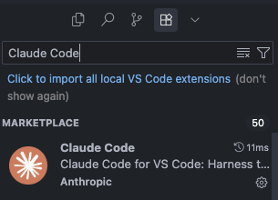
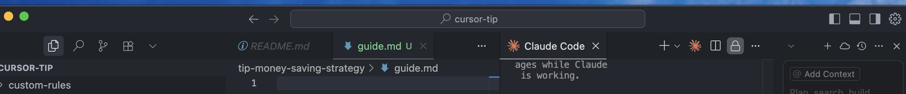

# Claude Code Extension Setup Guide for Cursor

A complete guide to setting up and using Claude Code extension in Cursor IDE for cost-effective AI-powered development.

## Overview

This guide walks you through setting up Claude Code extension in Cursor IDE as a money-saving strategy. Instead of upgrading to Cursor Pro+ or other expensive packages, you can use Gemini 2.5 Pro Preview for planning and Claude Code for implementation.

## Money-Saving Strategy

**Cost Optimization Approach:**
- Use **Gemini 2.5 Pro Preview** (free) for project planning and architecture
- Use **Claude Code extension** for code implementation 
- Reference planning files with `@` tags in prompts
- Avoid expensive Cursor Pro+ subscriptions

## Setup Workflow

```mermaid
graph TD
    %% Setup Phase
    Start["Start Setup"] --> InstallSDK["Install Claude Code SDK<br/>npm install -g @anthropic-ai/claude-code"]
    InstallSDK --> DownloadDesktop["Download Claude Desktop<br/>from claude.ai/download"]
    DownloadDesktop --> OpenCursor["Open Cursor IDE"]
    
    %% Extension Installation
    OpenCursor --> SearchExtension["Search 'Claude Code'<br/>in Extensions marketplace"]
    SearchExtension --> InstallExtension["Install Claude Code extension"]
    InstallExtension --> OpenExtensionPanel["Click Claude Code icon<br/>in top-right near chat"]
    
    %% Authentication
    OpenExtensionPanel --> RunClaude["Run 'claude' command<br/>in terminal"]
    RunClaude --> SignInBrowser["Sign in via browser<br/>when prompted"]
    SignInBrowser --> ExtensionReady["Claude Code Extension Ready"]
    
    %% Usage Workflow
    ExtensionReady --> PlanWithGemini["Plan project with<br/>Gemini 2.5 Pro Preview"]
    PlanWithGemini --> CreatePlanFile["Create planning file<br/>in Cursor"]
    CreatePlanFile --> UseAtTag["Use @ tag to reference<br/>planning file in prompts"]
    UseAtTag --> RunCode["Execute code with<br/>Claude Code extension"]
    RunCode --> SaveMoney["Save money vs<br/>Cursor Pro+ subscription"]
    
    %% Styling
    classDef secondary fill:#2d3748,stroke:#4a5568,stroke-width:2px,color:#fff
    classDef primary fill:#3182ce,stroke:#2c5282,stroke-width:2px,color:#fff
    classDef success fill:#38a169,stroke:#2f855a,stroke-width:2px,color:#fff
    classDef warning fill:#d69e2e,stroke:#b7791f,stroke-width:2px,color:#fff
    classDef info fill:#805ad5,stroke:#6b46c1,stroke-width:2px,color:#fff
    
    %% Apply styling
    class Start secondary
    class InstallSDK,DownloadDesktop,OpenCursor,SearchExtension,InstallExtension primary
    class OpenExtensionPanel,RunClaude,SignInBrowser info
    class ExtensionReady,SaveMoney success
    class PlanWithGemini,CreatePlanFile,UseAtTag,RunCode warning
```



## Step-by-Step Installation

### Step 1: Install Claude Code SDK

Open your terminal and run:

```bash
npm install -g @anthropic-ai/claude-code
```

This installs the Claude Code command-line interface globally on your system.

### Step 2: Download Claude Desktop

1. Visit [https://claude.ai/download](https://claude.ai/download)
2. Download Claude Desktop for your operating system
3. Install and set up Claude Desktop

### Step 3: Install Claude Code Extension in Cursor

1. Open Cursor IDE
2. Navigate to Extensions (Ctrl/Cmd + Shift + X)
3. Search for "Claude Code"
4. Install the Claude Code extension by Anthropic



### Step 4: Activate Claude Code Extension

1. Look for the Claude Code icon in the top-right area near the chat window
2. Click the Claude Code icon to open the extension panel



### Step 5: Authentication

1. Open terminal in Cursor (Terminal > New Terminal)
2. Run the command:
   ```bash
   claude
   ```
3. Follow the browser authentication flow when prompted
4. Complete the sign-in process

## Usage Strategy

### Planning Phase

1. **Use Gemini 2.5 Pro Preview** for:
   - Project architecture planning
   - Feature specifications
   - Technical documentation
   - Code structure design

2. **Create planning files** in your Cursor workspace:
   ```
   project/
   ├── docs/
   │   ├── architecture.md
   │   ├── features.md
   │   └── implementation-plan.md
   ```

### Implementation Phase

1. **Reference planning files** using `@` tags:
   ```
   @docs/architecture.md implement the user authentication system following this plan
   ```

2. **Use Claude Code extension** for:
   - Code generation and implementation
   - Debugging and code fixes
   - Refactoring and optimization
   - Code explanations and documentation

### Example Workflow

```markdown
# In Cursor chat window:
@docs/implementation-plan.md 

Please implement the shopping cart functionality as described in the plan. 
Focus on the Cart component with add/remove item methods.
```

## Benefits

### Cost Savings
- **Avoid Cursor Pro+ subscription** ($20/month)
- **Use free Gemini 2.5 Pro Preview** for planning
- **Pay-per-use Claude Code** only when needed

### Development Efficiency
- **Structured planning** with Gemini
- **High-quality implementation** with Claude Code
- **Context-aware development** using file references
- **Seamless IDE integration**

### Best Practices
- Plan thoroughly before implementation
- Use descriptive file names for easy referencing
- Keep planning documents updated
- Leverage both AI tools for their strengths

## Troubleshooting

### Common Issues

| Issue | Solution |
|-------|----------|
| `claude` command not found | Reinstall SDK: `npm install -g @anthropic-ai/claude-code` |
| Extension not appearing | Restart Cursor and check Extensions tab |
| Authentication failed | Clear browser cache and retry `claude` command |
| Cannot access planning files | Ensure files are in workspace and use correct `@` syntax |

### Tips for Optimal Usage

1. **Keep planning files organized** in dedicated folders
2. **Use clear, descriptive filenames** for easy @ referencing
3. **Update plans regularly** as project evolves
4. **Test implementation incrementally** rather than large batches
5. **Maintain context** by referencing relevant planning documents

## Conclusion

This setup provides a cost-effective alternative to expensive IDE subscriptions while maintaining high-quality AI-assisted development. By combining free planning tools with targeted implementation assistance, you can achieve professional development results without breaking the budget.

**Next Steps:**
- Set up your first planning document
- Practice using @ references in prompts
- Explore Claude Code's advanced features
- Monitor usage costs vs. subscription alternatives