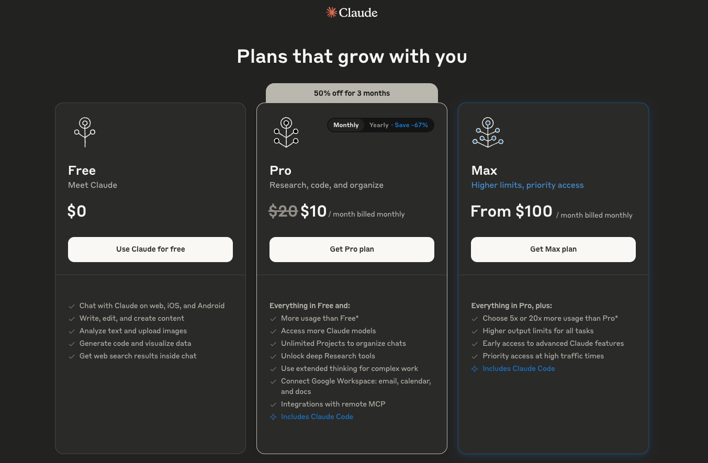
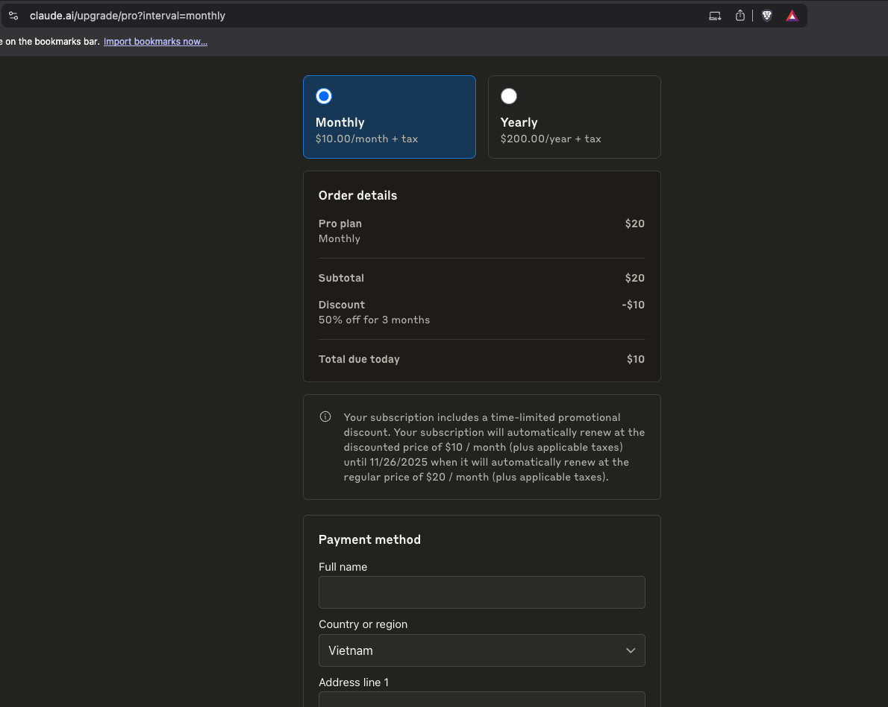
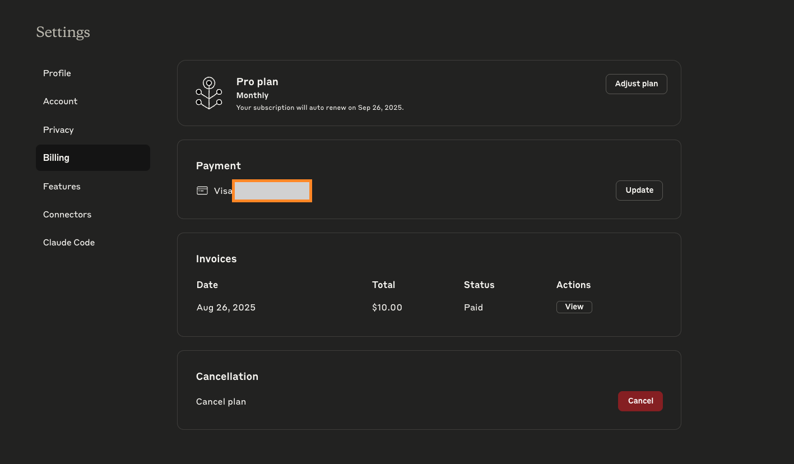

# Claude Code Pro - 50% Discount for New Accounts

Get Claude Code Pro at 50% off for 3 months when you're a new account holder.

## Requirements

- **New Claude account only** - This offer is exclusively for users who haven't subscribed to Claude Pro before

## How to Access the Discount

### Step 1: Visit the Special Link

Go to: [https://claude.ai/acquired](https://claude.ai/acquired)

### Step 2: Choose Your Plan

- You'll see the pricing page with a **"50% off for 3 months"** banner
- The Pro plan will show:
  - Original price: ~~$20~~ **$10/month**
  - Includes Claude Code access

### Step 3: Complete Payment

- Select "Monthly" billing option
- Fill in your payment details
- The discount will be automatically applied:
  - **Subtotal**: $20
  - **Discount**: -$10 (50% off for 3 months)
  - **Total due today**: $10

### Step 4: Verify Your Subscription

After payment, check your account settings to confirm:

- Pro plan is active
- Monthly billing at discounted rate
- Auto-renewal date (discount expires after 3 months)

## Important Notes

- **New accounts only** - Existing Pro subscribers are not eligible
- **Limited time offer** - 50% discount applies for first 3 months only
- **Auto-renewal** - After 3 months, subscription renews at regular $20/month
- **Includes Claude Code** - Full access to Claude's coding capabilities

## What You Get

- Claude Pro features: Research, code, and organize
- Claude Code integration for development
- Priority access during high traffic
- Extended thinking for complex work
