# Cursor Prompt Guide for MCP Workflow

This guide shows how to structure prompts for Cursor using **MCP Sequential Thinking**, **MCP Context7**, and **MCP Clear Thought**.  
You can adapt this format to your own project by replacing the example directories and files with your own.

---

## MCP Employee Module Workflow

```mermaid
flowchart TD
    %% ============================================
    %% MCP Employee Module Creation Workflow
    %% Following the "Pattern → Process → Output" methodology
    %% ============================================

    Start["🚀 Start:<br/>MCP Employee Module Creation"] --> Step1Process

    %% ============================================
    %% EXISTING PATTERNS (Reference Sources)
    %% ============================================
    subgraph "📚 Existing Patterns to Follow"
        direction TB
        SalaryDocsPattern["@salary-docs/<br/>📁 Directory structure pattern"]
        SalaryTypesPattern["@salary-types-group/<br/>📄 Type definitions pattern"]
        ApiEndpointsPattern["@api-endpoints.ts<br/>🔌 API structure pattern"]
        SalaryApiPattern["@salary-api/<br/>🌐 API implementation pattern"]
        SalaryStorePattern["@salary-store/<br/>💾 State management pattern"]
    end

    %% ============================================
    %% SPECIAL INPUT
    %% ============================================
    TempDocsInput["@temp-docs.md<br/>📋 POST/GET details from<br/>Postman/Swagger"]

    %% ============================================
    %% STEP 1: DOCUMENTATION CREATION
    %% ============================================
    subgraph "📝 Step 1: Create Documentation"
        direction TB
        Step1Process["Follow @salary-docs/ pattern<br/>to create @employee-docs/"]
        
        %% Individual file outputs
        CertificationFile["@certification-type.md<br/>📜 Certification definitions"]
        EducationFile["@education-type.md<br/>🎓 Education definitions"]
        EmploymentFile["@employment-status.md<br/>💼 Employment status definitions"]
        SkillFile["@skill-type.md<br/>🛠️ Skill type definitions"]
    end

    %% ============================================
    %% STEP 2: TYPES GROUP CREATION
    %% ============================================
    subgraph "🏗️ Step 2: Create Types Group"
        direction TB
        Step2Process["Follow @salary-types-group/<br/>pattern to create<br/>@employee-types-group/"]
        EmployeeTypesOutput["@employee-types-group/<br/>📦 Combined type definitions"]
    end

    %% ============================================
    %% STEP 3: API CREATION
    %% ============================================
    subgraph "🌐 Step 3: Create API"
        direction TB
        Step3Process["Follow @api-endpoints.ts<br/>and @salary-api/ patterns<br/>to create @employee-api/"]
        EmployeeApiOutput["@employee-api/<br/>🔌 Complete API implementation"]
    end

    %% ============================================
    %% STEP 4: STORE CREATION
    %% ============================================
    subgraph "💾 Step 4: Create Store"
        direction TB
        Step4Process["Follow @salary-store/<br/>pattern to create<br/>@employee-store/"]
        EmployeeStoreOutput["@employee-store/<br/>📊 State management system"]
    end

    Complete["✅ Complete:<br/>Full Employee Module Ready"]

    %% ============================================
    %% PATTERN CONNECTIONS (What feeds into each step)
    %% ============================================
    SalaryDocsPattern --> Step1Process
    TempDocsInput -.-> Step1Process
    
    SalaryTypesPattern --> Step2Process
    
    ApiEndpointsPattern --> Step3Process
    SalaryApiPattern --> Step3Process
    
    SalaryStorePattern --> Step4Process

    %% ============================================
    %% PROCESS FLOW (Sequential steps)
    %% ============================================
    Step1Process --> CertificationFile
    Step1Process --> EducationFile
    Step1Process --> EmploymentFile
    Step1Process --> SkillFile

    %% Step 1 outputs feed into Step 2
    CertificationFile --> Step2Process
    EducationFile --> Step2Process
    EmploymentFile --> Step2Process
    SkillFile --> Step2Process
    Step2Process --> EmployeeTypesOutput

    %% Step 2 output feeds into Step 3
    EmployeeTypesOutput --> Step3Process
    Step3Process --> EmployeeApiOutput

    %% Step 3 output feeds into Step 4
    EmployeeApiOutput --> Step4Process
    Step4Process --> EmployeeStoreOutput

    %% Final completion
    EmployeeStoreOutput --> Complete

    %% ============================================
    %% STYLING (Following project color guidelines)
    %% ============================================
    classDef secondary fill:#2d3748,stroke:#4a5568,stroke-width:2px,color:#fff
    classDef primary fill:#3182ce,stroke:#2c5282,stroke-width:2px,color:#fff
    classDef success fill:#38a169,stroke:#2f855a,stroke-width:2px,color:#fff
    classDef info fill:#805ad5,stroke:#6b46c1,stroke-width:2px,color:#fff
    classDef accent fill:#2b6cb0,stroke:#2c5282,stroke-width:2px,color:#fff

    %% Apply classes
    class Start,Complete accent
    class SalaryDocsPattern,SalaryTypesPattern,ApiEndpointsPattern,SalaryApiPattern,SalaryStorePattern secondary
    class TempDocsInput info
    class Step1Process,Step2Process,Step3Process,Step4Process primary
    class CertificationFile,EducationFile,EmploymentFile,SkillFile,EmployeeTypesOutput,EmployeeApiOutput,EmployeeStoreOutput success
```

---

## Example Prompt

Now please use **MCP Sequential Thinking**, **MCP Context7**, and **MCP Clear Thought** to help me:

### Step 1

Follow exactly the pattern in `@salary-docs/` to create `@employee-docs/` with:

- `@certification-type.md`
- `@education-type.md`
- `@employment-status.md`
- `@skill-type.md`

All of these should follow the details from `@temp-docs.md`.

### Step 2

Follow exactly the pattern in `@salary-types-group/`.  
From the information in Step 1, create `@employee-types-group/`.

### Step 3

Follow exactly the patterns in `@api-endpoints.ts` and `@salary-api/`.  
Using the information from Step 1 and Step 2, create `@employee-api/`.

### Step 4

Using the information from Step 3 (and everything inside `@employee-api/` once it’s complete), follow the pattern from `@salary-store/` to create `@employee-store/`.

---

## 📖 How to Use This Guide

1. **Understand the Pattern**

   - Each "Step" follows an existing reference (like `@salary-docs/` or `@salary-api/`)
   - You create a new version for employees (like `@employee-docs/`, `@employee-api/`)

2. **Adapt to Your Project**

   - Replace `salary` references with your own module name.
   - Replace file names (`@certification-type.md`, `@skill-type.md`) with files your project needs.
   - Keep the same structure of "follow pattern → create new files".

3. **Keep Consistency**
   - Always refer to the **original source** (pattern).
   - Always specify the **new output** you want to generate.
   - Keep the instructions in **step order** (1 → 2 → 3 → 4).

---

## 💡 Notes & Tips

- Be precise with directory names and file extensions.
- Use **imperative style** (“Follow”, “Create”, “Use”) so the AI understands clearly.
- If your project has more steps, simply extend the sequence.
- Keep each step small and clear to avoid confusion.

---

## 📌 Special Note about `@temp-docs.md`

The file `@temp-docs.md` contains **temporary content**.  
Because the data is often too long, I write down details of **POST/GET requests from Postman or Swagger** that the backend has already completed. This allows me to start describing the data and completing the FE part.

You can:

- Enter the content **directly** in your prompt if it’s short.
- Or, if it’s too long, put it inside a **temporary Markdown file** and reference it (just like `@temp-docs.md`).

This approach keeps your prompt clean and ensures Cursor can process it effectively.

---
